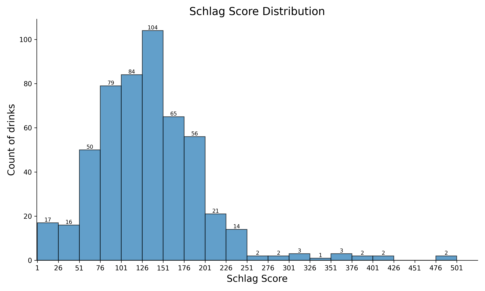

# Schlag Score Reference

This repository provides a ranking of the *schlag score* for a set of drinks available in Belgium. 

The *schlag score* is a scoring system for alcoholic drinks and gives an estimation of what could roughly be described as "the best bang for your buck" for alcohol. 
The score is computed as follows:

$$ \text{score} = \frac{\text{alcohol percentage } \times \text{ volume in cl}}{\text{price}} $$

The attribution of this formula is still unclear to this day.

For a practical application of this score, we recommend the following video [TOURNOI DES BIÈRES DE CLODO - Une bière et Jivay 129](https://www.youtube.com/watch?v=qABTb-Ydq18) (video in French).

## Dataset

The data used for this analysis is extracted for the website of Colruyt for their shop located in Halle, Belgium. 
The data was extracted on June 5th, 2025. 
Price may have changed since the data collection. 
The ranking did not take into account any discount that was applied.

We extracted data from the following product categories:
- Alcohols / Spirits
- Aperitifs
- Beers

The data contains 523 alcoholic drinks. 
The last one is listed as 0,0% alcohol but actually contains 0,04% alcohol and is therefore included in the ranking.

## Ranking

| Rank | Score  | Product                                                                             |
|------|--------|-------------------------------------------------------------------------------------|
| #1   | 500.89 | CARA Blond Strong 8,5% can 33cl (https://www.colruyt.be/fr/produits/6644)           |
| #2   | 476.19 | CARA Pils 4,4% canette 50cl (https://www.colruyt.be/fr/produits/5341)               |
| #3   | 419.64 | CARA Pils 4,7% bac 24x25cl (https://www.colruyt.be/fr/produits/5001)                |
| #4   | 410.07 | MARIE GALANTE Puerto Galero rouge 19% 3L (https://www.colruyt.be/fr/produits/19009) |
| #5   | 382.98 | MARIA JOLA Sangria Rouge 6% 1,5L (https://www.colruyt.be/fr/produits/39306)         |
| #6   | 379.95 | MARIE GALANTE Bianco 14,4% 1L (https://www.colruyt.be/fr/produits/37478)            |
| #7   | 375.19 | CARA Pils 4,4% canette 33cl (https://www.colruyt.be/fr/produits/5383)               |
| #8   | 360.90 | MARIE GALANTE Rosso 14,4% 1L (https://www.colruyt.be/fr/produits/37480)             |
| #9   | 355.09 | CARA Rouge Strong 7,5% can 33cl (https://www.colruyt.be/fr/produits/7762)           |
| #10  | 348.60 | MAES pils 5,2% bac 24x25cl (https://www.colruyt.be/fr/produits/5016)                |
| #11  | 303.84 | EVERYDAY Porto Ruby 19,0% 75cl (https://www.colruyt.be/fr/produits/19030)           |
| #12  | 303.84 | EVERYDAY Porto White 19% 75cl (https://www.colruyt.be/fr/produits/19032)            |
| #13  | 301.00 | MARIA JOLA Sangria blanche 6% 1,5L (https://www.colruyt.be/fr/produits/39305)       |
| #14  | 281.95 | MARIE GALANTE Sherry Fino Dry 15% 75cl (https://www.colruyt.be/fr/produits/12483)   |
| #15  | 277.22 | MAES pils 5,2% can 33cl (https://www.colruyt.be/fr/produits/5267)                   |
| #16  | 274.87 | 8.6 Extreme 10,5% canette 50cl (https://www.colruyt.be/fr/produits/8051)            |
| #17  | 255.39 | HAPKIN bière blonde 8,5%vol 6x33cl (https://www.colruyt.be/fr/produits/5159)        |
| #18  | 247.95 | JUPILER Pils 5,2% bac 24x33cl (https://www.colruyt.be/fr/produits/5037)             |
| #19  | 245.69 | BUSH bière Pêche Mel 8,5%vol 6x33cl (https://www.colruyt.be/fr/produits/18440)      |
| #20  | 245.69 | FRAM'BUSH 8,5% 6x33cl (https://www.colruyt.be/fr/produits/19121)                    |
| #21  | 243.62 | KASTEEL bière blonde triple 11% 6x33cl (https://www.colruyt.be/fr/produits/5198)    |
| #22  | 240.74 | MAES pils 5,2% canette 50cl (https://www.colruyt.be/fr/produits/5183)               |
| #23  | 240.13 | EVERYDAY London Dry Gin 38% 70cl (https://www.colruyt.be/fr/produits/18754)         |
| #24  | 239.38 | POSTEL bière abb. blonde 7,0%vol 6x33cl (https://www.colruyt.be/fr/produits/5024)   |
| #25  | 239.38 | POSTEL bière abb. double 7,0%vol 6x33cl (https://www.colruyt.be/fr/produits/5025)   |

Rank 25+

| Rank | Score  | Product                                                                             |
|------|--------|-------------------------------------------------------------------------------------|
| #26  | 238.85 | EVERYDAY vodka 37,5% 70cl (https://www.colruyt.be/fr/produits/18808)                |
| #27  | 237.80 | COCKBURN'S Fine Tawny 19% 75cl+33%gr 1L (https://www.colruyt.be/fr/produits/17423)  |
| #28  | 236.30 | POSTEL bière abb. triple 8,7% 6x33cl (https://www.colruyt.be/fr/produits/5026)      |
| #29  | 228.46 | EVERYDAY rhum blanc 37,5% 70cl (https://www.colruyt.be/fr/produits/18832)           |
| #30  | 228.18 | PORTO AMURO Tawny Connaisseurs 19% 1,5L (https://www.colruyt.be/fr/produits/19037)  |
| #31  | 227.06 | GRIMBERGEN bière abb.blonde 6,7% 8x33cl (https://www.colruyt.be/fr/produits/6697)   |
| #32  | 222.39 | NOLENS Hasseltse graanjenever 30% 1L (https://www.colruyt.be/fr/produits/18725)     |
| #33  | 220.68 | MARIE GALANTE pastis 40% 1L (https://www.colruyt.be/fr/produits/16489)              |
| #34  | 220.28 | GRIMBERGEN bière abb.double 6,5% 8x33cl (https://www.colruyt.be/fr/produits/6694)   |
| #35  | 220.00 | VICTORIA blonde 8,5% 6x33cl (https://www.colruyt.be/fr/produits/23131)              |
| #36  | 218.93 | EVERYDAY rhum brun 37,5% 70cl (https://www.colruyt.be/fr/produits/2779)             |
| #37  | 217.01 | MARIE GALANTE vieux genièvre 35% 1L (https://www.colruyt.be/fr/produits/2768)       |
| #38  | 216.87 | MAES Pils 5,2% bac 24x33cl (https://www.colruyt.be/fr/produits/23933)               |
| #39  | 216.08 | 8.6 Original 8,6% canette 50cl (https://www.colruyt.be/fr/produits/8496)            |
| #40  | 214.79 | KASTEEL bière foncée 11,0%vol 6x33cl (https://www.colruyt.be/fr/produits/5277)      |
| #41  | 214.44 | BUSH Caractère 12,0%vol 6x33cl (https://www.colruyt.be/fr/produits/38087)           |
| #42  | 213.93 | EVERYDAY Scotch Whisky 3Y 40% 70cl (https://www.colruyt.be/fr/produits/13826)       |
| #43  | 213.02 | WESTMALLE trappiste trip. 9,5%vol 6x33cl (https://www.colruyt.be/fr/produits/14234) |
| #44  | 212.67 | MARIE GALANTE Moscatel Valencia 15% 75cl (https://www.colruyt.be/fr/produits/19004) |
| #45  | 212.04 | KEYTE Oostendse tripel 7,7% 6x33cl (https://www.colruyt.be/fr/produits/18061)       |
| #46  | 210.82 | WESTMALLE trappiste trip.9,5%vol 24x33cl (https://www.colruyt.be/fr/produits/5072)  |
| #47  | 209.87 | AMURO White 19% 75cl (https://www.colruyt.be/fr/produits/19041)                     |
| #48  | 209.87 | AMURO Ruby 19% 75cl (https://www.colruyt.be/fr/produits/19043)                      |
| #49  | 206.02 | STELLA ARTOIS pils 5,2% 24x33cl (https://www.colruyt.be/fr/produits/31238)          |
| #50  | 205.40 | JUPILER pils 5,2% bac 24x25cl (https://www.colruyt.be/fr/produits/5030)             |
| #51  | 203.66 | TONGERLO triple bière d'abbaye 9% 6x33cl (https://www.colruyt.be/fr/produits/7974)  |
| #52  | 201.80 | CORNET Oaked blonde 8,5% 6x33cl (https://www.colruyt.be/fr/produits/42275)          |
| #53  | 198.47 | JUPILER Pils 5,2% canette 50cl (https://www.colruyt.be/fr/produits/19630)           |
| #54  | 198.38 | GULDEN DRAAK Classic 10,5% 6x33cl (https://www.colruyt.be/fr/produits/5345)         |
| #55  | 198.26 | CORSENDONK Agnus blonde 7,5%vol 6x33cl (https://www.colruyt.be/fr/produits/5252)    |
| #56  | 198.15 | TOUT BIEN Pils 5.2% can 50cl (https://www.colruyt.be/fr/produits/39358)             |
| #57  | 197.59 | STELLA ARTOIS pils 5,2% bac 24x25cl (https://www.colruyt.be/fr/produits/5006)       |
| #58  | 197.47 | JUPILER Pils 5,2% 6x25cl (https://www.colruyt.be/fr/produits/3734)                  |
| #59  | 197.41 | LA TRAPPE Quadrupel 6x33cl (https://www.colruyt.be/fr/produits/17205)               |
| #60  | 197.36 | alcool pur 96,0%vol 1L (https://www.colruyt.be/fr/produits/18700)                   |
| #61  | 197.16 | WESTMALLE trappiste doub. 7,0%vol 6x33cl (https://www.colruyt.be/fr/produits/12298) |
| #62  | 196.16 | MARIE GALANTE Triple Sec 35% 70cl (https://www.colruyt.be/fr/produits/21407)        |
| #63  | 196.04 | MARTHA Brown Eyes 12% 6x33cl (https://www.colruyt.be/fr/produits/5463)              |
| #64  | 195.27 | ST BERNARDUS Abt 12 6x33cl (https://www.colruyt.be/fr/produits/40567)               |
| #65  | 194.93 | CRISTAL ALKEN pils 5.0%vol 24x25cl (https://www.colruyt.be/fr/produits/5021)        |
| #66  | 194.66 | SAN GIORGIO Amaretto 25% 70cl (https://www.colruyt.be/fr/produits/43230)            |
| #67  | 193.45 | LEFFE Prestige 8,5% 6x33cl (https://www.colruyt.be/fr/produits/2987)                |
| #68  | 193.29 | GOUDEN CAROLUS Whisky Inf. 11.7% 4x33cl (https://www.colruyt.be/fr/produits/16647)  |
| #69  | 192.68 | BRUGGE 8,7% 6x33cl (https://www.colruyt.be/fr/produits/5275)                        |
| #70  | 192.35 | GRIMBERGEN Prestige blonde 8% 4x33cl (https://www.colruyt.be/fr/produits/38977)     |
| #71  | 192.11 | LEFFE bière abbaye blonde 6,6% 8x33cl (https://www.colruyt.be/fr/produits/5170)     |
| #72  | 189.93 | ST BERNARDUS triple 8,0%vol 6x33cl (https://www.colruyt.be/fr/produits/1655)        |
| #73  | 189.69 | DUVEL Blonde 8,5% bac 24x33cl (https://www.colruyt.be/fr/produits/5099)             |
| #74  | 189.66 | LEFFE bière abbaye blonde 6,6% can 50cl (https://www.colruyt.be/fr/produits/5259)   |
| #75  | 189.02 | KWAK rouge 8% 6x33cl (https://www.colruyt.be/fr/produits/28510)                     |
| #76  | 188.93 | LE FORT bière brune 10% 6x33cl (https://www.colruyt.be/fr/produits/8636)            |
| #77  | 188.41 | PRIMUS pils 5,2%vol 24x25cl (https://www.colruyt.be/fr/produits/5015)               |
| #78  | 187.31 | DUVEL bière blonde 8,5% 8x33cl (https://www.colruyt.be/fr/produits/31668)           |
| #79  | 186.79 | CHIMAY trappiste bleue 9,0%vol 8x33cl (https://www.colruyt.be/fr/produits/1114)     |
| #80  | 186.79 | SIR EDWARD'S whisky Finest 40,0%vol 70cl (https://www.colruyt.be/fr/produits/40411) |
| #81  | 185.39 | MARIE GALANTE Bourbon 40% 70cl (https://www.colruyt.be/fr/produits/12926)           |
| #82  | 185.01 | TRIPEL KARMELIET Blonde 8,4% 6x33cl (https://www.colruyt.be/fr/produits/10478)      |
| #83  | 184.58 | ENAME bière abbaye double 6,6% 6x33cl (https://www.colruyt.be/fr/produits/5371)     |
| #84  | 184.21 | GIN MG Pink Gin 37,5% 70cl (https://www.colruyt.be/fr/produits/16403)               |
| #85  | 184.21 | GIN MG London Dry Gin 37,5% 70cl (https://www.colruyt.be/fr/produits/40183)         |
| #86  | 183.95 | KASTEEL Triple 11% canette 50cl (https://www.colruyt.be/fr/produits/39206)          |
| #87  | 183.49 | GORDON Finest Platinum 12%vol can 50cl (https://www.colruyt.be/fr/produits/5114)    |
| #88  | 180.44 | LEFFE bière abbaye brune 6,5% 8x33cl (https://www.colruyt.be/fr/produits/5171)      |
| #89  | 180.33 | GORDON Finest Gold 10,0%vol can 33cl (https://www.colruyt.be/fr/produits/5307)      |
| #90  | 180.25 | LA TRAPPE trappist blond 6,5%vol 6x33cl (https://www.colruyt.be/fr/produits/1464)   |
| #91  | 180.24 | FLORIO Vecchioflorio Marsala 18% 75cl (https://www.colruyt.be/fr/produits/10534)    |
| #92  | 180.18 | MIGUEL FUERTE Sangria rosé 6% BIB 3L (https://www.colruyt.be/fr/produits/39295)     |
| #93  | 180.18 | MIGUEL FUERTE Sangria rouge 6% BIB 3L (https://www.colruyt.be/fr/produits/39303)    |
| #94  | 180.13 | TRIPEL KARMELIET Blonde 8,4% 12x25cl (https://www.colruyt.be/fr/produits/2926)      |
| #95  | 179.64 | TRAPPISTES ROCHEFORT 8 9,2%vol 4x33cl (https://www.colruyt.be/fr/produits/8042)     |
| #96  | 179.29 | GENTSE STROP Blonde 6,9% 6x33cl (https://www.colruyt.be/fr/produits/39101)          |
| #97  | 179.08 | TRIPEL LEFORT bière blonde 8,8% 6x33cl (https://www.colruyt.be/fr/produits/18591)   |
| #98  | 178.35 | COCKBURN'S Fine Tawny Port 19,0%vol 75cl (https://www.colruyt.be/fr/produits/7772)  |
| #99  | 178.35 | COCKBURN'S Fine Ruby Port 19,0%vol 75cl (https://www.colruyt.be/fr/produits/38405)  |
| #100 | 178.35 | COCKBURN'S Fine White Port 19,0%vol 75cl (https://www.colruyt.be/fr/produits/46124) |
| #101 | 177.93 | TRIPEL KARMELIET 24x33cl (https://www.colruyt.be/fr/produits/5050)                  |
| #102 | 177.82 | TOUT BIEN Av. Belgian pils 5,2% can 33cl (https://www.colruyt.be/fr/produits/22042) |
| #103 | 177.50 | JUPILER Pils 5,2% canette 35,5cl (https://www.colruyt.be/fr/produits/19308)         |
| #104 | 177.48 | SMIRNOFF vodka 37,5% 70cl (https://www.colruyt.be/fr/produits/18810)                |
| #105 | 177.18 | CHIMAY trappiste triple 8% 6x33cl (https://www.colruyt.be/fr/produits/5236)         |
| #106 | 176.79 | DELIRIUM TREMENS 8,5%+verre 6x33cl (https://www.colruyt.be/fr/produits/10245)       |
| #107 | 176.79 | DELIRIUM TREMENS Bière blonde8,5% 6x33cl (https://www.colruyt.be/fr/produits/5324)  |
| #108 | 176.30 | LEFFE bière abb.blonde 6,6% bac 24x33cl (https://www.colruyt.be/fr/produits/5077)   |
| #109 | 175.68 | STELLA ARTOIS Pils 5,2% canette 50cl (https://www.colruyt.be/fr/produits/19797)     |
| #110 | 175.11 | JOHNNIE WALKER Red Label 40% 70cl (https://www.colruyt.be/fr/produits/18039)        |
| #111 | 175.11 | LABEL 5 whisky Classic Black 40% 70cl (https://www.colruyt.be/fr/produits/7970)     |
| #112 | 175.10 | STELLA ARTOIS pils 5,2% canette 33cl (https://www.colruyt.be/fr/produits/5356)      |
| #113 | 175.09 | SMEETS genièvre extra 35% 1L (https://www.colruyt.be/fr/produits/18726)             |
| #114 | 173.63 | LEFFE bière abb.brune 6,5% bac 24x33cl (https://www.colruyt.be/fr/produits/5085)    |
| #115 | 172.41 | GORDON Xplosion Peach 11,0%vol can 50cl (https://www.colruyt.be/fr/produits/19213)  |
| #116 | 171.62 | RODENBACH bière 5,2% 8x25cl (https://www.colruyt.be/fr/produits/45816)              |
| #117 | 170.84 | CRISTAL ALKEN pils 5,0% 6x25cl (https://www.colruyt.be/fr/produits/19149)           |
| #118 | 170.62 | MARIE GALANTE Triple Orange 38% 70cl (https://www.colruyt.be/fr/produits/18257)     |
| #119 | 170.23 | MARIE GALANTE Pineau Chare.rosé 17% 75cl (https://www.colruyt.be/fr/produits/41275) |
| #120 | 170.21 | WILLIAM LAWSON'S whisky 40,0% 70cl (https://www.colruyt.be/fr/produits/18047)       |
| #121 | 169.88 | VAL-DIEU bière abbaye triple 9% 6x33cl (https://www.colruyt.be/fr/produits/7779)    |
| #122 | 169.54 | DESPERADOS Original 5,9% can 50cl (https://www.colruyt.be/fr/produits/33034)        |
| #123 | 167.84 | PORTO CRUZ Tawny 19,0%vol 75cl (https://www.colruyt.be/fr/produits/23127)           |
| #124 | 167.79 | HEINEKEN pils 5,0%vol canette 50cl (https://www.colruyt.be/fr/produits/16917)       |
| #125 | 166.86 | CHIMAY trappiste rouge 7,0%vol 6x33cl (https://www.colruyt.be/fr/produits/5495)     |
| #126 | 166.85 | HOMMELBIER bière blonde 7,5%vol 8x25cl (https://www.colruyt.be/fr/produits/5276)    |
| #127 | 166.76 | PETERMAN graanjenever 30% 1L (https://www.colruyt.be/fr/produits/18722)             |
| #128 | 166.76 | SMEETS Hasselt genièvre de grain 30% 1L (https://www.colruyt.be/fr/produits/18727)  |
| #129 | 166.70 | TROUBADOUR magma 9% 4x33cl (https://www.colruyt.be/fr/produits/5337)                |
| #130 | 165.52 | MARTHA Sexy Blond+Sous-verres gr. 6x33cl (https://www.colruyt.be/fr/produits/24976) |
| #131 | 165.52 | MARTHA Sexy Blond 8,0%vol 6x33cl (https://www.colruyt.be/fr/produits/6087)          |
| #132 | 165.34 | WESTMALLE trappiste doub.7,0%vol 24x33cl (https://www.colruyt.be/fr/produits/5071)  |
| #133 | 164.80 | BLEU D'ARGENT Lond.Dry Gin 40,0%vol 70cl (https://www.colruyt.be/fr/produits/40929) |
| #134 | 164.54 | DESPERADOS Original 5,9% 6x33cl (https://www.colruyt.be/fr/produits/13678)          |
| #135 | 164.17 | ERISTOFF Premium Vodka 37,5% 70cl (https://www.colruyt.be/fr/produits/18811)        |
| #136 | 164.17 | OUZO KEFI 37,5% 70cl (https://www.colruyt.be/fr/produits/1559)                      |
| #137 | 163.37 | MAREDSOUS bière abbaye triple 10% 6x33cl (https://www.colruyt.be/fr/produits/5229)  |
| #138 | 162.84 | TRAPPISTES ROCHEFORT 10 11,3%vol 6x33cl (https://www.colruyt.be/fr/produits/21104)  |
| #139 | 162.80 | CHOUFFE bière blonde 8% 6x33cl (https://www.colruyt.be/fr/produits/38692)           |
| #140 | 162.71 | PETRUS Triple 8% 4x33cl (https://www.colruyt.be/fr/produits/2666)                   |
| #141 | 162.52 | HOEGAARDEN bière blanche 4,9% 8x25cl (https://www.colruyt.be/fr/produits/6226)      |
| #142 | 162.25 | DOMAINE DU VIEUX COUVENT Old Fine 30% 1L (https://www.colruyt.be/fr/produits/18612) |
| #143 | 162.16 | FILLIERS genièvre grain 30,0%vol 1L (https://www.colruyt.be/fr/produits/18721)      |
| #144 | 161.66 | EVERYDAY Vieille fine 30% 70cl (https://www.colruyt.be/fr/produits/2774)            |
| #145 | 161.08 | PATER LIEVEN blonde 6,5 % vol 6x33cl (https://www.colruyt.be/fr/produits/19118)     |
| #146 | 160.94 | DOMECQ Sherry Fino Dry 15% 75cl (https://www.colruyt.be/fr/produits/19044)          |
| #147 | 160.77 | RICARD pastis de Marseille 45,0%vol 1L (https://www.colruyt.be/fr/produits/18910)   |
| #148 | 160.76 | TONGERLO Lux bière abb.blonde 6% 6x33cl (https://www.colruyt.be/fr/produits/7972)   |
| #149 | 160.37 | BAVIK Super pils 5,2% can 33cl (https://www.colruyt.be/fr/produits/26159)           |
| #150 | 159.68 | AUGUSTIJN bière blonde 7% 6x33cl (https://www.colruyt.be/fr/produits/5258)          |
| #151 | 159.53 | MARIE GALANTE Pisang 15% 70cl (https://www.colruyt.be/fr/produits/12874)            |
| #152 | 159.19 | POLIAKOV Vodka 37,5% 70cl (https://www.colruyt.be/fr/produits/7856)                 |
| #153 | 158.82 | GOUDEN CAROLUS tripel 9,0%vol 4x33cl (https://www.colruyt.be/fr/produits/11865)     |
| #154 | 158.56 | TEMPELIER Strong Blond 8,0% 6x33cl (https://www.colruyt.be/fr/produits/18019)       |
| #155 | 158.44 | CHIMAY trappiste bleue 9,0%vol 24x33cl (https://www.colruyt.be/fr/produits/5094)    |
| #156 | 157.98 | BON SECOURS Prestige triple 9,0% 4x33cl (https://www.colruyt.be/fr/produits/9696)   |
| #157 | 156.21 | KASTEEL Rouge 8% 6x33cl (https://www.colruyt.be/fr/produits/5313)                   |
| #158 | 156.08 | PALM bière ambrée 5,2% bac 24x25cl (https://www.colruyt.be/fr/produits/41364)       |
| #159 | 155.41 | OMER bière blonde 8,0%vol 24x33cl (https://www.colruyt.be/fr/produits/17641)        |
| #160 | 154.90 | TOUT BIEN Rouge 6,9% 33cl (https://www.colruyt.be/fr/produits/7093)                 |
| #161 | 154.76 | OFFLEY Tawny Porto 19,5% 75cl (https://www.colruyt.be/fr/produits/19015)            |
| #162 | 154.76 | OFFLEY White Port 19,5% 75cl (https://www.colruyt.be/fr/produits/19017)             |
| #163 | 154.76 | OFFLEY Ruby Porto 19,5% 75cl (https://www.colruyt.be/fr/produits/41403)             |
| #164 | 154.50 | GORDON'S London Dry Gin 37,5% 70cl (https://www.colruyt.be/fr/produits/18760)       |
| #165 | 153.68 | ST FEUILLIEN Grand Cru 9,5%vol 6x33cl (https://www.colruyt.be/fr/produits/42735)    |
| #166 | 153.09 | J&B Rare Blended Scotch Whisky 40% 70cl (https://www.colruyt.be/fr/produits/18081)  |
| #167 | 151.91 | CHOUFFE Blonde 8% 24x33cl (https://www.colruyt.be/fr/produits/37874)                |
| #168 | 151.58 | VAL-DIEU bière abbaye brune 8% 6x33cl (https://www.colruyt.be/fr/produits/7778)     |
| #169 | 151.15 | DELIRIUM Red 8% 6x33cl (https://www.colruyt.be/fr/produits/41787)                   |
| #170 | 151.15 | DE KONINCK tripel d'Anvers 6x33cl (https://www.colruyt.be/fr/produits/21889)        |
| #171 | 151.15 | DELIRIUM Red 8%+verre 6x33cl (https://www.colruyt.be/fr/produits/10610)             |
| #172 | 150.99 | MARIE GALANTE Brandy Napoleon 36% 70cl (https://www.colruyt.be/fr/produits/40879)   |
| #173 | 150.93 | TANQUERAY London Dry Gin 43,1% 70cl (https://www.colruyt.be/fr/produits/7163)       |
| #174 | 150.55 | KWAREMONT bière blonde 6,6% 6x33cl (https://www.colruyt.be/fr/produits/42650)       |
| #175 | 150.38 | CHOUFFE Blonde 75cl (https://www.colruyt.be/fr/produits/1148)                       |
| #176 | 150.15 | MARIE GALANTE Blue Curaçao 21% 70cl (https://www.colruyt.be/fr/produits/42085)      |
| #177 | 150.15 | COCKBURN'S Sp.Reserve Port 20,0%vol 75cl (https://www.colruyt.be/fr/produits/38406) |
| #178 | 150.00 | BRUGSE ZOT bière double 7,5% 6x33cl (https://www.colruyt.be/fr/produits/6951)       |
| #179 | 149.35 | CUVÉE DES TROLLS 7% 6x33cl (https://www.colruyt.be/fr/produits/21513)               |
| #180 | 149.33 | MARIE GALANTE calvados 40% 70cl (https://www.colruyt.be/fr/produits/16371)          |
| #181 | 149.25 | CHOUFFE bière blonde Houblon 9% 4x33cl (https://www.colruyt.be/fr/produits/7947)    |
| #182 | 148.94 | MARIE GALANTE Cream liqueur 17% 70cl (https://www.colruyt.be/fr/produits/15952)     |
| #183 | 147.93 | PALM bière ambrée 5,2%vol canette 33cl (https://www.colruyt.be/fr/produits/5310)    |
| #184 | 147.83 | DUVEL blonde 6,66% 6x33cl (https://www.colruyt.be/fr/produits/11765)                |
| #185 | 147.83 | DUVEL Blonde 6,66%+casquette gr. 6x33cl (https://www.colruyt.be/fr/produits/10532)  |
| #186 | 147.59 | SOGNO ITALIANO Limoncello 28% 70cl (https://www.colruyt.be/fr/produits/5567)        |
| #187 | 147.18 | ST FEUILLIEN blonde 7,5% 6x33cl (https://www.colruyt.be/fr/produits/6966)           |
| #188 | 146.87 | SCHUPPENBOER Triple 8% 4x33cl (https://www.colruyt.be/fr/produits/8473)             |
| #189 | 146.83 | DUVEL Imperial Blond 10% 4x33cl (https://www.colruyt.be/fr/produits/7855)           |
| #190 | 146.12 | DESPERADOS Original 5,9% 12x33cl (https://www.colruyt.be/fr/produits/13752)         |
| #191 | 146.02 | CRISTAL ALKEN pils 5% can 33cl (https://www.colruyt.be/fr/produits/5663)            |
| #192 | 145.91 | MARIE GALANTE Pink Gin 37,5% 70cl (https://www.colruyt.be/fr/produits/12977)        |
| #193 | 144.36 | DUVEL Tripel hop citra 9,5%vol 6x33cl (https://www.colruyt.be/fr/produits/35856)    |
| #194 | 144.35 | BRUGSE ZOT bière blonde 6% 6x33cl (https://www.colruyt.be/fr/produits/6952)         |
| #195 | 144.20 | CAPTAIN MORGAN Spiced Gold 35,0%vol 70cl (https://www.colruyt.be/fr/produits/9682)  |
| #196 | 144.16 | HOPUS Bière blonde 8,3% 6x33cl (https://www.colruyt.be/fr/produits/23179)           |
| #197 | 143.96 | THE FAMOUS GROUSE whisky 40,0%vol 70cl (https://www.colruyt.be/fr/produits/18041)   |
| #198 | 143.90 | TRAPPISTES ROCHEFORT 6 7,5%vol 33cl (https://www.colruyt.be/fr/produits/24348)      |
| #199 | 143.48 | OMMEGANG Triple 8% 4x33cl (https://www.colruyt.be/fr/produits/18850)                |
| #200 | 143.48 | MARIE GALANTE Elixir de Bruges 30% 70cl (https://www.colruyt.be/fr/produits/12885)  |
| #201 | 143.16 | GRIMBERGEN blonde 6,7% canette 50cl (https://www.colruyt.be/fr/produits/19401)      |
| #202 | 143.09 | GAGLIANO Sambuca 38% 70cl (https://www.colruyt.be/fr/produits/33460)                |
| #203 | 142.99 | PORTO AMURO Tawny 10Y 20% 75cl (https://www.colruyt.be/fr/produits/19026)           |
| #204 | 142.86 | MARIE GALANTE Gin fizz 15% 70cl (https://www.colruyt.be/fr/produits/14529)          |
| #205 | 142.64 | PORTO CRUZ Pink 19% 75cl (https://www.colruyt.be/fr/produits/23126)                 |
| #206 | 142.59 | MARIE GALANTE Rhum Agricole 40% 70cl (https://www.colruyt.be/fr/produits/38383)     |
| #207 | 142.08 | JUPILER Pils 5,2% can 25cl (https://www.colruyt.be/fr/produits/19776)               |
| #208 | 141.63 | PAIX DIEU Triple 10% 4x33cl (https://www.colruyt.be/fr/produits/16055)              |
| #209 | 141.43 | TRAPPISTES ROCHEFORT triple 8,1% 4x33cl (https://www.colruyt.be/fr/produits/12629)  |
| #210 | 141.43 | LEFFE Blonde 6,6% canette 33cl (https://www.colruyt.be/fr/produits/26506)           |
| #211 | 141.11 | ST BERNARDUS Extra 4 4,8% 4x33cl (https://www.colruyt.be/fr/produits/10904)         |
| #212 | 141.05 | GORDON scotch Ale 8,0%vol 6x33cl (https://www.colruyt.be/fr/produits/6119)          |
| #213 | 140.86 | MARIE GALANTE genievre de pomme 20% 70cl (https://www.colruyt.be/fr/produits/2771)  |
| #214 | 140.35 | GRANT'S Triple Wood 40% 70cl (https://www.colruyt.be/fr/produits/18017)             |
| #215 | 140.35 | JIM BEAM Kentucky Str. Bourbon 40% 70cl (https://www.colruyt.be/fr/produits/19478)  |
| #216 | 140.07 | BACARDÍ Carta Oro Gold Rum 40% 70cl (https://www.colruyt.be/fr/produits/1992)       |
| #217 | 140.07 | BULLDOG London Dry Gin 40,0% 70cl (https://www.colruyt.be/fr/produits/15317)        |
| #218 | 139.87 | WATERLOO Tripel 8,0%vol 4x33cl (https://www.colruyt.be/fr/produits/22950)           |
| #219 | 139.42 | SANDEMAN Tawny 19.5% 75cl (https://www.colruyt.be/fr/produits/23093)                |
| #220 | 139.40 | HOEGAARDEN bière blanche 4,9% can 33cl (https://www.colruyt.be/fr/produits/5464)    |
| #221 | 139.19 | CHOUFFE cherry 8% 6x33cl (https://www.colruyt.be/fr/produits/41998)                 |
| #222 | 138.95 | BARBAR bière blonde 8% 6x33cl (https://www.colruyt.be/fr/produits/19912)            |
| #223 | 138.75 | ST FEUILLIEN Triple 8,5% 6x33cl (https://www.colruyt.be/fr/produits/23064)          |
| #224 | 138.27 | FOURCHETTE Triple 7,5% 4x33cl (https://www.colruyt.be/fr/produits/35860)            |
| #225 | 138.23 | GORDON'S Premium Pink Gin 37,5%vol 70cl (https://www.colruyt.be/fr/produits/13483)  |
| #226 | 138.11 | DUVEL Tripel hop cashmere 9,5%vol 6x33cl (https://www.colruyt.be/fr/produits/7432)  |
| #227 | 138.09 | MAREDSOUS bière abb.blonde 6,5% 6x33cl (https://www.colruyt.be/fr/produits/38691)   |
| #228 | 137.98 | THE KRAKEN Black Spiced Rum 40% 70cl (https://www.colruyt.be/fr/produits/10533)     |
| #229 | 136.49 | COCKBURN'S LBV Port 20% 75cl (https://www.colruyt.be/fr/produits/40595)             |
| #230 | 136.41 | PETRUS Blonde 6,5% 4x33cl (https://www.colruyt.be/fr/produits/32135)                |
| #231 | 135.38 | TRIPEL KARMELIET Blonde 8,0% can 33cl (https://www.colruyt.be/fr/produits/33161)    |
| #232 | 135.00 | STRAFFE HENDRIK triple 9,0%vol 6x33cl (https://www.colruyt.be/fr/produits/24048)    |
| #233 | 134.69 | WESTMALLE Triple 9.5% 75cl (https://www.colruyt.be/fr/produits/1692)                |
| #234 | 134.42 | ENAME bière abbaye triple 8,5% 6x33cl (https://www.colruyt.be/fr/produits/5372)     |
| #235 | 134.08 | MARTINI Bianco 1,5L (https://www.colruyt.be/fr/produits/39289)                      |
| #236 | 134.06 | VEDETT extra Pilsner 5,2% 6x33cl (https://www.colruyt.be/fr/produits/5354)          |
| #237 | 133.78 | KASTEEL rouge 8% canette 50cl (https://www.colruyt.be/fr/produits/12698)            |
| #238 | 133.47 | LEFFE bière abbaye Ruby 5% 8x33cl (https://www.colruyt.be/fr/produits/8706)         |
| #239 | 133.40 | COINTREAU liqueur 40% 70cl (https://www.colruyt.be/fr/produits/18400)               |
| #240 | 133.40 | MARIE GALANTE Spiced rum 40% 70cl (https://www.colruyt.be/fr/produits/5746)         |
| #241 | 133.40 | MARIE GALANTE Asian Gin 40% 70cl (https://www.colruyt.be/fr/produits/19479)         |
| #242 | 133.08 | AMER LABIAU apéritif 30,0%vol 70cl (https://www.colruyt.be/fr/produits/19249)       |
| #243 | 133.07 | ERCOLE GAGLIANO Grappa Ant.Cast38% 70cl (https://www.colruyt.be/fr/produits/1696)   |
| #244 | 133.05 | MARTINI Rosso 1,5L (https://www.colruyt.be/fr/produits/39291)                       |
| #245 | 132.66 | CHIMAY Trappiste 150 10% 4x33cl (https://www.colruyt.be/fr/produits/8122)           |
| #246 | 132.18 | BRUSSELS BP Yeti Bang 7,5% 4x33cl (https://www.colruyt.be/fr/produits/7851)         |
| #247 | 132.08 | FIREBALL Liqueur 33% 70cl (https://www.colruyt.be/fr/produits/15533)                |
| #248 | 131.58 | MARIE GALANTE Crème de Cassis 15% 50cl (https://www.colruyt.be/fr/produits/41460)   |
| #249 | 131.52 | ABSOLUT Vodka 40% 70cl (https://www.colruyt.be/fr/produits/18812)                   |
| #250 | 131.41 | MARIE GALANTE Caipirinha 15% 70cl (https://www.colruyt.be/fr/produits/18352)        |
| #251 | 131.41 | MARIE GALANTE Sex On The Beach 15% 70cl (https://www.colruyt.be/fr/produits/2305)   |
| #252 | 131.32 | BACARDÍ Carta Blanca Rum 37,5% 70cl (https://www.colruyt.be/fr/produits/1109)       |
| #253 | 131.32 | BOMBAY London Dry Gin 37,5% 70cl (https://www.colruyt.be/fr/produits/38930)         |
| #254 | 131.32 | HAVANA CLUB Rhum blanc 3 Años 37,5% 70cl (https://www.colruyt.be/fr/produits/35742) |
| #255 | 130.09 | EL CHIRINGUITO Mojito 13% 1,5L (https://www.colruyt.be/fr/produits/13679)           |
| #256 | 129.68 | YENI RAKI 45% 70cl (https://www.colruyt.be/fr/produits/24918)                       |
| #257 | 129.05 | KASTEEL Rubus Framboise 7,0% 6x33cl (https://www.colruyt.be/fr/produits/32244)      |
| #258 | 129.02 | JUPILER pils 5,2% Cold Grip can 33cl (https://www.colruyt.be/fr/produits/38431)     |
| #259 | 129.02 | JÄGERMEISTER Liqueur 35% 70cl (https://www.colruyt.be/fr/produits/18719)            |
| #260 | 128.50 | DUC DE MARAVAT armagnac 40,0%vol 70cl (https://www.colruyt.be/fr/produits/18528)    |
| #261 | 128.37 | ENAME bière abbaye blonde 6,5% 6x33cl (https://www.colruyt.be/fr/produits/5369)     |
| #262 | 127.95 | YPRA Blonde 6% 4x33cl (https://www.colruyt.be/fr/produits/14268)                    |
| #263 | 127.81 | CORNET Oaked Gold Blond 5,8% 4x33cl (https://www.colruyt.be/fr/produits/29990)      |
| #264 | 127.76 | DUVEL Bière blonde 8,5% 75cl (https://www.colruyt.be/fr/produits/15214)             |
| #265 | 127.63 | SANTA MARIA Madère 17% 75cl (https://www.colruyt.be/fr/produits/19008)              |
| #266 | 127.63 | VIGIER-LATOUR P.Charentes 17,0%vol 75cl (https://www.colruyt.be/fr/produits/19002)  |
| #267 | 127.63 | VIGIER-LATOUR P.Char. rosé 17,0%vol 75cl (https://www.colruyt.be/fr/produits/19003) |
| #268 | 127.40 | RODENBACH bière 5,2%vol 24x25cl (https://www.colruyt.be/fr/produits/5097)           |
| #269 | 127.33 | BOMBAY SAPPHIRE London Dry Gin 40% 70cl (https://www.colruyt.be/fr/produits/18750)  |
| #270 | 127.33 | CAPTAIN MORGAN Dark rum 40 % vol 70cl (https://www.colruyt.be/fr/produits/13317)    |
| #271 | 127.33 | MARIE GALANTE Cognac VS 2Y 40% 70cl (https://www.colruyt.be/fr/produits/41607)      |
| #272 | 127.12 | EVERYDAY cidre demi-sec 75cl (https://www.colruyt.be/fr/produits/17800)             |
| #273 | 127.12 | EVERYDAY cidre brut de framboise 75cl (https://www.colruyt.be/fr/produits/17335)    |
| #274 | 127.03 | MARIE GALANTE Pina colada 14,5% 70cl (https://www.colruyt.be/fr/produits/20761)     |
| #275 | 126.53 | DISARONNO Amaretto Originale 28% 70cl (https://www.colruyt.be/fr/produits/18425)    |
| #276 | 126.26 | CARLSBERG pils 5% canette 50cl (https://www.colruyt.be/fr/produits/2652)            |
| #277 | 126.25 | TRIPEL KARMELIET bière blonde 8,4% 75cl (https://www.colruyt.be/fr/produits/1856)   |
| #278 | 125.48 | LEFFE bière abbaye brune 6,5% can 50cl (https://www.colruyt.be/fr/produits/8557)    |
| #279 | 125.42 | EVERYDAY cidre brut de pêche 75cl (https://www.colruyt.be/fr/produits/17802)        |
| #280 | 125.16 | SUPER 8 Flandrien 6.4%vol 4x33cl (https://www.colruyt.be/fr/produits/7082)          |
| #281 | 125.00 | JUPILER BLUE Pils 4,0% 24x25cl (https://www.colruyt.be/fr/produits/5100)            |
| #282 | 124.53 | QUINTINE Blonde 8% 4x33cl (https://www.colruyt.be/fr/produits/32647)                |
| #283 | 124.50 | ANGOSTURA Rum Tamboo Spices 40% 70cl (https://www.colruyt.be/fr/produits/18887)     |
| #284 | 123.85 | FAGNES bière blonde 7,5%vol 6x33cl (https://www.colruyt.be/fr/produits/12245)       |
| #285 | 123.28 | BLONDEN OS 6,5%vol 4x33cl (https://www.colruyt.be/fr/produits/21086)                |
| #286 | 122.56 | BACARDÍ Spiced Rum 35% 70cl (https://www.colruyt.be/fr/produits/23624)              |
| #287 | 122.42 | MARIE GALANTE Amarol 11% 70cl (https://www.colruyt.be/fr/produits/16721)            |
| #288 | 121.85 | ST BERNARDUS Kombine 2025 6% 4x33cl (https://www.colruyt.be/fr/produits/3528)       |
| #289 | 121.79 | JAMESON Irish Whiskey 40,0%vol 70cl (https://www.colruyt.be/fr/produits/18025)      |
| #290 | 121.79 | GRAND MARNIER liqueur 40%vol 70cl (https://www.colruyt.be/fr/produits/18410)        |
| #291 | 121.79 | PRUNIER cognac VS 40,0%vol 70cl (https://www.colruyt.be/fr/produits/18500)          |
| #292 | 121.70 | CRISTAL XTRA pils 5,2% can 33cl (https://www.colruyt.be/fr/produits/22103)          |
| #293 | 121.49 | HOMMELBIER Edition limitée 2025 75cl (https://www.colruyt.be/fr/produits/38763)     |
| #294 | 121.04 | MARTINI Bianco 1L (https://www.colruyt.be/fr/produits/39288)                        |
| #295 | 121.04 | MARTINI Fiero 1L (https://www.colruyt.be/fr/produits/4216)                          |
| #296 | 121.04 | MARTINI Rosso 1L (https://www.colruyt.be/fr/produits/4273)                          |
| #297 | 120.75 | CHIMAY Grande Réserve 9,0% 75cl (https://www.colruyt.be/fr/produits/8535)           |
| #298 | 120.39 | MOINETTE bière blonde 8,5%vol 6x33cl (https://www.colruyt.be/fr/produits/7659)      |
| #299 | 120.39 | MOINETTE 8,5%+sous-verre gratuit 6x33cl (https://www.colruyt.be/fr/produits/9552)   |
| #300 | 120.34 | HOEGAARDEN bière blanche 4,9%bac 24x25cl (https://www.colruyt.be/fr/produits/5082)  |
| #301 | 120.00 | SINT HUBERTUS Triple blonde 7,2% 3x33cl (https://www.colruyt.be/fr/produits/38423)  |
| #302 | 119.45 | FILLIERS Classic Gin 40,7% 70cl (https://www.colruyt.be/fr/produits/32390)          |
| #303 | 119.37 | HAVANA CLUB Especial rhum 37,5% 70cl (https://www.colruyt.be/fr/produits/35738)     |
| #304 | 118.49 | TRIPEL LEFORT 8,8% 75cl (https://www.colruyt.be/fr/produits/1319)                   |
| #305 | 117.13 | LEFFE Été 5,2%vol 6x33cl (https://www.colruyt.be/fr/produits/40481)                 |
| #306 | 117.06 | SMIRNOFF Vodka Raspberry Crush 25% 70cl (https://www.colruyt.be/fr/produits/31032)  |
| #307 | 116.95 | MARIE GALANTE Avocat 14% 70cl (https://www.colruyt.be/fr/produits/2760)             |
| #308 | 116.74 | MARCATI Arancello 25% 70cl (https://www.colruyt.be/fr/produits/29052)               |
| #309 | 116.72 | CAMINO REAL tequila 35% 70cl (https://www.colruyt.be/fr/produits/18010)             |
| #310 | 116.72 | JACK DANIEL'S Whisky Old N°7 40% 70cl (https://www.colruyt.be/fr/produits/18031)    |
| #311 | 116.08 | KEREL Blonde 7% 4x33cl (https://www.colruyt.be/fr/produits/32688)                   |
| #312 | 115.56 | ST BERNARDUS Abt12 quadrupel 10% 75cl (https://www.colruyt.be/fr/produits/21444)    |
| #313 | 114.58 | CARLSBERG Pils 5% can 33cl (https://www.colruyt.be/fr/produits/5161)                |
| #314 | 114.32 | LA CHOUFFE Blonde 8% mini-fût 5L (https://www.colruyt.be/fr/produits/24147)         |
| #315 | 113.36 | VAL-DIEU bière abbaye blonde 6% 6x33cl (https://www.colruyt.be/fr/produits/7777)    |
| #316 | 113.27 | KASTEEL Rubus Framboise 7,0 % can 50cl (https://www.colruyt.be/fr/produits/8085)    |
| #317 | 112.62 | ENAME bière abbaye Pater 5,5% 6x33cl (https://www.colruyt.be/fr/produits/11801)     |
| #318 | 112.61 | MUSCAT BEAUMES DE VENISE 15,0%vol 75cl (https://www.colruyt.be/fr/produits/16180)   |
| #319 | 112.04 | APPLETON ESTATE Jamaica Rum 40% 70cl (https://www.colruyt.be/fr/produits/39356)     |
| #320 | 111.70 | ZUBROWKA Bison Grass vodka 37,5% 70cl (https://www.colruyt.be/fr/produits/16682)    |
| #321 | 111.52 | FILLIERS Single Malt Whisky 43% 70cl (https://www.colruyt.be/fr/produits/37564)     |
| #322 | 111.51 | CORONA Extra 4,5% 6x33cl (https://www.colruyt.be/fr/produits/31796)                 |
| #323 | 111.42 | JACK'S Precious IPA 5,9 % 4x33cl (https://www.colruyt.be/fr/produits/4153)          |
| #324 | 111.11 | OMER Blonde 8% 75cl (https://www.colruyt.be/fr/produits/1346)                       |
| #325 | 110.98 | JIM BEAM Honey 32,5% 70cl (https://www.colruyt.be/fr/produits/15416)                |
| #326 | 110.86 | CARLSBERG pils 5% 24x25cl (https://www.colruyt.be/fr/produits/5058)                 |
| #327 | 110.77 | SUPER 8 IPA 6.0%vol 4x33cl (https://www.colruyt.be/fr/produits/7085)                |
| #328 | 110.51 | ST FEUILLIEN blonde 7,5% 75cl (https://www.colruyt.be/fr/produits/30977)            |
| #329 | 110.00 | SINT HUBERTUS Tripel Blond 6,8% 33cl (https://www.colruyt.be/fr/produits/8413)      |
| #330 | 110.00 | DUVEL Blonde 6,66% canette 33cl (https://www.colruyt.be/fr/produits/15090)          |
| #331 | 109.47 | GUINNESS Special Export 8,0%vol 6x33cl (https://www.colruyt.be/fr/produits/5109)    |
| #332 | 109.38 | DESPERADOS Original 5,9% can 33cl (https://www.colruyt.be/fr/produits/33033)        |
| #333 | 108.99 | BACARDÍ Rum Añejo Cuatro 4Y 40% 70cl (https://www.colruyt.be/fr/produits/19200)     |
| #334 | 108.84 | CHERRY ROCHER Crème Cassis 16% 50cl (https://www.colruyt.be/fr/produits/17948)      |
| #335 | 107.99 | BELGIUM PEAK BEER Triple 8,5 % 4x33cl (https://www.colruyt.be/fr/produits/1303)     |
| #336 | 107.91 | PAIX DIEU triple 10% 75cl (https://www.colruyt.be/fr/produits/16757)                |
| #337 | 107.90 | JOHN CRABBIE Single Malt Whisky 40% 70cl (https://www.colruyt.be/fr/produits/39169) |
| #338 | 107.67 | ELIXIR D'ANVERS liqueur 37% 70cl (https://www.colruyt.be/fr/produits/14119)         |
| #339 | 107.66 | DESPERADOS Red Caipirinha 5,9% can 50cl (https://www.colruyt.be/fr/produits/39262)  |
| #340 | 107.14 | SAISON DUPONT 5,5% Bio 75cl (https://www.colruyt.be/fr/produits/3755)               |
| #341 | 106.34 | CAMILLE DUPUIS Pineau Charent.blanc 75cl (https://www.colruyt.be/fr/produits/24808) |
| #342 | 106.22 | MOINETTE bière blonde 7,5%vol bio 6x33cl (https://www.colruyt.be/fr/produits/14695) |
| #343 | 106.12 | DESPERADOS Tropical 5,9% can 50cl (https://www.colruyt.be/fr/produits/39464)        |
| #344 | 105.95 | WORTEGEMSEN genièvre citron 24,2% 1L (https://www.colruyt.be/fr/produits/18736)     |
| #345 | 105.42 | BOON oude geuze 7,0%vol 6x37,5cl (https://www.colruyt.be/fr/produits/5871)          |
| #346 | 105.08 | MALIBU rhum Coconut 21,0%vol 70cl (https://www.colruyt.be/fr/produits/19134)        |
| #347 | 104.90 | CHIMAY trappiste dorée 4,8%vol 6x33cl (https://www.colruyt.be/fr/produits/23953)    |
| #348 | 104.89 | CORONA Extra 4,5% 12x33cl (https://www.colruyt.be/fr/produits/31548)                |
| #349 | 104.67 | GANCIA Aperitivo Italiano 14,5%vol 75cl (https://www.colruyt.be/fr/produits/19285)  |
| #350 | 104.17 | CARLSBERG pils 5% 6x25cl (https://www.colruyt.be/fr/produits/1684)                  |
| #351 | 103.74 | GLEN MORAY Sherry Cask Finish 40% 70cl (https://www.colruyt.be/fr/produits/16390)   |
| #352 | 103.74 | JOHNNIE WALKER Black Label 12Y 40% 70cl (https://www.colruyt.be/fr/produits/18069)  |
| #353 | 103.70 | SAFARI liqueur Exotic Fr.20,0%vol 70cl (https://www.colruyt.be/fr/produits/19168)   |
| #354 | 103.14 | CUVÉE DES TROLLS Triple 7,0% 75cl (https://www.colruyt.be/fr/produits/16174)        |
| #355 | 102.43 | DESPERADOS Mojito 5,9% can 50cl (https://www.colruyt.be/fr/produits/33036)          |
| #356 | 101.67 | LUPULUS Hopera 6%+visite bras.gr. 4x33cl (https://www.colruyt.be/fr/produits/22952) |
| #357 | 101.67 | LUPULUS Hopera 6% 4x33cl (https://www.colruyt.be/fr/produits/1616)                  |
| #358 | 101.65 | CURTIUS Classic 7% 4x33cl (https://www.colruyt.be/fr/produits/32955)                |
| #359 | 101.59 | VEDETT IPA bière ambrée 5,5%vol 6x33cl (https://www.colruyt.be/fr/produits/16087)   |
| #360 | 101.49 | SAISON DUPONT 5,5% Bio 6x33cl (https://www.colruyt.be/fr/produits/19837)            |
| #361 | 101.40 | POIRE WILLIAMS eau de vie 45,0%vol 50cl (https://www.colruyt.be/fr/produits/5490)   |
| #362 | 100.79 | SANTISIMA TRINIDAD de Cuba 7y 40,3% 70cl (https://www.colruyt.be/fr/produits/18819) |
| #363 | 100.57 | CORONA Extra 4,5% can 33cl (https://www.colruyt.be/fr/produits/30784)               |
| #364 | 100.07 | SMEETS genièvre cactus 20% 70cl (https://www.colruyt.be/fr/produits/19257)          |
| #365 | 100.07 | COCKBURN'S Tawny Porto 10Y 20% 75cl (https://www.colruyt.be/fr/produits/7661)       |
| #366 | 100.06 | MARIE GALANTE Tequila 35% 50cl (https://www.colruyt.be/fr/produits/15560)           |
| #367 | 100.04 | MARIE GALANTE Cognac VSOP 4Y 40% 70cl (https://www.colruyt.be/fr/produits/41618)    |
| #368 | 100.04 | CHIVAS REGAL whisky 12Y 40% 70cl (https://www.colruyt.be/fr/produits/18079)         |
| #369 | 99.34  | NOILLY PRAT Vermouth Origin.Dry 18% 75cl (https://www.colruyt.be/fr/produits/29951) |
| #370 | 98.68  | LICOR 43 31,0%vol 70cl (https://www.colruyt.be/fr/produits/18411)                   |
| #371 | 98.51  | HASSELT KAFFÉ 18,0% 70cl (https://www.colruyt.be/fr/produits/19150)                 |
| #372 | 98.25  | SMEETS Mangue-fr.de la passion 20% 70cl (https://www.colruyt.be/fr/produits/36106)  |
| #373 | 97.28  | LE SICILIANE Grappa dolce 35% 50cl (https://www.colruyt.be/fr/produits/37948)       |
| #374 | 96.76  | MANDARINE NAPOLÉON liqueur 38% 70cl (https://www.colruyt.be/fr/produits/18414)      |
| #375 | 96.59  | PRUNIER cognac VSOP 40,0%vol 70cl (https://www.colruyt.be/fr/produits/18504)        |
| #376 | 96.59  | DROUIN Sélection Calvados 40% 70cl (https://www.colruyt.be/fr/produits/5415)        |
| #377 | 96.40  | TANQUERAY Rangpur gin 41,3%vol 70cl (https://www.colruyt.be/fr/produits/18769)      |
| #378 | 95.86  | CORNET Oaked blonde 8,5% 75cl (https://www.colruyt.be/fr/produits/1474)             |
| #379 | 95.09  | DESPERADOS Mojito 5,9% 4x33cl (https://www.colruyt.be/fr/produits/24201)            |
| #380 | 94.74  | LINDEMANS Vieille Gueuze Cuv.René 6x25cl (https://www.colruyt.be/fr/produits/1442)  |
| #381 | 94.65  | CAPTAIN MORGAN Tiki Mango&Pineap25% 70cl (https://www.colruyt.be/fr/produits/25804) |
| #382 | 93.87  | VICARIS Lustrum Brut 10% 75cl (https://www.colruyt.be/fr/produits/6262)             |
| #383 | 93.40  | FILLIERS genièvre pommes 20,0%vol 70cl (https://www.colruyt.be/fr/produits/19159)   |
| #384 | 93.40  | FILLIERS genièvre citron 20,0%vol 70cl (https://www.colruyt.be/fr/produits/19162)   |
| #385 | 93.36  | AUCHENTOSHAN American Oak whisky40% 70cl (https://www.colruyt.be/fr/produits/21546) |
| #386 | 93.36  | VIGIER-LATOUR Cognac VS 40% 70cl (https://www.colruyt.be/fr/produits/21390)         |
| #387 | 93.36  | THE GLENLIVET Founder's Reserve 40% 70cl (https://www.colruyt.be/fr/produits/8620)  |
| #388 | 93.29  | TRIPICK 6 6,0% 4x33cl (https://www.colruyt.be/fr/produits/30072)                    |
| #389 | 93.11  | CURTIUS Smash Original 6,2% 4x33cl (https://www.colruyt.be/fr/produits/32971)       |
| #390 | 92.76  | CAMPARI 25,0%vol 1L (https://www.colruyt.be/fr/produits/18127)                      |
| #391 | 92.75  | LIMONCELLO DI SICILIA liqueur 32% 50cl (https://www.colruyt.be/fr/produits/18402)   |
| #392 | 92.45  | TRIPLEN OS Triple 8% 75cl (https://www.colruyt.be/fr/produits/38646)                |
| #393 | 92.44  | GRISETTE blonde 5,5% SG Bio 8x25cl (https://www.colruyt.be/fr/produits/40861)       |
| #394 | 92.00  | TANQUERAY Gin N° Ten 47,3% 70cl (https://www.colruyt.be/fr/produits/19417)          |
| #395 | 91.25  | ZINNEBIR Belgian Pale Ale 5,8%Bio 4x33cl (https://www.colruyt.be/fr/produits/25420) |
| #396 | 91.24  | TYRCONNELL Irish whisky 43,0%vol 70cl (https://www.colruyt.be/fr/produits/21561)    |
| #397 | 91.24  | ROKU GIN 43% 70cl (https://www.colruyt.be/fr/produits/11932)                        |
| #398 | 91.14  | LILLET Blanc 17% 75cl (https://www.colruyt.be/fr/produits/16895)                    |
| #399 | 91.14  | LILLET Rosé 17% 75cl (https://www.colruyt.be/fr/produits/8683)                      |
| #400 | 90.35  | TAMNAVULIN Port Cask Edition 40% 70cl (https://www.colruyt.be/fr/produits/15692)    |
| #401 | 90.06  | ERISTOFF Vodka Red 18,0% 70cl (https://www.colruyt.be/fr/produits/16782)            |
| #402 | 89.46  | SOMERSBY Apple Cider 4,5% can 33cl (https://www.colruyt.be/fr/produits/14344)       |
| #403 | 89.12  | BRUSSELS BP Delta IPA 6% 6x33cl (https://www.colruyt.be/fr/produits/31397)          |
| #404 | 89.12  | BRUSSELS BP 6%+chapeau gratuit 6x33cl (https://www.colruyt.be/fr/produits/10319)    |
| #405 | 88.00  | KWAREMONT Giftpack 6,6%+verre 4x33cl (https://www.colruyt.be/fr/produits/39268)     |
| #406 | 87.80  | HAVANA CLUB Rhum 7 Años Brun 40%vol 70cl (https://www.colruyt.be/fr/produits/18016) |
| #407 | 87.55  | FILLIERS Genièvre pomme verte 20% 70cl (https://www.colruyt.be/fr/produits/1618)    |
| #408 | 86.99  | PETERMAN genièvre violet 14,9% 70cl (https://www.colruyt.be/fr/produits/1782)       |
| #409 | 86.99  | PETERMAN Genièvre cuberdon 14,9% 70cl (https://www.colruyt.be/fr/produits/1528)     |
| #410 | 86.52  | PICON Amer 21% 70cl (https://www.colruyt.be/fr/produits/19016)                      |
| #411 | 86.02  | KNOCKANDO Whisky 12Y 43% 70cl (https://www.colruyt.be/fr/produits/26582)            |
| #412 | 86.01  | PICON Orange 18% 70cl (https://www.colruyt.be/fr/produits/19124)                    |
| #413 | 85.11  | BRUSSELS BP Jungle Joy 4x33cl (https://www.colruyt.be/fr/produits/8632)             |
| #414 | 85.06  | BAILEYS Irish Cream 17% 70cl (https://www.colruyt.be/fr/produits/19133)             |
| #415 | 84.87  | BISQUIT DUBOUCHÉ Cognac VS 40%vol 70cl (https://www.colruyt.be/fr/produits/20520)   |
| #416 | 84.38  | SOMERSBY cidre Blackberry 4,5% can 33cl (https://www.colruyt.be/fr/produits/40984)  |
| #417 | 83.84  | TIMMERMANS Vieille Gueuze 6,7% 3x37,5cl (https://www.colruyt.be/fr/produits/38872)  |
| #418 | 83.63  | TOKI Suntory Whisky japonais 43% 70cl (https://www.colruyt.be/fr/produits/17851)    |
| #419 | 83.58  | BIÈRE DES AMIS blonde 5,8% 4x33cl (https://www.colruyt.be/fr/produits/8255)         |
| #420 | 83.58  | BIÈRE DES AMIS Blonde+décapsuleur 4x33cl (https://www.colruyt.be/fr/produits/37331) |
| #421 | 82.28  | ORVAL trappiste 6,2%vol 6x33cl (https://www.colruyt.be/fr/produits/5496)            |
| #422 | 81.69  | JACK DANIEL'S Tennessee Honey 35% 70cl (https://www.colruyt.be/fr/produits/26508)   |
| #423 | 81.69  | JACK DANIEL'S Apple 35% 70cl (https://www.colruyt.be/fr/produits/3952)              |
| #424 | 80.52  | HENDRICK'S gin 41,4% 70cl (https://www.colruyt.be/fr/produits/40928)                |
| #425 | 80.40  | GORDON'S Pink Gin & Tonic 6,4% can 25cl (https://www.colruyt.be/fr/produits/42377)  |
| #426 | 80.02  | HIGHLAND PARK Viking Scars 10Y 40% 70cl (https://www.colruyt.be/fr/produits/11092)  |
| #427 | 80.02  | GLENFIDDICH whisky 12Y 40% 70cl (https://www.colruyt.be/fr/produits/18077)          |
| #428 | 80.02  | FLOR DE CAÑA Rum 12Y 40% 70cl (https://www.colruyt.be/fr/produits/35998)            |
| #429 | 79.60  | PISANG AMBON liqueur 17,0%vol 70cl (https://www.colruyt.be/fr/produits/12076)       |
| #430 | 79.60  | PASSOÃ liqueur 17,0%vol 70cl (https://www.colruyt.be/fr/produits/19132)             |
| #431 | 79.57  | PLANTERAY Rhum Gran Añejo 42% 70cl (https://www.colruyt.be/fr/produits/19176)       |
| #432 | 79.41  | TER DOLEN Kriek 4,5% 4x33cl (https://www.colruyt.be/fr/produits/15616)              |
| #433 | 79.34  | GOUDEN CAROLUS S. Malt Whisky 46% 50cl (https://www.colruyt.be/fr/produits/16642)   |
| #434 | 79.33  | LIEFMANS Fruitesse 3,8% 8x25cl (https://www.colruyt.be/fr/produits/38553)           |
| #435 | 79.31  | TARAS BOULBA Bio 4,5% 4x33cl (https://www.colruyt.be/fr/produits/25435)             |
| #436 | 77.80  | BARON OTARD Cognac VS 40% 70cl (https://www.colruyt.be/fr/produits/24389)           |
| #437 | 76.77  | FILLIERS genièvre chocolat 17,0%vol 70cl (https://www.colruyt.be/fr/produits/19188) |
| #438 | 76.77  | FILLIERS genièvre vanille 17,0%vol 70cl (https://www.colruyt.be/fr/produits/19245)  |
| #439 | 76.41  | ERISTOFF Vodka Watermelon 18% 70cl (https://www.colruyt.be/fr/produits/22671)       |
| #440 | 75.94  | BIÈRE DES AMIS Cr(h)azy IPA 5,5% 4x33cl (https://www.colruyt.be/fr/produits/32759)  |
| #441 | 75.70  | THE SINGLETON whisky 12Y 40% 70cl (https://www.colruyt.be/fr/produits/2690)         |
| #442 | 75.34  | ARRAN Barrel Reserve 43% 70cl (https://www.colruyt.be/fr/produits/22231)            |
| #443 | 75.27  | GLENKINCHIE whisky 12Y 43% 70cl (https://www.colruyt.be/fr/produits/6919)           |
| #444 | 74.92  | MANGAROCA Batida de Côco 16% 70cl (https://www.colruyt.be/fr/produits/19143)        |
| #445 | 74.82  | GIN MARE Mediterranean Gin 42,7% 70cl (https://www.colruyt.be/fr/produits/31505)    |
| #446 | 74.78  | ERISTOFF Vodka Passion Fruit 18% 70cl (https://www.colruyt.be/fr/produits/4209)     |
| #447 | 74.77  | PLANTERAY Rhum Grande Réserve 40% 70cl (https://www.colruyt.be/fr/produits/25700)   |
| #448 | 74.55  | BACARDÍ Mojito 14,9% 70cl (https://www.colruyt.be/fr/produits/12695)                |
| #449 | 74.50  | LINDEMANS Vieille Gueuze Cuvée René 75cl (https://www.colruyt.be/fr/produits/25980) |
| #450 | 73.72  | CHOUFFE Coffee 20% 70cl (https://www.colruyt.be/fr/produits/40992)                  |
| #451 | 73.71  | LINDEMANS bière kriek 3,5% bac 24x25cl (https://www.colruyt.be/fr/produits/5078)    |
| #452 | 73.07  | LINDEMANS bière kriek 3,5% 8x25cl (https://www.colruyt.be/fr/produits/31753)        |
| #453 | 73.06  | GORDON'S London Dry Gin & Tonic 25cl (https://www.colruyt.be/fr/produits/4256)      |
| #454 | 72.41  | CYNAR apéritif 16,5%vol 70cl (https://www.colruyt.be/fr/produits/17855)             |
| #455 | 72.37  | SILLY Saison Fermière 5,5% Bio 75cl (https://www.colruyt.be/fr/produits/6570)       |
| #456 | 71.89  | LAPHROAIG Oak Select 40% 70cl (https://www.colruyt.be/fr/produits/8643)             |
| #457 | 71.68  | SMEETS genièvre pomme/cerise 14.9% 70cl (https://www.colruyt.be/fr/produits/14096)  |
| #458 | 71.23  | ERISTOFF Vodka Black 18% 70cl (https://www.colruyt.be/fr/produits/31820)            |
| #459 | 70.18  | SMIRNOFF Ice Original 4% 70cl (https://www.colruyt.be/fr/produits/19248)            |
| #460 | 70.02  | DON PAPA Masskara Rum 40% 70cl (https://www.colruyt.be/fr/produits/14397)           |
| #461 | 69.11  | RODENBACH Fruitage 3,4% 4x25cl (https://www.colruyt.be/fr/produits/19655)           |
| #462 | 68.68  | FOURCHETTE Triple 7,5% 75cl (https://www.colruyt.be/fr/produits/35855)              |
| #463 | 68.10  | FILLIERS advokaat 14,0%vol bocal 70cl (https://www.colruyt.be/fr/produits/19130)    |
| #464 | 67.28  | APEROL Aperitivo 11% 1L (https://www.colruyt.be/fr/produits/12539)                  |
| #465 | 67.11  | HOEGAARDEN Rosée framboise 3% 8x25cl (https://www.colruyt.be/fr/produits/6005)      |
| #466 | 66.57  | BONI Bière table brune 1,5% bac 12x75cl (https://www.colruyt.be/fr/produits/5036)   |
| #467 | 66.14  | ERISTOFF Red Flash 5% can 25cl (https://www.colruyt.be/fr/produits/41645)           |
| #468 | 66.14  | WILLIAM LAWSON'S whisky & cola 5% 25cl (https://www.colruyt.be/fr/produits/16365)   |
| #469 | 65.50  | TALISKER whisky 10Y 45,8% 70cl (https://www.colruyt.be/fr/produits/25951)           |
| #470 | 65.38  | ROCKETSHOT 14% 70cl (https://www.colruyt.be/fr/produits/23592)                      |
| #471 | 65.26  | BOMBAY SAPPHIRE Gin&Tonic 6,5% can 25cl (https://www.colruyt.be/fr/produits/19318)  |
| #472 | 64.26  | J&B Whisky-cola 6,4% can 25cl (https://www.colruyt.be/fr/produits/4254)             |
| #473 | 64.06  | CAOL ILA 12Y Single Malt whisky 70cl (https://www.colruyt.be/fr/produits/20559)     |
| #474 | 63.31  | GET 27 liqueur de menthe 17,9% 70cl (https://www.colruyt.be/fr/produits/30560)      |
| #475 | 62.81  | CAPTAIN MORGAN Spiced Gold&Cola 5% 25cl (https://www.colruyt.be/fr/produits/26140)  |
| #476 | 62.54  | ZIZI COIN COIN Original 10%vol 1L (https://www.colruyt.be/fr/produits/19347)        |
| #477 | 60.06  | MARTINI Mimosa 75cl (https://www.colruyt.be/fr/produits/12544)                      |
| #478 | 60.00  | HOEGAARDEN Rosée framboise 3% can 33cl (https://www.colruyt.be/fr/produits/10110)   |
| #479 | 59.65  | DEN OUDEN ADVOKAAT liq.oeufs 14,9% 50cl (https://www.colruyt.be/fr/produits/18554)  |
| #480 | 59.17  | SMIRNOFF Ice 4% canette 25cl (https://www.colruyt.be/fr/produits/31031)             |
| #481 | 57.71  | COCKBURN'S Tawny Porto 20Y 20% 75cl (https://www.colruyt.be/fr/produits/37892)      |
| #482 | 56.97  | BAILEYS Salted Caramel 17% 70cl (https://www.colruyt.be/fr/produits/7822)           |
| #483 | 56.04  | WOODBERRIES apéritif Orig.12,0%vol 70cl (https://www.colruyt.be/fr/produits/26144)  |
| #484 | 55.18  | BONI BIO Cidre de pommes doux 75cl (https://www.colruyt.be/fr/produits/17843)       |
| #485 | 54.59  | ABSOLUT Raspberry Lemon. can 25cl (https://www.colruyt.be/fr/produits/10575)        |
| #486 | 54.59  | MALIBU Piña Colada can 25cl (https://www.colruyt.be/fr/produits/8597)               |
| #487 | 54.59  | ABSOLUT Passionfruit Martini can 25cl (https://www.colruyt.be/fr/produits/31552)    |
| #488 | 54.05  | APEROL SPRITZ 9% 3x20cl (https://www.colruyt.be/fr/produits/31937)                  |
| #489 | 53.93  | GUINNESS stout 4,2% can 33cl (https://www.colruyt.be/fr/produits/5303)              |
| #490 | 52.55  | LIEFMANS Kriek Brut Rosa Lim.Ed. 7% 75cl (https://www.colruyt.be/fr/produits/3357)  |
| #491 | 48.80  | RODENBACH Evolved St Georges 6,5% 75cl (https://www.colruyt.be/fr/produits/14686)   |
| #492 | 48.26  | ERISTOFF Pink It Up! 5% can 25cl (https://www.colruyt.be/fr/produits/29460)         |
| #493 | 44.89  | LICOR 43 Crème Brûlée 16% 70cl (https://www.colruyt.be/fr/produits/5305)            |
| #494 | 43.93  | RODENBACH Vintage 2022 7% 75cl (https://www.colruyt.be/fr/produits/19801)           |
| #495 | 43.71  | MAES Radler citron 2,0%vol canette 33cl (https://www.colruyt.be/fr/produits/23171)  |
| #496 | 43.67  | SMIRNOFF Ice Raspberry 4% canette 25cl (https://www.colruyt.be/fr/produits/31901)   |
| #497 | 42.81  | LINDEMANS Pecheresse 2,5% 8x25cl (https://www.colruyt.be/fr/produits/3028)          |
| #498 | 40.46  | ERISTOFF Orange Flash 4% can 25cl (https://www.colruyt.be/fr/produits/39437)        |
| #499 | 40.16  | WOODBERRIES Monkey Mule 4,0%vol 25cl (https://www.colruyt.be/fr/produits/28874)     |
| #500 | 38.61  | FUNKIN Piña Colada 5% 20cl (https://www.colruyt.be/fr/produits/24404)               |
| #501 | 38.61  | FUNKIN Passion Fruit Martini 5% 20cl (https://www.colruyt.be/fr/produits/24436)     |
| #502 | 38.61  | FUNKIN Strawberry Daiquiri 5% 20cl (https://www.colruyt.be/fr/produits/25610)       |
| #503 | 38.61  | ERISTOFF Blue 4% can 25cl (https://www.colruyt.be/fr/produits/24533)                |
| #504 | 36.50  | PIEDBOEUF bière tab. bl.1,5%vol 12x75cl (https://www.colruyt.be/fr/produits/5049)   |
| #505 | 33.44  | MARTINI Bellini 4% canette 25cl (https://www.colruyt.be/fr/produits/6136)           |
| #506 | 32.70  | PIEDBOEUF bière tab. br. 1,1%vol 6x33cl (https://www.colruyt.be/fr/produits/8751)   |
| #507 | 25.03  | FLÜGEL 10%vol 10x2cl (https://www.colruyt.be/fr/produits/4386)                      |
| #508 | 8.00   | SPORTZOT Bière sans alcool 0,4% 6x33cl (https://www.colruyt.be/fr/produits/3475)    |
| #509 | 7.94   | CORNET Oaked Alcohol-Free 0,3% 4x33cl (https://www.colruyt.be/fr/produits/9776)     |
| #510 | 7.83   | CHOUFFE Blonde sans alcool 0,4% 6x33cl (https://www.colruyt.be/fr/produits/38897)   |
| #511 | 7.23   | RAMON Bière sans alcool 0,3% can 33cl (https://www.colruyt.be/fr/produits/10297)    |
| #512 | 6.63   | SPORTZOT Bière sans alcool 0,4% can 33cl (https://www.colruyt.be/fr/produits/39447) |
| #513 | 5.89   | VICARIS Nano° Hoppy Blond 0,3% 4x33cl (https://www.colruyt.be/fr/produits/36064)    |
| #514 | 5.73   | LIEFMANS Fruitesse Alcohol Free 6x25cl (https://www.colruyt.be/fr/produits/16314)   |
| #515 | 5.67   | DELIRIO 0,3% 6x33cl (https://www.colruyt.be/fr/produits/7952)                       |
| #516 | 5.67   | DELIRIO 0,3%+verre 6x33cl (https://www.colruyt.be/fr/produits/10452)                |
| #517 | 5.41   | TROUBADOUR Zestra 0,3% 4x33cl (https://www.colruyt.be/fr/produits/19010)            |
| #518 | 4.53   | BRUSSELS BP Delta Zero3 0,3% 4x33cl (https://www.colruyt.be/fr/produits/26945)      |
| #519 | 4.42   | BRUSSELS BP Pico Bello 0,3% can 33cl (https://www.colruyt.be/fr/produits/36051)     |
| #520 | 4.14   | THRIVE Peak IPA 0,3% canette 33cl (https://www.colruyt.be/fr/produits/32383)        |
| #521 | 3.26   | MARTINI Floreale <0,5% 75cl (https://www.colruyt.be/fr/produits/22983)              |
| #522 | 2.25   | MARTINI Vibrante <0.5% 75cl (https://www.colruyt.be/fr/produits/22987)              |
| #523 | 0.79   | LIEFMANS On The Rocks Peach 0,0% 4x25cl (https://www.colruyt.be/fr/produits/15015)  |

## Score distribution

## Future works

- Provide live updates of this ranking
- Get data from more sources to allow a comparisons
- Propose the *schlag score* as mandatory information on alcoholic drinks labels

## Acknowledgements

Thanks to [@Jefidev](https://github.com/Jefidev) for the idea of crating this extensive ranking.

Generative AI was used to write the code. 

This is a personal project and isn't in any way affiliated with, sponsored or endorsed by [Colruyt](https://www.colruyt.be) or any brand listed in the ranking.
