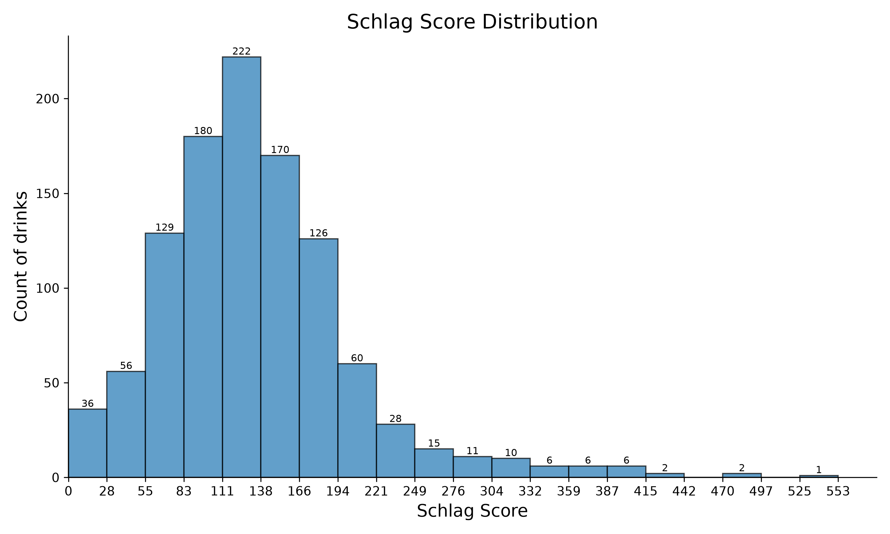

# Schlag Score Reference

This repository provides a ranking of the *schlag score* for a set of drinks available in Belgium. 

The *schlag score* is a scoring system for alcoholic drinks and gives an estimation of what could roughly be described as "the best bang for your buck" for alcohol. 
The score is computed as follows:

$$ \text{score} = \frac{\text{alcohol percentage } \times \text{ volume in cl}}{\text{price}} $$

The attribution of this formula is still unclear to this day.

For a practical application of this score, we recommend the following video [TOURNOI DES BIÈRES DE CLODO - Une bière et Jivay 129](https://www.youtube.com/watch?v=qABTb-Ydq18) (video in French).

## Dataset

The data used for this analysis is extracted for the website of Colruyt for their shop located in Halle, Belgium. 
The data was extracted on June 21st, 2026. 
Price may have changed since the data collection. 
The ranking did not take into account any discount that was applied.

We extracted data from the following product categories:
- Drinks (alcoholic and non-alcoholic)
- Wine

The data contains 1066 alcoholic drinks (against 523 in June 2025), out of 1984 collected products.
The last one is listed as 0,0% alcohol but actually contains 0,01% alcohol and is therefore included in the ranking.

## Ranking

Evolution since June 2025:  
🟰 same rank  
🔺 better rank    
🔻 worse rank   
🌟 new product  

| Rank   | Score | Product                                                                             |
|--------|-------|-------------------------------------------------------------------------------------|
| 🌟 #1  | 552.8 | LE VA ET VIN Blanc 75cl (https://www.colruyt.be/fr/produits/22776)                  |
| 🟰 #2  | 478.3 | CARA Pils 4,4% canette 50cl (https://www.colruyt.be/fr/produits/5341)               |
| 🔻 #3  | 477.5 | CARA Blond Strong 8,5% can 33cl (https://www.colruyt.be/fr/produits/6644)           |
| 🌟 #4  | 441.7 | LE VA ET VIN Blanc BIB 3L (https://www.colruyt.be/fr/produits/17363)                |
| 🌟 #5  | 433.3 | SOUBIRAC Espagne rouge BIB 5L (https://www.colruyt.be/fr/produits/17006)            |
| 🔻 #6  | 409.5 | MARIE GALANTE Puerto Galero rouge 19% 3L (https://www.colruyt.be/fr/produits/19009) |
| 🌟 #7  | 406.4 | LE VA ET VIN Rouge BIB 3L (https://www.colruyt.be/fr/produits/14801)                |
| 🔻 #8  | 401.7 | CARA Pils 4,7% bac 24x25cl (https://www.colruyt.be/fr/produits/5001)                |
| 🌟 #9  | 400.0 | SOUBIRAC Espagne rosé BIB 5L (https://www.colruyt.be/fr/produits/17065)             |
| 🔻 #10 | 396.8 | CARA Rouge Strong 7,5% can 33cl (https://www.colruyt.be/fr/produits/7762)           |
| 🌟 #11 | 390.4 | DUC DE LERME Chardonay-Viognier BIB 3L (https://www.colruyt.be/fr/produits/40583)   |
| 🔻 #12 | 372.9 | CARA Pils 4,4% canette 33cl (https://www.colruyt.be/fr/produits/5383)               |
| 🌟 #13 | 371.4 | BLYGEDACHT Afrique du Sud rouge BIB 5L (https://www.colruyt.be/fr/produits/18095)   |
| 🔻 #14 | 361.4 | MARIA JOLA Sangria Rouge 6% 1,5L (https://www.colruyt.be/fr/produits/39306)         |
| 🔻 #15 | 360.9 | MARIE GALANTE Bianco 14,4% 1L (https://www.colruyt.be/fr/produits/37478)            |
| 🔻 #16 | 360.9 | MARIE GALANTE Rosso 14,4% 1L (https://www.colruyt.be/fr/produits/37480)             |
| 🌟 #17 | 360.4 | SOUBIRAC Blanc de Blancs BIB 5L (https://www.colruyt.be/fr/produits/17063)          |
| 🔺 #18 | 353.7 | TOUT BIEN Av. Belgian pils 5,2% can 33cl (https://www.colruyt.be/fr/produits/22042) |
| 🌟 #19 | 345.0 | KALAMUNDI Shiraz Caber-Sauv.rouge BIB 3L (https://www.colruyt.be/fr/produits/5136)  |
| 🌟 #20 | 340.1 | DUC DE LERME Cabernet-Syrah rouge BIB 3L (https://www.colruyt.be/fr/produits/38781) |
| 🌟 #21 | 338.3 | BISSON Côtes du Rhône 75cl (https://www.colruyt.be/fr/produits/6896)                |
| 🌟 #22 | 337.5 | Batedor Portugal BIB 3L (https://www.colruyt.be/fr/produits/7695)                   |
| 🔻 #23 | 335.5 | MAES pils 5,2% bac 24x25cl (https://www.colruyt.be/fr/produits/5016)                |
| 🌟 #24 | 328.9 | BLYGEDACHT Afrique du sud rosé BIB 3L (https://www.colruyt.be/fr/produits/14197)    |
| 🔺 #25 | 327.0 | TOUT BIEN Rouge 6,9% 33cl (https://www.colruyt.be/fr/produits/7093)                 |

Rank 25+

| Rank     | Score | Product                                                                             |
|----------|-------|-------------------------------------------------------------------------------------|
| 🌟 #26   | 325.0 | KALAMUNDI Chardonnay blanc BIB 3L (https://www.colruyt.be/fr/produits/17224)        |
| 🌟 #27   | 316.4 | VINO SENTADA Argentine rouge BIB 3L (https://www.colruyt.be/fr/produits/7446)       |
| 🌟 #28   | 313.3 | Montepulciano d'Abruzzo 75cl (https://www.colruyt.be/fr/produits/5642)              |
| 🌟 #29   | 312.5 | BLYGEDACHT Afrique du Sud blanc BIB 3L (https://www.colruyt.be/fr/produits/17240)   |
| 🌟 #30   | 312.5 | CORDILLERA Chili rouge BIB 5L (https://www.colruyt.be/fr/produits/17999)            |
| 🌟 #31   | 311.8 | Puglia Rosso IGT BIB 3L (https://www.colruyt.be/fr/produits/7870)                   |
| 🌟 #32   | 309.5 | VINO SENTADA Argentinië blanc BIB 3L (https://www.colruyt.be/fr/produits/17355)     |
| 🌟 #33   | 305.2 | AOP Bordeaux rouge 75cl (https://www.colruyt.be/fr/produits/4595)                   |
| 🌟 #34   | 303.5 | MARIE GALANTE Porto Ruby 19,0% 75cl (https://www.colruyt.be/fr/produits/24317)      |
| 🌟 #35   | 303.5 | MARIE GALANTE Porto White 19% 75cl (https://www.colruyt.be/fr/produits/29437)       |
| 🔺 #36   | 303.0 | CRISTAL pils 5.0%vol 24x25cl (https://www.colruyt.be/fr/produits/5021)              |
| 🌟 #37   | 296.1 | LE CAVALIER-ROI Bordeaux rouge BIB 5L (https://www.colruyt.be/fr/produits/17447)    |
| 🌟 #38   | 295.7 | LE VA ET VIN Rosé demi-sec 75cl (https://www.colruyt.be/fr/produits/40687)          |
| 🌟 #39   | 295.7 | LE VA ET VIN Rouge 75cl (https://www.colruyt.be/fr/produits/22538)                  |
| 🌟 #40   | 290.3 | IL GRAN GIARDINO Sicile rouge Bio BIB 3L (https://www.colruyt.be/fr/produits/41731) |
| 🌟 #41   | 284.0 | LES BÉCASSES Corbieres AOP BIB 3L (https://www.colruyt.be/fr/produits/41148)        |
| 🔻 #42   | 282.0 | MARIE GALANTE Sherry Fino Dry 15% 75cl (https://www.colruyt.be/fr/produits/12483)   |
| 🌟 #43   | 279.0 | Tocornal Sauvignon Chili blanc 75cl (https://www.colruyt.be/fr/produits/35241)      |
| 🌟 #44   | 279.0 | BANROCK ST. Chardonnay-Verdelho 75cl (https://www.colruyt.be/fr/produits/7169)      |
| 🔻 #45   | 272.7 | MARIA JOLA Sangria blanche 6% 1,5L (https://www.colruyt.be/fr/produits/39305)       |
| 🌟 #46   | 268.8 | IL GRAN GIARDINO Sicile blanc Bio BIB 3L (https://www.colruyt.be/fr/produits/41312) |
| 🌟 #47   | 267.7 | DUC DE LERME Cinsault-Grenache BIB 3L (https://www.colruyt.be/fr/produits/26363)    |
| 🔻 #48   | 263.8 | 8.6 Extreme 10,5% canette 50cl (https://www.colruyt.be/fr/produits/8051)            |
| 🌟 #49   | 263.2 | DUC DE LERME Merlot IGP Pays d'Oc 75cl (https://www.colruyt.be/fr/produits/1713)    |
| 🌟 #50   | 263.2 | BANROCK ST. Reserve Cabarnet-Shiraz 75cl (https://www.colruyt.be/fr/produits/38777) |
| 🌟 #51   | 262.7 | LES HAUTS ROCS La Roubine rouge BIB 3L (https://www.colruyt.be/fr/produits/17248)   |
| 🌟 #52   | 257.0 | Puglia Rosato Negro Amaro BIB 3L (https://www.colruyt.be/fr/produits/12168)         |
| 🌟 #53   | 256.0 | J. EGBERTS Liebfraumilch 75cl (https://www.colruyt.be/fr/produits/17696)            |
| 🔻 #54   | 254.8 | BUSH Caractère 12,0%vol 6x33cl (https://www.colruyt.be/fr/produits/38087)           |
| 🌟 #55   | 253.8 | Robb's chardonnay W.O Robertson (https://www.colruyt.be/fr/produits/18779)          |
| 🌟 #56   | 253.8 | ALPACA Carmenère Chili rouge 75cl (https://www.colruyt.be/fr/produits/15558)        |
| 🌟 #57   | 253.8 | CROIX DES VIGNES Languedoc rouge 75cl (https://www.colruyt.be/fr/produits/40509)    |
| 🌟 #58   | 253.8 | DUC DE LERME Chardonnay Pays d'Oc 75cl (https://www.colruyt.be/fr/produits/32317)   |
| 🌟 #59   | 250.0 | CORDILLERA Chili blanc BIB 3L (https://www.colruyt.be/fr/produits/17998)            |
| 🌟 #60   | 246.7 | NODO PIANO Vino da Tavola Bianco 75cl (https://www.colruyt.be/fr/produits/41341)    |
| 🌟 #61   | 244.4 | ALPACA Cabernet Sauvignon Chili 75cl (https://www.colruyt.be/fr/produits/24778)     |
| 🌟 #62   | 244.4 | Nero d'Avola DOC Sicilia 75cl (https://www.colruyt.be/fr/produits/7882)             |
| 🔻 #63   | 240.7 | MAES pils 5,2% canette 50cl (https://www.colruyt.be/fr/produits/5183)               |
| 🌟 #64   | 240.1 | MARIE GALANTE Gin 38% 70cl (https://www.colruyt.be/fr/produits/30294)               |
| 🌟 #65   | 240.0 | Pinot Luxembourg blanc BIB 3L (https://www.colruyt.be/fr/produits/41848)            |
| 🌟 #66   | 238.9 | MARIE GALANTE vodka 37,5% 70cl (https://www.colruyt.be/fr/produits/17195)           |
| 🔻 #67   | 235.9 | GRIMBERGEN bière abb.blonde 6,7% 8x33cl (https://www.colruyt.be/fr/produits/6697)   |
| 🌟 #68   | 235.0 | DUC DE LERME Sauvignon 75cl (https://www.colruyt.be/fr/produits/42437)              |
| 🌟 #69   | 235.0 | BLYGEDACHT Sauvignon Afrique du Sud 75cl (https://www.colruyt.be/fr/produits/42451) |
| 🌟 #70   | 234.5 | LES HAUTS ROCS Ventoux rosé BIB 3L (https://www.colruyt.be/fr/produits/17251)       |
| 🌟 #71   | 234.5 | MASQUENADA Mac-Sauv.Espag.Bio Pouch 1,5L (https://www.colruyt.be/fr/produits/18030) |
| 🔻 #72   | 234.2 | MAES pils 5,2% can 33cl (https://www.colruyt.be/fr/produits/5267)                   |
| 🌟 #73   | 233.7 | Château Agram Corbières AOP 75cl (https://www.colruyt.be/fr/produits/14499)         |
| 🌟 #74   | 232.7 | LES HAUTS ROCS C. du Rhône Villages 75cl (https://www.colruyt.be/fr/produits/32677) |
| 🌟 #75   | 230.4 | JP. CHENET Cabernet-Syrah Pouch 1,5L (https://www.colruyt.be/fr/produits/28729)     |
| 🔻 #76   | 229.6 | POSTEL bière abb. triple 8,7% 6x33cl (https://www.colruyt.be/fr/produits/5026)      |
| 🌟 #77   | 228.7 | FLYING FISH Bière citron 5,9% 6x33cl (https://www.colruyt.be/fr/produits/40655)     |
| 🌟 #78   | 227.3 | Chardonnay Sauvignon Bulgarie Boyar 75cl (https://www.colruyt.be/fr/produits/17149) |
| 🔻 #79   | 226.5 | GRIMBERGEN bière abb.double 6,5% 8x33cl (https://www.colruyt.be/fr/produits/6694)   |
| 🌟 #80   | 225.6 | DUC DE LERME Rosé 75cl (https://www.colruyt.be/fr/produits/8989)                    |
| 🌟 #81   | 225.6 | LILY Western Cape rosé 75cl (https://www.colruyt.be/fr/produits/14472)              |
| 🌟 #82   | 225.2 | CHÂTEAU CRILLON Ventoux rouge 75cl (https://www.colruyt.be/fr/produits/30251)       |
| 🌟 #83   | 225.1 | Diable rosé BIB 3L (https://www.colruyt.be/fr/produits/7428)                        |
| 🔺 #84   | 225.1 | CUVÉE DES TROLLS 7% 6x33cl (https://www.colruyt.be/fr/produits/21513)               |
| 🌟 #85   | 222.9 | BUSH triple 10,5%vol 6x33cl (https://www.colruyt.be/fr/produits/13223)              |
| 🔻 #86   | 222.4 | NOLENS Hasseltse graanjenever 30% 1L (https://www.colruyt.be/fr/produits/18725)     |
| 🌟 #87   | 221.6 | LE CENGE Garganega IGT Veneto 75cl (https://www.colruyt.be/fr/produits/42290)       |
| 🔻 #88   | 220.7 | MARIE GALANTE pastis 40% 1L (https://www.colruyt.be/fr/produits/16489)              |
| 🔻 #89   | 219.4 | PORTO AMURO Tawny Connaisseurs 19% 1,5L (https://www.colruyt.be/fr/produits/19037)  |
| 🌟 #90   | 218.9 | MARIE GALANTE Rhum brun 37,5% 70cl (https://www.colruyt.be/fr/produits/4546)        |
| 🌟 #91   | 218.9 | Entre-Deux-Mers blanc 75cl (https://www.colruyt.be/fr/produits/6273)                |
| 🔻 #92   | 218.5 | VICTORIA blonde 8,5% 6x33cl (https://www.colruyt.be/fr/produits/23131)              |
| 🔻 #93   | 217.4 | POSTEL bière abb. double 7,0%vol 6x33cl (https://www.colruyt.be/fr/produits/5025)   |
| 🌟 #94   | 217.0 | Quinta Vista Reserva "Lisboa" Rouge 75cl (https://www.colruyt.be/fr/produits/43697) |
| 🔻 #95   | 217.0 | MARIE GALANTE vieux genièvre 35% 1L (https://www.colruyt.be/fr/produits/2768)       |
| 🔻 #96   | 216.7 | POSTEL bière abb. blonde 7,0%vol 6x33cl (https://www.colruyt.be/fr/produits/5024)   |
| 🔻 #97   | 216.7 | MAES Pils 5,2% bac 24x33cl (https://www.colruyt.be/fr/produits/23933)               |
| 🔻 #98   | 214.4 | KASTEEL bière foncée 11,0%vol 6x33cl (https://www.colruyt.be/fr/produits/5277)      |
| 🔻 #99   | 214.4 | KASTEEL bière blonde triple 11% 6x33cl (https://www.colruyt.be/fr/produits/5198)    |
| 🌟 #100  | 213.9 | MARIE GALANTE Scotch Whisky 40% 70cl (https://www.colruyt.be/fr/produits/30141)     |
| 🌟 #101  | 213.9 | LE PRÉ CLOS Sauvignon Loire BIB 3L (https://www.colruyt.be/fr/produits/21243)       |
| 🌟 #102  | 213.4 | LE PLUS DE LUZANET BIB 3L (https://www.colruyt.be/fr/produits/45712)                |
| 🌟 #103  | 213.3 | VIÑA TARAPACÁ Sauvignon Chili 75cl (https://www.colruyt.be/fr/produits/17206)       |
| 🌟 #104  | 213.3 | PETIT BISTRO Syrah-Pinot Noir pouch 1,5L (https://www.colruyt.be/fr/produits/16137) |
| 🌟 #105  | 213.3 | PETIT BISTRO Viognier-Rolle pouch 1,5L (https://www.colruyt.be/fr/produits/13827)   |
| 🔻 #106  | 213.1 | JUPILER Pils 5,2% bac 24x33cl (https://www.colruyt.be/fr/produits/5037)             |
| 🔻 #107  | 213.0 | WESTMALLE trappiste trip. 9,5%vol 6x33cl (https://www.colruyt.be/fr/produits/14234) |
| 🌟 #108  | 212.5 | VITTORE Moscatel de Valencia 15% 75cl (https://www.colruyt.be/fr/produits/39827)    |
| 🌟 #109  | 211.3 | COCKBURN'S Fine White Port 19% 1L (https://www.colruyt.be/fr/produits/28065)        |
| 🔻 #110  | 210.6 | WESTMALLE trappiste trip.9,5%vol 24x33cl (https://www.colruyt.be/fr/produits/5072)  |
| 🌟 #111  | 210.2 | VIÑA TARAPACÁ Rosé Chili 75cl (https://www.colruyt.be/fr/produits/32702)            |
| 🌟 #112  | 210.2 | LES HAUTS ROCS Côtes du Rhône 75cl (https://www.colruyt.be/fr/produits/15051)       |
| 🌟 #113  | 210.2 | Rioja Torrealdea Crianza 75cl (https://www.colruyt.be/fr/produits/17146)            |
| 🔻 #114  | 209.8 | 8.6 Original 8,6% canette 50cl (https://www.colruyt.be/fr/produits/8496)            |
| 🌟 #115  | 208.7 | NODO PIANO Vino da Tavola Rosato 75cl (https://www.colruyt.be/fr/produits/41343)    |
| 🌟 #116  | 208.7 | VIÑA TARAPACÁ Merlot Chili 75cl (https://www.colruyt.be/fr/produits/17211)          |
| 🌟 #117  | 207.3 | Los Condes Gran Res. Pla de Bages 75cl (https://www.colruyt.be/fr/produits/17738)   |
| 🌟 #118  | 207.2 | A La Bonne Heure Roussilon Village 75cl (https://www.colruyt.be/fr/produits/40396)  |
| 🌟 #119  | 205.7 | Don Cristobal 1492 Argentine rouge 75cl (https://www.colruyt.be/fr/produits/6178)   |
| 🔻 #120  | 204.9 | CRISTAL pils 5,0% 6x25cl (https://www.colruyt.be/fr/produits/19149)                 |
| 🌟 #121  | 204.8 | MASQUENADA Rosé Espagne Bio Pouch 1,5L (https://www.colruyt.be/fr/produits/1318)    |
| 🌟 #122  | 202.7 | Les Trois Colonnes Rosé 75cl (https://www.colruyt.be/fr/produits/17497)             |
| 🌟 #123  | 202.7 | Mont Tauch AOP Fitou 75cl (https://www.colruyt.be/fr/produits/38595)                |
| 🔻 #124  | 201.9 | CORNET Oaked blonde 8,5% 6x33cl (https://www.colruyt.be/fr/produits/42275)          |
| 🔻 #125  | 201.6 | STELLA ARTOIS pils 5,2% 24x33cl (https://www.colruyt.be/fr/produits/31238)          |
| 🔺 #126  | 201.1 | WESTMALLE trappiste doub.7,0%vol 24x33cl (https://www.colruyt.be/fr/produits/5071)  |
| 🌟 #127  | 200.5 | COLBELLO Lambrusco Rosato8,0% 75cl (https://www.colruyt.be/fr/produits/39510)       |
| 🌟 #128  | 200.5 | COLBELLO Lambrusco Rosso8,0% 75cl (https://www.colruyt.be/fr/produits/39018)        |
| 🌟 #129  | 200.3 | Tocornal Merlot Chili rouge 75cl (https://www.colruyt.be/fr/produits/42454)         |
| 🌟 #130  | 199.7 | QUINTA VISTA Reserva Lisboa blanc 75cl (https://www.colruyt.be/fr/produits/38705)   |
| 🌟 #131  | 199.7 | TERREFORT Cahors 75cl (https://www.colruyt.be/fr/produits/32814)                    |
| 🌟 #132  | 199.7 | DOM.SAINT-ANDRÉ rosé IGP d'Oc 75cl (https://www.colruyt.be/fr/produits/6929)        |
| 🔻 #133  | 198.2 | LEFFE bière abbaye blonde 6,6% 8x33cl (https://www.colruyt.be/fr/produits/5170)     |
| 🔻 #134  | 197.9 | CORSENDONK Agnus triple 7,5% 6x33cl (https://www.colruyt.be/fr/produits/5252)       |
| 🔻 #135  | 197.2 | LA TRAPPE Quadrupel 6x33cl (https://www.colruyt.be/fr/produits/17205)               |
| 🌟 #136  | 197.2 | Bois des Brandes Blaye Cotes de Bdx 75cl (https://www.colruyt.be/fr/produits/32665) |
| 🔻 #137  | 197.0 | JUPILER Pils 5,2% canette 50cl (https://www.colruyt.be/fr/produits/19630)           |
| 🔻 #138  | 196.6 | WESTMALLE trappiste doub. 7,0%vol 6x33cl (https://www.colruyt.be/fr/produits/12298) |
| 🔻 #139  | 196.1 | MARIE GALANTE Triple Sec 35% 70cl (https://www.colruyt.be/fr/produits/21407)        |
| 🌟 #140  | 195.9 | Bergerac Domaine de la Grande Vigne 75cl (https://www.colruyt.be/fr/produits/12795) |
| 🌟 #141  | 195.2 | Tocornal Chardonnay Chili blanc 75cl (https://www.colruyt.be/fr/produits/14420)     |
| 🌟 #142  | 195.2 | Evidanse Chardonnay IGP OC Bio 75cl (https://www.colruyt.be/fr/produits/40438)      |
| 🌟 #143  | 195.2 | LA FANFINETTE Côtes du Rhône blanc 75cl (https://www.colruyt.be/fr/produits/8041)   |
| 🌟 #144  | 195.2 | Groot Genoegen Cinsaut-Cabernet 75cl (https://www.colruyt.be/fr/produits/17104)     |
| 🔻 #145  | 194.8 | JUPILER pils 5,2% bac 24x25cl (https://www.colruyt.be/fr/produits/5030)             |
| 🔻 #146  | 194.8 | STELLA ARTOIS pils 5,2% bac 24x25cl (https://www.colruyt.be/fr/produits/5006)       |
| 🌟 #147  | 193.7 | Saint-André IGP Pays d'Oc Viognier 75cl (https://www.colruyt.be/fr/produits/9202)   |
| 🔺 #148  | 193.3 | ST FEUILLIEN blonde 7,5% 6x33cl (https://www.colruyt.be/fr/produits/6966)           |
| 🌟 #149  | 192.0 | Combe d'Or Bordeaux moelleux 75cl (https://www.colruyt.be/fr/produits/30855)        |
| 🔻 #150  | 191.3 | GULDEN DRAAK Classic 10,5% 6x33cl (https://www.colruyt.be/fr/produits/5345)         |
| 🌟 #151  | 191.2 | Torino Torrontes Argentinië 75cl (https://www.colruyt.be/fr/produits/17207)         |
| 🔻 #152  | 190.6 | KEYTE Oostendse tripel 7,7% 6x33cl (https://www.colruyt.be/fr/produits/18061)       |
| 🌟 #153  | 190.4 | CH. COMMANDERIE Bordeaux 75cl (https://www.colruyt.be/fr/produits/32671)            |
| 🔻 #154  | 190.4 | SMIRNOFF vodka 37,5% 70cl (https://www.colruyt.be/fr/produits/18810)                |
| 🔻 #155  | 190.2 | AMURO Ruby 19% 75cl (https://www.colruyt.be/fr/produits/19043)                      |
| 🔻 #156  | 190.2 | AMURO White 19% 75cl (https://www.colruyt.be/fr/produits/19041)                     |
| 🌟 #157  | 189.7 | LEFFE Blonde 6,6% Cold Grip can 50cl (https://www.colruyt.be/fr/produits/40659)     |
| 🔻 #158  | 189.3 | DUVEL Blonde 8,5% bac 24x33cl (https://www.colruyt.be/fr/produits/5099)             |
| 🔻 #159  | 188.7 | LE FORT bière brune 10% 6x33cl (https://www.colruyt.be/fr/produits/8636)            |
| 🔻 #160  | 188.4 | PRIMUS Pils 5,2% 24x25cl (https://www.colruyt.be/fr/produits/5015)                  |
| 🌟 #161  | 188.0 | Portuguese rosé 75cl (https://www.colruyt.be/fr/produits/17170)                     |
| 🌟 #162  | 187.8 | Pinot blanc Alsace 75cl (https://www.colruyt.be/fr/produits/16262)                  |
| 🌟 #163  | 187.7 | LES HAUTS ROCS Rosé du Ventoux 75cl (https://www.colruyt.be/fr/produits/40488)      |
| 🌟 #164  | 187.7 | WINZER KREMS Grüner Veltliner 75cl (https://www.colruyt.be/fr/produits/17773)       |
| 🔻 #165  | 187.6 | HAPKIN bière blonde 8,5%vol 6x33cl (https://www.colruyt.be/fr/produits/5159)        |
| 🌟 #166  | 187.6 | TRIPEL LEFORT Blonde 8,8% 6x33cl (https://www.colruyt.be/fr/produits/6991)          |
| 🌟 #167  | 187.6 | LE PRÉ CLOS Anjou BIB 3L (https://www.colruyt.be/fr/produits/2205)                  |
| 🔻 #168  | 187.2 | DUVEL Bière blonde 8,5% 8x33cl (https://www.colruyt.be/fr/produits/31668)           |
| 🌟 #169  | 187.2 | DUVEL Bière blonde 8,5% 12x33cl (https://www.colruyt.be/fr/produits/4236)           |
| 🔻 #170  | 186.8 | LEFFE Prestige 8,5% 6x33cl (https://www.colruyt.be/fr/produits/2987)                |
| 🔻 #171  | 186.7 | SIR EDWARD'S Scotch Whisky 40% 70cl (https://www.colruyt.be/fr/produits/40411)      |
| 🔻 #172  | 186.7 | CHIMAY trappiste bleue 9,0%vol 8x33cl (https://www.colruyt.be/fr/produits/1114)     |
| 🌟 #173  | 186.0 | LE CAVALIER-ROI Bordeaux rouge 75cl (https://www.colruyt.be/fr/produits/32663)      |
| 🔻 #174  | 185.3 | MARIE GALANTE Bourbon 40% 70cl (https://www.colruyt.be/fr/produits/12926)           |
| 🔺 #175  | 184.8 | ST FEUILLIEN Triple 8,5% 6x33cl (https://www.colruyt.be/fr/produits/23064)          |
| 🔻 #176  | 184.5 | ST BERNARDUS Abt 12 6x33cl (https://www.colruyt.be/fr/produits/40567)               |
| 🌟 #177  | 184.4 | HARDY'S Stamp Cabernet-Merlot 75cl (https://www.colruyt.be/fr/produits/17268)       |
| 🌟 #178  | 184.4 | HARDY'S Stamps Caber./Shiraz rouge 75cl (https://www.colruyt.be/fr/produits/17420)  |
| 🌟 #179  | 184.4 | Gardian Rouge Côtes de Béziers 75cl (https://www.colruyt.be/fr/produits/28538)      |
| 🌟 #180  | 184.1 | Dordonia 24 IGP Périgord 75cl (https://www.colruyt.be/fr/produits/31869)            |
| 🔻 #181  | 184.1 | ST FEUILLIEN Grand Cru 9,5%vol 6x33cl (https://www.colruyt.be/fr/produits/42735)    |
| 🌟 #182  | 184.0 | KWAREMONT Triple 9%+verre gratuit 4x33cl (https://www.colruyt.be/fr/produits/41509) |
| 🔻 #183  | 184.0 | MARTHA Brown Eyes 12% 6x33cl (https://www.colruyt.be/fr/produits/5463)              |
| 🌟 #184  | 184.0 | KWAREMONT Triple 9% 4x33cl (https://www.colruyt.be/fr/produits/40446)               |
| 🌟 #185  | 183.7 | TERREFORT Côtes de Gascogne 75cl (https://www.colruyt.be/fr/produits/13688)         |
| 🌟 #186  | 183.6 | Luzanet VDP de Gascogne 75cl (https://www.colruyt.be/fr/produits/19810)             |
| 🌟 #187  | 183.5 | VICTOR PREISS Sylvaner Alsace Trad. 75cl (https://www.colruyt.be/fr/produits/17656) |
| 🔻 #188  | 182.4 | GORDON Finest Platinum 12%vol can 50cl (https://www.colruyt.be/fr/produits/5114)    |
| 🌟 #189  | 182.1 | Madiran Réserve Tuguets 75cl (https://www.colruyt.be/fr/produits/17275)             |
| 🌟 #190  | 181.8 | Pecorino Cantina Apelio 75cl (https://www.colruyt.be/fr/produits/1429)              |
| 🌟 #191  | 181.8 | LOS CONDES Vin blanc 75cl (https://www.colruyt.be/fr/produits/28839)                |
| 🌟 #192  | 181.8 | LE CENGE Custoza Bianco 75cl (https://www.colruyt.be/fr/produits/41531)             |
| 🌟 #193  | 181.5 | LES HAUTS ROCS Côtes du Rhône Bio 75cl (https://www.colruyt.be/fr/produits/32818)   |
| 🔺 #194  | 181.3 | ENAME Bière abbaye blonde 6,5% 6x33cl (https://www.colruyt.be/fr/produits/5369)     |
| 🌟 #195  | 181.2 | Rio Belo Portugal Douro D.O.C Rouge 75cl (https://www.colruyt.be/fr/produits/15327) |
| 🔻 #196  | 181.2 | POLIAKOV Vodka 37,5% 70cl (https://www.colruyt.be/fr/produits/7856)                 |
| 🌟 #197  | 181.0 | PLAIMONT Diable Rouge AOC St-Mont 75cl (https://www.colruyt.be/fr/produits/17031)   |
| 🌟 #198  | 180.8 | Granbeau Gren. Noir IGP Pays d'Oc 75cl (https://www.colruyt.be/fr/produits/40440)   |
| 🔻 #199  | 180.2 | MIGUEL FUERTE Sangria rouge 6% BIB 3L (https://www.colruyt.be/fr/produits/39303)    |
| 🔻 #200  | 180.2 | MIGUEL FUERTE Sangria rosé 6% BIB 3L (https://www.colruyt.be/fr/produits/39295)     |
| 🌟 #201  | 180.2 | BARDOLINO CHIARETTO rosé 75cl (https://www.colruyt.be/fr/produits/42404)            |
| 🔻 #202  | 180.1 | LEFFE bière abbaye brune 6,5% 8x33cl (https://www.colruyt.be/fr/produits/5171)      |
| 🔻 #203  | 179.9 | TRIPEL KARMELIET Blonde 8,4% 12x25cl (https://www.colruyt.be/fr/produits/2926)      |
| 🔻 #204  | 179.9 | CRISTAL Pils 5% can 33cl (https://www.colruyt.be/fr/produits/5663)                  |
| 🌟 #205  | 179.5 | Alibi Vinho Regional Alentejano R 75cl (https://www.colruyt.be/fr/produits/15345)   |
| 🌟 #206  | 179.4 | OMER Blonde 8% 6x33cl (https://www.colruyt.be/fr/produits/6985)                     |
| 🔻 #207  | 179.3 | TRAP.ROCHEFORT 8 9,2%vol 4x33cl (https://www.colruyt.be/fr/produits/8042)           |
| 🔻 #208  | 178.7 | TRIPEL KARMELIET Blonde 8,4% 6x33cl (https://www.colruyt.be/fr/produits/10478)      |
| 🔻 #209  | 178.2 | COCKBURN'S Fine Ruby Port 19,0%vol 75cl (https://www.colruyt.be/fr/produits/38405)  |
| 🔻 #210  | 178.1 | STELLA ARTOIS Pils 5,2% canette 50cl (https://www.colruyt.be/fr/produits/19797)     |
| 🌟 #211  | 177.9 | CODICE VINO Tierra de Castilla 75cl (https://www.colruyt.be/fr/produits/4494)       |
| 🌟 #212  | 177.9 | Primitivo Puglia IGT 75cl (https://www.colruyt.be/fr/produits/17276)                |
| 🌟 #213  | 177.6 | Gardian Blanc Côtes de Béziers 75cl (https://www.colruyt.be/fr/produits/1970)       |
| 🔻 #214  | 177.6 | TRIPEL KARMELIET 24x33cl (https://www.colruyt.be/fr/produits/5050)                  |
| 🔻 #215  | 177.5 | GOUDEN CAROLUS Whisky Inf. 11.7% 4x33cl (https://www.colruyt.be/fr/produits/16647)  |
| 🔻 #216  | 177.4 | OMER Blonde 8% 24x33cl (https://www.colruyt.be/fr/produits/17641)                   |
| 🔻 #217  | 177.3 | GORDON Finest Gold 10% can 33cl (https://www.colruyt.be/fr/produits/5307)           |
| 🔻 #218  | 177.3 | alcool pur 96,0%vol 1L (https://www.colruyt.be/fr/produits/18700)                   |
| 🔻 #219  | 177.0 | CHIMAY trappiste triple 8% 6x33cl (https://www.colruyt.be/fr/produits/5236)         |
| 🔻 #220  | 176.7 | DELIRIUM TREMENS 8,5%+verre 6x33cl (https://www.colruyt.be/fr/produits/10245)       |
| 🔻 #221  | 176.7 | DELIRIUM TREMENS Bière blonde8,5% 6x33cl (https://www.colruyt.be/fr/produits/5324)  |
| 🔻 #222  | 176.5 | LEFFE bière abb.blonde 6,6% bac 24x33cl (https://www.colruyt.be/fr/produits/5077)   |
| 🌟 #223  | 176.3 | CASA MAYOR Chili Chardonnay 75cl (https://www.colruyt.be/fr/produits/17201)         |
| 🌟 #224  | 176.3 | Hardys Nottage Hill Chardonnay 75cl (https://www.colruyt.be/fr/produits/6864)       |
| 🌟 #225  | 176.3 | CASA MAYOR Carmenere Old Vines 75cl (https://www.colruyt.be/fr/produits/17217)      |
| 🔻 #226  | 176.2 | KWAK rouge 8% 6x33cl (https://www.colruyt.be/fr/produits/28510)                     |
| 🌟 #227  | 175.2 | CHÂTEAU HAUT GAY Bordeaux Supérieur 75cl (https://www.colruyt.be/fr/produits/24340) |
| 🌟 #228  | 175.2 | EMILIANA Adobe Malbec Reserva Bio 75cl (https://www.colruyt.be/fr/produits/40507)   |
| 🔻 #229  | 175.1 | SMEETS genièvre grain extra 35% 1L (https://www.colruyt.be/fr/produits/18726)       |
| 🔻 #230  | 175.1 | SAN GIORGIO Amaretto 25% 70cl (https://www.colruyt.be/fr/produits/43230)            |
| 🔻 #231  | 175.1 | GIN MG London Dry Gin 37,5% 70cl (https://www.colruyt.be/fr/produits/40183)         |
| 🔻 #232  | 175.1 | GIN MG Pink Gin 37,5% 70cl (https://www.colruyt.be/fr/produits/16403)               |
| 🔻 #233  | 174.5 | BAVIK Super pils 5,2% can 33cl (https://www.colruyt.be/fr/produits/26159)           |
| 🔻 #234  | 174.0 | LABEL 5 whisky Classic Black 40% 70cl (https://www.colruyt.be/fr/produits/7970)     |
| 🔻 #235  | 173.9 | JUPILER Pils 5,2% canette 35,5cl (https://www.colruyt.be/fr/produits/19308)         |
| 🔻 #236  | 173.3 | LEFFE bière abb.brune 6,5% bac 24x33cl (https://www.colruyt.be/fr/produits/5085)    |
| 🌟 #237  | 173.3 | PRIMUS Pils 5,2% canette 33cl (https://www.colruyt.be/fr/produits/8156)             |
| 🌟 #238  | 173.3 | Seau de bière 2026 max. 10,5% 9x33cl (https://www.colruyt.be/fr/produits/5203)      |
| 🔻 #239  | 173.1 | RICARD pastis de Marseille 45,0%vol 1L (https://www.colruyt.be/fr/produits/18910)   |
| 🌟 #240  | 172.9 | Gracioso Hugo on Ice 75cl (https://www.colruyt.be/fr/produits/11241)                |
| 🌟 #241  | 172.8 | Prince de Coste mousseux 75cl (https://www.colruyt.be/fr/produits/31619)            |
| 🌟 #242  | 172.7 | Côtes de Bergerac blanc demi-sec 75cl (https://www.colruyt.be/fr/produits/4203)     |
| 🔻 #243  | 172.6 | BRUGGE 8,7% 6x33cl (https://www.colruyt.be/fr/produits/5275)                        |
| 🔻 #244  | 172.4 | GORDON Xplosion Peach 11,0%vol can 50cl (https://www.colruyt.be/fr/produits/19213)  |
| 🔻 #245  | 172.0 | LA TRAPPE trappist blond 6,5%vol 6x33cl (https://www.colruyt.be/fr/produits/1464)   |
| 🌟 #246  | 171.0 | Marittimo Pinot Gri.IGP T.Siciliane 75cl (https://www.colruyt.be/fr/produits/1652)  |
| 🌟 #247  | 170.8 | Le Sablou Bergerac Blanc sec 75cl (https://www.colruyt.be/fr/produits/17262)        |
| 🌟 #248  | 170.8 | Le Sablou Bergerac rouge 75cl (https://www.colruyt.be/fr/produits/17241)            |
| 🔻 #249  | 170.6 | MARIE GALANTE Triple Orange 38% 70cl (https://www.colruyt.be/fr/produits/18257)     |
| 🔻 #250  | 170.5 | ERISTOFF Premium Vodka 37,5% 70cl (https://www.colruyt.be/fr/produits/18811)        |
| 🌟 #251  | 170.0 | EL COTO Rosado Rioja 75cl (https://www.colruyt.be/fr/produits/7172)                 |
| 🌟 #252  | 170.0 | CASA MAYOR Chili Cabernet sauvignon 75cl (https://www.colruyt.be/fr/produits/17200) |
| 🔻 #253  | 169.8 | VAL-DIEU bière abbaye triple 9% 6x33cl (https://www.colruyt.be/fr/produits/7779)    |
| 🔻 #254  | 169.5 | DESPERADOS Original 5,9% can 50cl (https://www.colruyt.be/fr/produits/33034)        |
| 🌟 #255  | 169.5 | FLYING FISH Bière citron 5,9% can 50cl (https://www.colruyt.be/fr/produits/40658)   |
| 🌟 #256  | 169.0 | Bicicleta Viognier Chili blanc 75cl (https://www.colruyt.be/fr/produits/39493)      |
| 🌟 #257  | 169.0 | EMILIANA Adobe Chardonnay blanc Bio 75cl (https://www.colruyt.be/fr/produits/18658) |
| 🌟 #258  | 169.0 | Côtes du Rhône Louis Bernard rouge 75cl (https://www.colruyt.be/fr/produits/17038)  |
| 🌟 #259  | 169.0 | Cetus Chardonnay Afrique du Sud 75cl (https://www.colruyt.be/fr/produits/3015)      |
| 🌟 #260  | 169.0 | Dama de Toro barrel aged 75cl (https://www.colruyt.be/fr/produits/24414)            |
| 🌟 #261  | 168.4 | Piemonte Barbera San Silvestro 75cl (https://www.colruyt.be/fr/produits/18111)      |
| 🔻 #262  | 168.1 | ST BERNARDUS Triple 8% 6x33cl (https://www.colruyt.be/fr/produits/1655)             |
| 🔻 #263  | 168.1 | MARIE GALANTE Brandy Napoleon 36% 70cl (https://www.colruyt.be/fr/produits/40879)   |
| 🔻 #264  | 168.0 | MARIE GALANTE Pineau Chare.rosé 17% 75cl (https://www.colruyt.be/fr/produits/41275) |
| 🌟 #265  | 167.6 | PLAIMONT Diable Blanc AOC St-Mont 75cl (https://www.colruyt.be/fr/produits/17061)   |
| 🌟 #266  | 167.4 | FANTINI Primitivo Puglia 75cl (https://www.colruyt.be/fr/produits/12044)            |
| 🌟 #267  | 166.9 | Verso Rosso IGT Salento 75cl (https://www.colruyt.be/fr/produits/17590)             |
| 🔻 #268  | 166.8 | PETERMAN graanjenever 30% 1L (https://www.colruyt.be/fr/produits/18722)             |
| 🔻 #269  | 166.7 | WILLIAM LAWSON'S whisky 40,0% 70cl (https://www.colruyt.be/fr/produits/18047)       |
| 🔻 #270  | 166.7 | HOMMELBIER bière blonde 7,5%vol 8x25cl (https://www.colruyt.be/fr/produits/5276)    |
| 🌟 #271  | 166.7 | Château Haut Belian 75cl (https://www.colruyt.be/fr/produits/9160)                  |
| 🌟 #272  | 166.2 | Chardonnay Jean Balmont 75cl (https://www.colruyt.be/fr/produits/17082)             |
| 🌟 #273  | 166.1 | ADRIAEN BROUWER bière br. 5,0%vol 8x25cl (https://www.colruyt.be/fr/produits/7854)  |
| 🔻 #274  | 165.7 | DESPERADOS Original 5,9% 6x33cl (https://www.colruyt.be/fr/produits/13678)          |
| 🌟 #275  | 165.4 | LA CROIX DE PATY Côtes de Bourg 75cl (https://www.colruyt.be/fr/produits/6322)      |
| 🌟 #276  | 165.2 | Mirestel IGP Gascogne blanc 75cl (https://www.colruyt.be/fr/produits/25922)         |
| 🌟 #277  | 165.2 | VIG.VINSMOSELLE Rivaner 75cl (https://www.colruyt.be/fr/produits/22840)             |
| 🔻 #278  | 164.7 | BLEU D'ARGENT Lond.Dry Gin 40,0%vol 70cl (https://www.colruyt.be/fr/produits/40929) |
| 🌟 #279  | 164.3 | DOM.FRANÇOIS LURTON Là, Là & Là 75cl (https://www.colruyt.be/fr/produits/22450)     |
| 🔻 #280  | 164.1 | OUZO KEFI 37,5% 70cl (https://www.colruyt.be/fr/produits/1559)                      |
| 🌟 #281  | 163.7 | Diable rosé Saint-Mont magnum 1,5L (https://www.colruyt.be/fr/produits/37561)       |
| 🌟 #282  | 162.7 | FANTINI Montepulciano d'Abruzzo 75cl (https://www.colruyt.be/fr/produits/17186)     |
| 🌟 #283  | 162.7 | JP. CHENET Cabernet-Syrah IGP Oc 75cl (https://www.colruyt.be/fr/produits/7382)     |
| 🌟 #284  | 162.7 | Salice Salentino 'Caramia' Cantele 75cl (https://www.colruyt.be/fr/produits/1794)   |
| 🌟 #285  | 162.7 | EMILIANA Adobe Carmenere Chili Bio 75cl (https://www.colruyt.be/fr/produits/18249)  |
| 🔻 #286  | 162.5 | JUPILER Pils 5,2% 6x25cl (https://www.colruyt.be/fr/produits/3734)                  |
| 🔻 #287  | 162.3 | HEINEKEN Pils 5,0% canette 50cl (https://www.colruyt.be/fr/produits/16917)          |
| 🌟 #288  | 162.3 | COMTESSES DU VAL Rosé d'Anjou 75cl (https://www.colruyt.be/fr/produits/6493)        |
| 🌟 #289  | 161.9 | ROODEBERG Western Cape blanc 75cl (https://www.colruyt.be/fr/produits/24308)        |
| 🌟 #290  | 161.6 | MARIE GALANTE Vieille Fine 30% 70cl (https://www.colruyt.be/fr/produits/11804)      |
| 🔻 #291  | 160.9 | DOMECQ Sherry Fino Dry 15% 75cl (https://www.colruyt.be/fr/produits/19044)          |
| 🌟 #292  | 160.9 | Argento Malbec 75cl (https://www.colruyt.be/fr/produits/17257)                      |
| 🌟 #293  | 160.9 | Cuore Mio DOC Brindisi Rosso 75cl (https://www.colruyt.be/fr/produits/38297)        |
| 🔻 #294  | 160.9 | PATER LIEVEN blonde 6,5 % vol 6x33cl (https://www.colruyt.be/fr/produits/19118)     |
| 🔻 #295  | 160.9 | FLORIO Vecchioflorio Marsala 18% 75cl (https://www.colruyt.be/fr/produits/10534)    |
| 🌟 #296  | 160.9 | Diable rose AOC Saint-Mont 75cl (https://www.colruyt.be/fr/produits/14281)          |
| 🌟 #297  | 160.1 | Les Trois Colonnes Bordeaux 75cl (https://www.colruyt.be/fr/produits/17496)         |
| 🌟 #298  | 159.0 | La Rosaline Grenache Syrah rosé 75cl (https://www.colruyt.be/fr/produits/7047)      |
| 🌟 #299  | 159.0 | Coteaux V. Provence 75cl (https://www.colruyt.be/fr/produits/17100)                 |
| 🔻 #300  | 158.9 | MARIE GALANTE Cream liqueur 17% 70cl (https://www.colruyt.be/fr/produits/15952)     |
| 🔻 #301  | 158.5 | PORTO CRUZ Tawny 19,0%vol 75cl (https://www.colruyt.be/fr/produits/23127)           |
| 🔻 #302  | 158.5 | PORTO CRUZ Pink 19% 75cl (https://www.colruyt.be/fr/produits/23126)                 |
| 🔻 #303  | 158.4 | LA CHOUFFE bière blonde 8% 6x33cl (https://www.colruyt.be/fr/produits/38692)        |
| 🔻 #304  | 158.4 | MARIE GALANTE Pisang 15% 70cl (https://www.colruyt.be/fr/produits/12874)            |
| 🌟 #305  | 157.9 | Zeller Schwarze Katz 75cl (https://www.colruyt.be/fr/produits/17700)                |
| 🌟 #306  | 157.1 | RECODA Cava brut 75cl (https://www.colruyt.be/fr/produits/39559)                    |
| 🌟 #307  | 157.1 | RECODA Cava demi sec 75cl (https://www.colruyt.be/fr/produits/39560)                |
| 🔻 #308  | 157.0 | AUGUSTIJN bière blonde 7% 6x33cl (https://www.colruyt.be/fr/produits/5258)          |
| 🌟 #309  | 156.4 | Cot.Aix Provence Vallon des Glauges 75cl (https://www.colruyt.be/fr/produits/17666) |
| 🌟 #310  | 156.4 | Pinot Gris Alsace 75cl (https://www.colruyt.be/fr/produits/40988)                   |
| 🌟 #311  | 156.4 | Verso Rosato IGT Puglia 75cl (https://www.colruyt.be/fr/produits/8452)              |
| 🌟 #312  | 156.4 | Camp.al Moro IGT Toscana Sangiovese 75cl (https://www.colruyt.be/fr/produits/11829) |
| 🌟 #313  | 156.4 | GASTON FÉBUS Jurançon sec 75cl (https://www.colruyt.be/fr/produits/10253)           |
| 🌟 #314  | 156.4 | Montauriol Fronton 75cl (https://www.colruyt.be/fr/produits/17760)                  |
| 🌟 #315  | 156.4 | Oxford Landing Pinot 12.5% 75cl (https://www.colruyt.be/fr/produits/6675)           |
| 🌟 #316  | 156.4 | Beaujolais Nouveau 2025 75cl (https://www.colruyt.be/fr/produits/20384)             |
| 🔻 #317  | 156.2 | MAREDSOUS bière abbaye triple 10% 6x33cl (https://www.colruyt.be/fr/produits/5229)  |
| 🔻 #318  | 155.9 | KASTEEL Rouge 8% 6x33cl (https://www.colruyt.be/fr/produits/5313)                   |
| 🔻 #319  | 155.9 | DE KONINCK tripel d'Anvers 6x33cl (https://www.colruyt.be/fr/produits/21889)        |
| 🔻 #320  | 155.9 | CHIMAY Trappiste rouge 7,0% 6x33cl (https://www.colruyt.be/fr/produits/5495)        |
| 🌟 #321  | 155.9 | Argento Chardonnay 75cl (https://www.colruyt.be/fr/produits/17414)                  |
| 🌟 #322  | 155.9 | Chusclan Bastion du Colombier 75cl (https://www.colruyt.be/fr/produits/17513)       |
| 🌟 #323  | 155.9 | LA PETITE MURAILLE Corbières Bio 75cl (https://www.colruyt.be/fr/produits/39682)    |
| 🌟 #324  | 155.9 | ROODEBERG Western Cape rosé 75cl (https://www.colruyt.be/fr/produits/9297)          |
| 🌟 #325  | 155.9 | CHÂTEAU PILLEBART Bordeaux rosé 75cl (https://www.colruyt.be/fr/produits/40959)     |
| 🔻 #326  | 155.9 | TRAPPISTES ROCHEFORT 10 11,3%vol 6x33cl (https://www.colruyt.be/fr/produits/21104)  |
| 🔻 #327  | 155.6 | JOHNNIE WALKER Red Label 40% 70cl (https://www.colruyt.be/fr/produits/18039)        |
| 🌟 #328  | 155.6 | Dark Horse Zinfandel California 75cl (https://www.colruyt.be/fr/produits/10498)     |
| 🌟 #329  | 155.6 | BIO Château Pauly la Martinette 75cl (https://www.colruyt.be/fr/produits/41996)     |
| 🌟 #330  | 155.6 | ANDRÉ LURTON Les Jardins de Bonnet 75cl (https://www.colruyt.be/fr/produits/39779)  |
| 🌟 #331  | 155.4 | CH.MARGUERITE Fronton rosé Bio 75cl (https://www.colruyt.be/fr/produits/28972)      |
| 🌟 #332  | 155.4 | Verdicchio dei Castelli di Jesi 75cl (https://www.colruyt.be/fr/produits/17096)     |
| 🔻 #333  | 154.9 | CHIMAY trappiste bleue 9,0%vol 24x33cl (https://www.colruyt.be/fr/produits/5094)    |
| 🔻 #334  | 154.8 | OFFLEY Tawny Porto 19,5% 75cl (https://www.colruyt.be/fr/produits/19015)            |
| 🔻 #335  | 154.8 | OFFLEY White Port 19,5% 75cl (https://www.colruyt.be/fr/produits/19017)             |
| 🔻 #336  | 154.6 | GOUDEN CAROLUS Triple 9,0% 4x33cl (https://www.colruyt.be/fr/produits/11865)        |
| 🔻 #337  | 154.4 | GORDON'S London Dry Gin 37,5% 70cl (https://www.colruyt.be/fr/produits/18760)       |
| 🔻 #338  | 153.9 | FILLIERS genièvre grain 30,0%vol 1L (https://www.colruyt.be/fr/produits/18721)      |
| 🌟 #339  | 153.6 | Jean Chardonnay blanc 75cl (https://www.colruyt.be/fr/produits/39392)               |
| 🔻 #340  | 153.1 | SMEETS Hasselt genièvre de grain 30% 1L (https://www.colruyt.be/fr/produits/18727)  |
| 🔻 #341  | 153.1 | J&B Rare Blended Scotch Whisky 40% 70cl (https://www.colruyt.be/fr/produits/18081)  |
| 🌟 #342  | 153.0 | LES HAUTS ROCS CDR Villages Roaix 75cl (https://www.colruyt.be/fr/produits/31519)   |
| 🌟 #343  | 152.6 | Granbeau blanc Oak Aged Gr. Réserve 75cl (https://www.colruyt.be/fr/produits/32432) |
| 🔻 #344  | 152.5 | CORONA Extra 4,5% 6x33cl (https://www.colruyt.be/fr/produits/31796)                 |
| 🔻 #345  | 152.5 | TONGERLO triple bière d'abbaye 9% 6x33cl (https://www.colruyt.be/fr/produits/7974)  |
| 🔻 #346  | 151.8 | CHOUFFE Blonde 8% 24x33cl (https://www.colruyt.be/fr/produits/37874)                |
| 🌟 #347  | 151.5 | Ch. de Pena Côtes Roussillon Vill. 75cl (https://www.colruyt.be/fr/produits/14645)  |
| 🌟 #348  | 151.1 | EL COTO Blanco Rioja 75cl (https://www.colruyt.be/fr/produits/17721)                |
| 🌟 #349  | 151.0 | SAN SILVESTRO Monfer.Nebbiolo rouge 75cl (https://www.colruyt.be/fr/produits/38749) |
| 🔻 #350  | 150.9 | DELIRIUM Red 8%+verre 6x33cl (https://www.colruyt.be/fr/produits/10610)             |
| 🔻 #351  | 150.9 | DELIRIUM Red 8% 6x33cl (https://www.colruyt.be/fr/produits/41787)                   |
| 🔻 #352  | 150.9 | TANQUERAY London Dry Gin 43,1% 70cl (https://www.colruyt.be/fr/produits/7163)       |
| 🔻 #353  | 150.4 | CHOUFFE Blonde 75cl (https://www.colruyt.be/fr/produits/1148)                       |
| 🔻 #354  | 150.3 | KWAREMONT bière blonde 6,6% 6x33cl (https://www.colruyt.be/fr/produits/42650)       |
| 🌟 #355  | 150.3 | COMTESSES DU VAL Cab. d'Anjou schrf 75cl (https://www.colruyt.be/fr/produits/6495)  |
| 🌟 #356  | 150.2 | CELLIER D.PRINCES Héritage Royal 75cl (https://www.colruyt.be/fr/produits/20379)    |
| 🌟 #357  | 150.2 | LES HAUTS ROCS Tavel 75cl (https://www.colruyt.be/fr/produits/22268)                |
| 🌟 #358  | 150.2 | JP. CHENET Grenache Cinsault 75cl (https://www.colruyt.be/fr/produits/8080)         |
| 🌟 #359  | 150.2 | Les Trois Colonnes Bordeaux blanc 75cl (https://www.colruyt.be/fr/produits/35987)   |
| 🌟 #360  | 150.2 | FANTINI Pinot Grigio Blush 75cl (https://www.colruyt.be/fr/produits/41286)          |
| 🌟 #361  | 150.2 | LE PEYRAT Graves blanc 75cl (https://www.colruyt.be/fr/produits/14770)              |
| 🌟 #362  | 150.2 | RECODA Cava Brut Rosé 75cl (https://www.colruyt.be/fr/produits/15371)               |
| 🌟 #363  | 150.2 | Chianti BIO Antico di Burchino 75cl (https://www.colruyt.be/fr/produits/18000)      |
| 🌟 #364  | 150.2 | Bio Montepulciano San Francesco 75cl (https://www.colruyt.be/fr/produits/1518)      |
| 🌟 #365  | 150.2 | Chianti DOCG - Sensi 75cl (https://www.colruyt.be/fr/produits/17037)                |
| 🔻 #366  | 150.2 | COCKBURN'S Sp.Reserve Port 20,0%vol 75cl (https://www.colruyt.be/fr/produits/38406) |
| 🌟 #367  | 150.1 | CAVES ST-PIERRE Côtes du Rhône 75cl (https://www.colruyt.be/fr/produits/17139)      |
| 🌟 #368  | 150.1 | Amstramgram Viognier IGP Oc 75cl (https://www.colruyt.be/fr/produits/19818)         |
| 🌟 #369  | 150.1 | ESSAY White Blend Afrique du Sud 75cl (https://www.colruyt.be/fr/produits/39093)    |
| 🌟 #370  | 150.1 | JEAN LORON Les Repentis Bea.Villag. 75cl (https://www.colruyt.be/fr/produits/38890) |
| 🔻 #371  | 150.1 | MARIE GALANTE Blue Curaçao 21% 70cl (https://www.colruyt.be/fr/produits/42085)      |
| 🔻 #372  | 149.8 | HOEGAARDEN bière blanche 4,9% 8x25cl (https://www.colruyt.be/fr/produits/6226)      |
| 🔻 #373  | 149.5 | VAL-DIEU bière abbaye brune 8% 6x33cl (https://www.colruyt.be/fr/produits/7778)     |
| 🔻 #374  | 149.0 | CHOUFFE IPA 9% 4x33cl (https://www.colruyt.be/fr/produits/7947)                     |
| 🔻 #375  | 148.9 | TROUBADOUR magma 9% 4x33cl (https://www.colruyt.be/fr/produits/5337)                |
| 🔻 #376  | 148.8 | BRUGSE ZOT bière double 7,5% 6x33cl (https://www.colruyt.be/fr/produits/6951)       |
| 🌟 #377  | 148.6 | SMIRNOFF Vodka Miami Peach 35% 70cl (https://www.colruyt.be/fr/produits/40270)      |
| 🔻 #378  | 148.5 | STRAFFE HENDRIK triple 9,0%vol 6x33cl (https://www.colruyt.be/fr/produits/24048)    |
| 🌟 #379  | 147.9 | JEAN LORON Jean Gamay Noir 75cl (https://www.colruyt.be/fr/produits/40480)          |
| 🌟 #380  | 147.9 | L'Artiste Pinot Noir Vin de France 75cl (https://www.colruyt.be/fr/produits/10394)  |
| 🔻 #381  | 147.7 | PALM bière ambrée 5,2%vol canette 33cl (https://www.colruyt.be/fr/produits/5310)    |
| 🔻 #382  | 147.5 | SOGNO ITALIANO Limoncello 28% 70cl (https://www.colruyt.be/fr/produits/5567)        |
| 🔻 #383  | 147.4 | MARIE GALANTE calvados 40% 70cl (https://www.colruyt.be/fr/produits/16371)          |
| 🌟 #384  | 147.4 | Granbeau Gde Cuv.Rosé IGP Pays d'Oc 75cl (https://www.colruyt.be/fr/produits/19722) |
| 🌟 #385  | 146.9 | Luna AOP Fitou Bio 75cl (https://www.colruyt.be/fr/produits/17575)                  |
| 🔻 #386  | 146.4 | OFFLEY Ruby Porto 19,5% 75cl (https://www.colruyt.be/fr/produits/41403)             |
| 🌟 #387  | 146.0 | ALIBI Reserva DOC Alentejo 75cl (https://www.colruyt.be/fr/produits/15627)          |
| 🔻 #388  | 145.9 | DUVEL Tripel hop citra 9,5%vol 6x33cl (https://www.colruyt.be/fr/produits/35856)    |
| 🔻 #389  | 145.9 | BOMBAY London Dry Gin 37,5% 70cl (https://www.colruyt.be/fr/produits/38930)         |
| 🔻 #390  | 145.9 | MARIE GALANTE Pink Gin 37,5% 70cl (https://www.colruyt.be/fr/produits/12977)        |
| 🌟 #391  | 145.7 | Vegante Chianti Superiore Bio Sensi 75cl (https://www.colruyt.be/fr/produits/41515) |
| 🔻 #392  | 145.7 | CHOUFFE cherry 8% 6x33cl (https://www.colruyt.be/fr/produits/41998)                 |
| 🌟 #393  | 145.6 | DOM. SAINT-PAUL Pinot Noir Bio 75cl (https://www.colruyt.be/fr/produits/35748)      |
| 🌟 #394  | 145.5 | TRIPEL KARMELIET Blonde 8,0% can 50cl (https://www.colruyt.be/fr/produits/15853)    |
| 🌟 #395  | 145.3 | CH.VAUGELAS Prieuré Corbières 75cl (https://www.colruyt.be/fr/produits/17365)       |
| 🌟 #396  | 145.3 | BONI Bière table triple 3,4% bac 12x75cl (https://www.colruyt.be/fr/produits/5002)  |
| 🌟 #397  | 145.1 | RAÍCES IBÉRICAS Rouge DO Calatayud 75cl (https://www.colruyt.be/fr/produits/31483)  |
| 🌟 #398  | 145.1 | EVIDANSE vin rosé Bio 75cl (https://www.colruyt.be/fr/produits/22246)               |
| 🔻 #399  | 145.0 | CAPTAIN MORGAN Spiced Gold 35,0%vol 70cl (https://www.colruyt.be/fr/produits/9682)  |
| 🌟 #400  | 144.8 | Solensis VDF Cabernet Syrah Merlot 75cl (https://www.colruyt.be/fr/produits/22177)  |
| 🌟 #401  | 144.3 | CasaMayor Rosé Cabernet Sauv. 75cl (https://www.colruyt.be/fr/produits/1548)        |
| 🔻 #402  | 144.2 | BRUGSE ZOT bière blonde 6% 6x33cl (https://www.colruyt.be/fr/produits/6952)         |
| 🌟 #403  | 144.1 | PAIX DIEU Triple 10% 4x33cl (https://www.colruyt.be/fr/produits/26985)              |
| 🔻 #404  | 144.1 | FRAM'BUSH 8,5% 6x33cl (https://www.colruyt.be/fr/produits/19121)                    |
| 🌟 #405  | 143.9 | RECODA Cava Brut Nature 75cl (https://www.colruyt.be/fr/produits/19278)             |
| 🔻 #406  | 143.5 | MARIE GALANTE Elixir de Bruges 30% 70cl (https://www.colruyt.be/fr/produits/12885)  |
| 🌟 #407  | 143.3 | JARDIN DES CIGALES Cinsault-Syrah 75cl (https://www.colruyt.be/fr/produits/19656)   |
| 🔻 #408  | 143.2 | DOMAINE DU VIEUX COUVENT Old Fine 30% 1L (https://www.colruyt.be/fr/produits/18612) |
| 🌟 #409  | 143.0 | Les Lauriers Muscadet 75cl (https://www.colruyt.be/fr/produits/17078)               |
| 🌟 #410  | 142.9 | STELLA ARTOIS Pils 5,2% canette 35,5cl (https://www.colruyt.be/fr/produits/40651)   |
| 🔻 #411  | 142.9 | MARIE GALANTE Gin fizz 15% 70cl (https://www.colruyt.be/fr/produits/14529)          |
| 🌟 #412  | 142.4 | Sensi Tua Rosa rosato IGT Toscana 75cl (https://www.colruyt.be/fr/produits/26297)   |
| 🌟 #413  | 142.3 | DARK HORSE Buttery Chardo.USA Tetra 75cl (https://www.colruyt.be/fr/produits/8899)  |
| 🌟 #414  | 142.2 | MLLE JEANNE Rosé 75cl (https://www.colruyt.be/fr/produits/41518)                    |
| 🌟 #415  | 142.2 | Campo al Moro Vermentino 75cl (https://www.colruyt.be/fr/produits/12060)            |
| 🔻 #416  | 142.1 | JUPILER Pils 5,2% can 25cl (https://www.colruyt.be/fr/produits/19776)               |
| 🌟 #417  | 142.0 | EL COTO Crianza Rioja 75cl (https://www.colruyt.be/fr/produits/17720)               |
| 🔻 #418  | 141.7 | PALM bière ambrée 5,2% bac 24x25cl (https://www.colruyt.be/fr/produits/41364)       |
| 🌟 #419  | 141.5 | CLOS LA COUTALE Cahors Bio 75cl (https://www.colruyt.be/fr/produits/24528)          |
| 🌟 #420  | 141.4 | ROCHEFORT triple 8,1% 6x33cl (https://www.colruyt.be/fr/produits/39993)             |
| 🔻 #421  | 141.0 | BUSH bière Pêche Mel 8,5%vol 6x33cl (https://www.colruyt.be/fr/produits/18440)      |
| 🔻 #422  | 140.8 | GORDON scotch Ale 8,0%vol 6x33cl (https://www.colruyt.be/fr/produits/6119)          |
| 🔻 #423  | 140.8 | MARIE GALANTE genievre de pomme 20% 70cl (https://www.colruyt.be/fr/produits/2771)  |
| 🔻 #424  | 140.7 | JIM BEAM Kentucky Str. Bourbon 40% 70cl (https://www.colruyt.be/fr/produits/19478)  |
| 🔻 #425  | 140.4 | OMMEGANG Triple 8% 4x33cl (https://www.colruyt.be/fr/produits/18850)                |
| 🌟 #426  | 140.2 | Château la Croix de Guillot 75cl (https://www.colruyt.be/fr/produits/17646)         |
| 🌟 #427  | 140.1 | CH.LOGIS SIPIAN Médoc 75cl (https://www.colruyt.be/fr/produits/25579)               |
| 🌟 #428  | 140.1 | LA CROIX FOURGET Lussac St-Émilion 75cl (https://www.colruyt.be/fr/produits/6525)   |
| 🌟 #429  | 140.1 | CASA MAYOR Red Blend Reserva Andes 75cl (https://www.colruyt.be/fr/produits/7414)   |
| 🌟 #430  | 140.1 | La petite muraille rosé 75cl (https://www.colruyt.be/fr/produits/20990)             |
| 🌟 #431  | 140.1 | EL COTO Verdejo D.O.C Rioja 75cl (https://www.colruyt.be/fr/produits/35924)         |
| 🌟 #432  | 139.9 | FANTINI Trebbiano d'Abruzzo 75cl (https://www.colruyt.be/fr/produits/17155)         |
| 🌟 #433  | 139.8 | LA CAPITAINERIE Viognier-Rolle blc 75cl (https://www.colruyt.be/fr/produits/33538)  |
| 🌟 #434  | 139.5 | Ma Belle Pomelle Ventoux rosé 75cl (https://www.colruyt.be/fr/produits/10112)       |
| 🌟 #435  | 139.5 | Château Pey la Tour 75cl (https://www.colruyt.be/fr/produits/17457)                 |
| 🔻 #436  | 139.4 | CORNET Oaked Gold Blond 5,8% 4x33cl (https://www.colruyt.be/fr/produits/29990)      |
| 🔻 #437  | 139.2 | HOEGAARDEN bière blanche 4,9% can 33cl (https://www.colruyt.be/fr/produits/5464)    |
| 🔻 #438  | 139.1 | WATERLOO Tripel 8,0%vol 4x33cl (https://www.colruyt.be/fr/produits/22950)           |
| 🌟 #439  | 138.9 | MARTHA Triple 8% 6x33cl (https://www.colruyt.be/fr/produits/10308)                  |
| 🔻 #440  | 138.9 | BARBAR bière blonde 8% 6x33cl (https://www.colruyt.be/fr/produits/19912)            |
| 🌟 #441  | 138.9 | ANDRÉ LURTON Jardins Bonnet blanc 75cl (https://www.colruyt.be/fr/produits/16118)   |
| 🌟 #442  | 138.6 | EXHIB Rosé Cap d'Agde IGP Pays d'Oc 75cl (https://www.colruyt.be/fr/produits/40332) |
| 🌟 #443  | 138.5 | LE PEYRAT Graves rouge 75cl (https://www.colruyt.be/fr/produits/30116)              |
| 🌟 #444  | 138.2 | VIG.VINSMOSELLE Rivaner 25cl (https://www.colruyt.be/fr/produits/24094)             |
| 🔻 #445  | 138.1 | FOURCHETTE Triple 7,5% 4x33cl (https://www.colruyt.be/fr/produits/35860)            |
| 🔻 #446  | 138.1 | TRAPPISTES ROCHEFORT 6 7,5%vol 33cl (https://www.colruyt.be/fr/produits/24348)      |
| 🌟 #447  | 137.7 | FIOCCO DI VITE Frizzante Bianc.Brut 75cl (https://www.colruyt.be/fr/produits/40791) |
| 🌟 #448  | 137.7 | HANS BAER Riesling 75cl (https://www.colruyt.be/fr/produits/24621)                  |
| 🔻 #449  | 137.4 | HOPUS Bière blonde 8,3% 6x33cl (https://www.colruyt.be/fr/produits/23179)           |
| 🌟 #450  | 137.3 | Monbazillac moelleux 75cl (https://www.colruyt.be/fr/produits/31538)                |
| 🌟 #451  | 136.8 | TROUBADOUR bouteille Zestra gr. 4x33cl (https://www.colruyt.be/fr/produits/6899)    |
| 🌟 #452  | 136.8 | UMANI RONCHI Pecori.Terre d'Abruzzo 75cl (https://www.colruyt.be/fr/produits/20023) |
| 🌟 #453  | 136.8 | Dom. de la Tible Rosé IGP Var 75cl (https://www.colruyt.be/fr/produits/31450)       |
| 🌟 #454  | 136.8 | VAUGELAS Le Rosé IGP Pays d'Oc 75cl (https://www.colruyt.be/fr/produits/41598)      |
| 🌟 #455  | 136.8 | MIGUEL TORRES Las Mulas rosé Bio 75cl (https://www.colruyt.be/fr/produits/23715)    |
| 🌟 #456  | 136.8 | VAUGELAS Les Falaises blanc 75cl (https://www.colruyt.be/fr/produits/1280)          |
| 🔻 #457  | 136.4 | PORTO AMURO Tawny 10Y 20% 75cl (https://www.colruyt.be/fr/produits/19026)           |
| 🔻 #458  | 136.4 | COCKBURN'S LBV Port 20% 75cl (https://www.colruyt.be/fr/produits/40595)             |
| 🔻 #459  | 136.2 | BACARDÍ Spiced Rum 35% 70cl (https://www.colruyt.be/fr/produits/23624)              |
| 🔻 #460  | 136.2 | BON SECOURS Prestige triple 9,0% 4x33cl (https://www.colruyt.be/fr/produits/9696)   |
| 🌟 #461  | 136.0 | BEAUMES DE VENISE 75cl (https://www.colruyt.be/fr/produits/40082)                   |
| 🌟 #462  | 135.8 | MASSO ANTICO Primitivo 75cl (https://www.colruyt.be/fr/produits/2283)               |
| 🔻 #463  | 135.6 | BOMBAY SAPPHIRE London Dry Gin 40% 70cl (https://www.colruyt.be/fr/produits/18750)  |
| 🌟 #464  | 135.1 | MIGUEL TORRES Las Mulas Reserva Bio 75cl (https://www.colruyt.be/fr/produits/39810) |
| 🌟 #465  | 135.1 | CELLIER DU PONT D'ARC Viognier 75cl (https://www.colruyt.be/fr/produits/14910)      |
| 🌟 #466  | 135.1 | MIGUEL TORRES Las Mulas rouge Bio 75cl (https://www.colruyt.be/fr/produits/39809)   |
| 🌟 #467  | 135.1 | Coronas tempranil.Torres Catalunya 75cl (https://www.colruyt.be/fr/produits/35884)  |
| 🌟 #468  | 134.8 | Dom St Paul Fleur d'Eau Chardo Bio 75cl (https://www.colruyt.be/fr/produits/22182)  |
| 🌟 #469  | 134.7 | ART. PARTISANS Grenach.noir VDF Bio 75cl (https://www.colruyt.be/fr/produits/16791) |
| 🌟 #470  | 134.7 | GORDON Revolución 5,9% 50cl (https://www.colruyt.be/fr/produits/40370)              |
| 🔻 #471  | 134.6 | GORDON'S Premium Pink Gin 37,5%vol 70cl (https://www.colruyt.be/fr/produits/13483)  |
| 🌟 #472  | 134.6 | ROODEBERG Western Cape rouge 75cl (https://www.colruyt.be/fr/produits/17112)        |
| 🔻 #473  | 134.6 | WESTMALLE Triple 9.5% 75cl (https://www.colruyt.be/fr/produits/1692)                |
| 🔻 #474  | 134.5 | SUPER 8 Flandrien 6,4% 4x33cl (https://www.colruyt.be/fr/produits/7082)             |
| 🌟 #475  | 134.4 | UMANI RONCHI Pecori.Terre d'Abruzzo 1,5L (https://www.colruyt.be/fr/produits/30574) |
| 🌟 #476  | 134.2 | LA CAPITAINERIE Rosé IGP Pays d'Oc 75cl (https://www.colruyt.be/fr/produits/20184)  |
| 🌟 #477  | 134.1 | VICTOR PREISS Alsace Pinot Noir 75cl (https://www.colruyt.be/fr/produits/17701)     |
| 🌟 #478  | 134.1 | Bio Ch Vieux Gabiran Bordeaux 75cl (https://www.colruyt.be/fr/produits/17245)       |
| 🌟 #479  | 134.1 | NOTTE ROSSA Primitivo Salento rosé 75cl (https://www.colruyt.be/fr/produits/39012)  |
| 🌟 #480  | 134.1 | Chianti DOCG Riserva 75cl (https://www.colruyt.be/fr/produits/11751)                |
| 🌟 #481  | 134.1 | Stamps Hardys Chard./Sémil.blanc 75cl (https://www.colruyt.be/fr/produits/17372)    |
| 🌟 #482  | 134.1 | GÉRARD BERTRAND Solensis Adissan 75cl (https://www.colruyt.be/fr/produits/39539)    |
| 🌟 #483  | 134.1 | DOM. BOURDIEU Sainte Anne Bio 75cl (https://www.colruyt.be/fr/produits/17539)       |
| 🔻 #484  | 134.0 | TRIPEL KARMELIET Blonde 8,0% can 33cl (https://www.colruyt.be/fr/produits/33161)    |
| 🔻 #485  | 133.8 | KASTEEL rouge 8% canette 50cl (https://www.colruyt.be/fr/produits/12698)            |
| 🔻 #486  | 133.5 | DUVEL Blonde 6,66% 6x33cl (https://www.colruyt.be/fr/produits/11765)                |
| 🔻 #487  | 133.4 | MARIE GALANTE Spiced rum 40% 70cl (https://www.colruyt.be/fr/produits/5746)         |
| 🔻 #488  | 133.4 | MARIE GALANTE Asian Gin 40% 70cl (https://www.colruyt.be/fr/produits/19479)         |
| 🌟 #489  | 133.0 | STELLA ARTOIS Pils 5,2% Cold Grip 33cl (https://www.colruyt.be/fr/produits/40422)   |
| 🔻 #490  | 133.0 | VEDETT extra Pilsner 5,2% 6x33cl (https://www.colruyt.be/fr/produits/5354)          |
| 🔻 #491  | 133.0 | CHIMAY Trappiste 150 10% 4x33cl (https://www.colruyt.be/fr/produits/8122)           |
| 🌟 #492  | 132.8 | La Majeure Plan de Dieu 75cl (https://www.colruyt.be/fr/produits/8580)              |
| 🌟 #493  | 132.6 | CASA MAYOR Chardonnay Res.Rio Andes 75cl (https://www.colruyt.be/fr/produits/14714) |
| 🌟 #494  | 132.5 | Château du Bois de la Garde 75cl (https://www.colruyt.be/fr/produits/17437)         |
| 🌟 #495  | 132.1 | ART. PARTISANS Un Air d'Ici Bio 75cl (https://www.colruyt.be/fr/produits/32794)     |
| 🌟 #496  | 132.0 | CAVES ST-PIERRE Côtes du Rhône 37,5cl (https://www.colruyt.be/fr/produits/3768)     |
| 🌟 #497  | 131.8 | GÉRARD BERTRAND Languedoc Réserve 75cl (https://www.colruyt.be/fr/produits/40471)   |
| 🔻 #498  | 131.6 | MARIE GALANTE Crème de Cassis 15% 50cl (https://www.colruyt.be/fr/produits/41460)   |
| 🌟 #499  | 131.4 | Rosé d'Anjou Elysis 75cl (https://www.colruyt.be/fr/produits/17216)                 |
| 🌟 #500  | 131.4 | TENIMENTI CIVA Bianco Frizzante IGT 75cl (https://www.colruyt.be/fr/produits/40555) |
| 🔻 #501  | 131.3 | MARIE GALANTE Sex On The Beach 15% 70cl (https://www.colruyt.be/fr/produits/2305)   |
| 🔻 #502  | 131.3 | MARIE GALANTE Caipirinha 15% 70cl (https://www.colruyt.be/fr/produits/18352)        |
| 🌟 #503  | 131.3 | APPASSIMENTO Veneto IGT 75cl (https://www.colruyt.be/fr/produits/33368)             |
| 🌟 #504  | 131.3 | CAMINO DEL MONTE Rioja Reserva 75cl (https://www.colruyt.be/fr/produits/30620)      |
| 🌟 #505  | 131.3 | Michel Torino Malbec Reserva 75cl (https://www.colruyt.be/fr/produits/17406)        |
| 🌟 #506  | 131.3 | Château Côtes de Blaignan 75cl (https://www.colruyt.be/fr/produits/1211)            |
| 🌟 #507  | 131.3 | LES TROIS ÉGLISES Montagne St-Émil. 75cl (https://www.colruyt.be/fr/produits/32815) |
| 🔻 #508  | 131.3 | BACARDÍ Carta Blanca Rum 37,5% 70cl (https://www.colruyt.be/fr/produits/1109)       |
| 🔻 #509  | 131.3 | HAVANA CLUB Especial rhum 37,5% 70cl (https://www.colruyt.be/fr/produits/35738)     |
| 🌟 #510  | 131.3 | BACARDÍ Carta Oro Rum 37,5% 70cl (https://www.colruyt.be/fr/produits/41248)         |
| 🔻 #511  | 131.3 | HAVANA CLUB Rhum blanc 3 Años 37,5% 70cl (https://www.colruyt.be/fr/produits/35742) |
| 🔻 #512  | 131.3 | AMER LABIAU apéritif 30,0%vol 70cl (https://www.colruyt.be/fr/produits/19249)       |
| 🌟 #513  | 131.0 | Ma Belle Pomelle Ventoux blanc 75cl (https://www.colruyt.be/fr/produits/26389)      |
| 🔻 #514  | 131.0 | CRISTAL XTRA pils 5,2% can 33cl (https://www.colruyt.be/fr/produits/22103)          |
| 🔻 #515  | 130.9 | GENTSE STROP Blonde 6,9% 6x33cl (https://www.colruyt.be/fr/produits/39101)          |
| 🔻 #516  | 130.8 | MAREDSOUS bière abb.blonde 6,5% 6x33cl (https://www.colruyt.be/fr/produits/38691)   |
| 🌟 #517  | 130.6 | VICTOR PREISS Gewurztr.Alsace Trad. 75cl (https://www.colruyt.be/fr/produits/17658) |
| 🌟 #518  | 130.5 | FAM. BOUGRIER Merlot Pays d'Oc 25cl (https://www.colruyt.be/fr/produits/17529)      |
| 🔻 #519  | 130.4 | GAGLIANO Sambuca 38% 70cl (https://www.colruyt.be/fr/produits/33460)                |
| 🔻 #520  | 130.4 | MOINETTE bière blonde 8,5%vol 6x33cl (https://www.colruyt.be/fr/produits/7659)      |
| 🔻 #521  | 130.2 | THE FAMOUS GROUSE whisky 40,0%vol 70cl (https://www.colruyt.be/fr/produits/18041)   |
| 🌟 #522  | 130.1 | CH.TAUREAU Lussac St-Émilion 75cl (https://www.colruyt.be/fr/produits/1694)         |
| 🌟 #523  | 130.1 | GÉRARD BERTRAND Aigle N.Pinot N.Bio 75cl (https://www.colruyt.be/fr/produits/31666) |
| 🌟 #524  | 130.1 | RAÍCES IBÉRICAS Rosé DO Cigales 75cl (https://www.colruyt.be/fr/produits/7269)      |
| 🌟 #525  | 130.1 | CH. PARENCHÈRE Bordeaux Clairet Bio 75cl (https://www.colruyt.be/fr/produits/31012) |
| 🌟 #526  | 130.1 | RAÍCES IBÉRICAS Blanc Verdejo-Albi. 75cl (https://www.colruyt.be/fr/produits/23121) |
| 🔻 #527  | 129.8 | ENAME Bière abbaye triple 8,5% 6x33cl (https://www.colruyt.be/fr/produits/5372)     |
| 🌟 #528  | 129.5 | MASSO ANTICO Primitivo rosé 75cl (https://www.colruyt.be/fr/produits/25716)         |
| 🌟 #529  | 129.4 | VICTOR PREISS Pinot Blanc Alsace 75cl (https://www.colruyt.be/fr/produits/18613)    |
| 🌟 #530  | 129.4 | HECHO MANO Chardonnay-Macabeo Bio 75cl (https://www.colruyt.be/fr/produits/17563)   |
| 🌟 #531  | 129.4 | RENDEZ-VOUS Chenin IGP Val de Loire 75cl (https://www.colruyt.be/fr/produits/26012) |
| 🔻 #532  | 129.3 | COINTREAU liqueur triple sec 40% 70cl (https://www.colruyt.be/fr/produits/18400)    |
| 🌟 #533  | 129.3 | Les Champs Vignons Chinon 75cl (https://www.colruyt.be/fr/produits/38343)           |
| 🌟 #534  | 129.2 | MASSO ANTICO Verdeca Chardonnay Bio 75cl (https://www.colruyt.be/fr/produits/1824)  |
| 🔻 #535  | 129.1 | MARIE GALANTE Tequila 35% 50cl (https://www.colruyt.be/fr/produits/15560)           |
| 🔻 #536  | 128.9 | KASTEEL Rubus Framboise 7,0% 6x33cl (https://www.colruyt.be/fr/produits/32244)      |
| 🔻 #537  | 128.7 | FIREBALL Liqueur 33% 70cl (https://www.colruyt.be/fr/produits/15533)                |
| 🔻 #538  | 128.5 | MARIE GALANTE Amarol 11% 70cl (https://www.colruyt.be/fr/produits/16721)            |
| 🌟 #539  | 128.3 | CH.GALOT CHAPELLE Castillon Bdx 75cl (https://www.colruyt.be/fr/produits/3697)      |
| 🌟 #540  | 128.3 | CHÂTEAU JUVENAL Nature Bio 75cl (https://www.colruyt.be/fr/produits/23044)          |
| 🌟 #541  | 128.2 | CHIMAY Trappiste jaune 6,5% 4x33cl (https://www.colruyt.be/fr/produits/7397)        |
| 🌟 #542  | 128.1 | Rasteau 'Les Peyrières' 75cl (https://www.colruyt.be/fr/produits/15878)             |
| 🔻 #543  | 128.0 | MARTINI Bianco 1,5L (https://www.colruyt.be/fr/produits/39289)                      |
| 🌟 #544  | 127.9 | YPRA Blonde + 4x Ypra 0,4% gr. 4x33cl (https://www.colruyt.be/fr/produits/41510)    |
| 🔻 #545  | 127.9 | YPRA Blonde 6% 4x33cl (https://www.colruyt.be/fr/produits/14268)                    |
| 🔻 #546  | 127.9 | DUC DE MARAVAT armagnac 40,0%vol 70cl (https://www.colruyt.be/fr/produits/18528)    |
| 🔻 #547  | 127.8 | JUPILER pils 5,2% Cold Grip can 33cl (https://www.colruyt.be/fr/produits/38431)     |
| 🔻 #548  | 127.6 | VIGIER-LATOUR P.Charentes 17,0%vol 75cl (https://www.colruyt.be/fr/produits/19002)  |
| 🔻 #549  | 127.6 | VIGIER-LATOUR P.Char. rosé 17,0%vol 75cl (https://www.colruyt.be/fr/produits/19003) |
| 🔻 #550  | 127.3 | ABSOLUT Vodka 40% 70cl (https://www.colruyt.be/fr/produits/18812)                   |
| 🔻 #551  | 127.2 | MARTINI Rosso 1,5L (https://www.colruyt.be/fr/produits/39291)                       |
| 🔻 #552  | 127.1 | RODENBACH Classic 5,2% 24x25cl (https://www.colruyt.be/fr/produits/5097)            |
| 🌟 #553  | 127.1 | DOMAINE AUTRAND Mosaïque Vinsobres 75cl (https://www.colruyt.be/fr/produits/15036)  |
| 🌟 #554  | 127.0 | MATEUS The Original rosé 75cl (https://www.colruyt.be/fr/produits/17001)            |
| 🔻 #555  | 127.0 | MARIE GALANTE Pina colada 14,5% 70cl (https://www.colruyt.be/fr/produits/20761)     |
| 🌟 #556  | 126.9 | VIÑA TARAPACÁ Merlot Chili 37,5cl (https://www.colruyt.be/fr/produits/17428)        |
| 🌟 #557  | 126.7 | Museum Rose D.O Cigales 75cl (https://www.colruyt.be/fr/produits/30949)             |
| 🔻 #558  | 126.5 | DISARONNO Amaretto Originale 28% 70cl (https://www.colruyt.be/fr/produits/18425)    |
| 🌟 #559  | 126.1 | DUVEL Tripel Hop Krush 8,4% 4x33cl (https://www.colruyt.be/fr/produits/1522)        |
| 🌟 #560  | 125.8 | Mme Dubard Tendresse Côtes de Berg. 75cl (https://www.colruyt.be/fr/produits/8197)  |
| 🌟 #561  | 125.6 | CH.LA FRANCE Bordeaux Supérieur 75cl (https://www.colruyt.be/fr/produits/17508)     |
| 🔻 #562  | 125.5 | DESPERADOS Original 5,9% 12x33cl (https://www.colruyt.be/fr/produits/13752)         |
| 🌟 #563  | 125.3 | Toso Moscato Spumante 75cl (https://www.colruyt.be/fr/produits/21571)               |
| 🔻 #564  | 125.2 | MARTINI Fiero 1L (https://www.colruyt.be/fr/produits/4216)                          |
| 🌟 #565  | 125.1 | Pinot Blanc Alsace Wolfberger 75cl (https://www.colruyt.be/fr/produits/17779)       |
| 🌟 #566  | 125.1 | CHEVALIER NOËL Bordeaux Supérieur 75cl (https://www.colruyt.be/fr/produits/17494)   |
| 🌟 #567  | 125.1 | Mâcon Villages Vieil.Vignes Gde Rés 75cl (https://www.colruyt.be/fr/produits/17465) |
| 🔻 #568  | 125.0 | DUVEL Blonde 6,66% canette 33cl (https://www.colruyt.be/fr/produits/15090)          |
| 🔻 #569  | 124.7 | CAPTAIN MORGAN Dark rum 40 % vol 70cl (https://www.colruyt.be/fr/produits/13317)    |
| 🌟 #570  | 124.5 | CAM. SACRAMENTO Rioja Alavesa 75cl (https://www.colruyt.be/fr/produits/39401)       |
| 🌟 #571  | 124.2 | CH.DE CASTETS Blaye Bio 75cl (https://www.colruyt.be/fr/produits/31547)             |
| 🔻 #572  | 123.8 | FAGNES bière blonde 7,5%vol 6x33cl (https://www.colruyt.be/fr/produits/12245)       |
| 🌟 #573  | 123.7 | CHÂTEAU DES JAUME Infusion rouge 75cl (https://www.colruyt.be/fr/produits/19513)    |
| 🌟 #574  | 123.6 | VICTOR PREISS Pinot Gris Alsace Tr. 75cl (https://www.colruyt.be/fr/produits/17650) |
| 🌟 #575  | 123.5 | Koaa Haut-Poitou Sauvignon Blanc 75cl (https://www.colruyt.be/fr/produits/23441)    |
| 🌟 #576  | 123.5 | COMTE DE BREDIMUS Brut Luxembourg 75cl (https://www.colruyt.be/fr/produits/17880)   |
| 🌟 #577  | 123.4 | TENIMENTI CIVA Ribolla Gialla Brut 75cl (https://www.colruyt.be/fr/produits/16545)  |
| 🌟 #578  | 123.4 | NOTTE ROSSA Frizzante Rosato 75cl (https://www.colruyt.be/fr/produits/40154)        |
| 🌟 #579  | 123.3 | GÉRARD BERTRAND Aigle Noir Char.Bio 75cl (https://www.colruyt.be/fr/produits/31645) |
| 🌟 #580  | 123.2 | LA CHOUFFE Framboise 7% 4x33cl (https://www.colruyt.be/fr/produits/23619)           |
| 🌟 #581  | 123.2 | Le Passanti Primitivo 75cl (https://www.colruyt.be/fr/produits/29794)               |
| 🔻 #582  | 123.1 | LEFFE bière abbaye brune 6,5% can 50cl (https://www.colruyt.be/fr/produits/8557)    |
| 🔻 #583  | 122.8 | SANTA MARIA Madère 17% 75cl (https://www.colruyt.be/fr/produits/19008)              |
| 🌟 #584  | 122.7 | Réserve Croix Mouton 75cl (https://www.colruyt.be/fr/produits/26333)                |
| 🔻 #585  | 122.6 | BLONDEN OS 6,5%vol 4x33cl (https://www.colruyt.be/fr/produits/21086)                |
| 🌟 #586  | 122.6 | Roero Arneis Ghita Borgo Lame 75cl (https://www.colruyt.be/fr/produits/31449)       |
| 🌟 #587  | 122.6 | CLOS GRAND MARÉ Vieilles Vignes 75cl (https://www.colruyt.be/fr/produits/22367)     |
| 🔻 #588  | 122.5 | JÄGERMEISTER Liqueur 35% 70cl (https://www.colruyt.be/fr/produits/18719)            |
| 🌟 #589  | 122.4 | KASTEEL Tropical 7% 6x33cl (https://www.colruyt.be/fr/produits/18972)               |
| 🌟 #590  | 122.2 | CHÂTEAU DE BROSSAY Cabernet d'Anjou 75cl (https://www.colruyt.be/fr/produits/17157) |
| 🌟 #591  | 121.8 | MORT SUBITE Crime Of Passion 7,2% 33cl (https://www.colruyt.be/fr/produits/38947)   |
| 🌟 #592  | 121.8 | MORT SUBITE Bloody Berry 7,2% 33cl (https://www.colruyt.be/fr/produits/11014)       |
| 🔻 #593  | 121.8 | MARIE GALANTE Cognac VS 2Y 40% 70cl (https://www.colruyt.be/fr/produits/41607)      |
| 🔻 #594  | 121.8 | PRUNIER cognac VS 40,0%vol 70cl (https://www.colruyt.be/fr/produits/18500)          |
| 🌟 #595  | 121.7 | CH.LA FRANCE Bordeaux Supérieur 37,5cl (https://www.colruyt.be/fr/produits/17506)   |
| 🔻 #596  | 121.6 | QUINTINE Blonde 8% 4x33cl (https://www.colruyt.be/fr/produits/32647)                |
| 🌟 #597  | 121.2 | Mademoiselle Amour VDF rosé 75cl (https://www.colruyt.be/fr/produits/26175)         |
| 🔻 #598  | 121.0 | MARTINI Bianco 1L (https://www.colruyt.be/fr/produits/39288)                        |
| 🔻 #599  | 121.0 | MARTINI Rosso 1L (https://www.colruyt.be/fr/produits/4273)                          |
| 🔻 #600  | 120.9 | ERCOLE GAGLIANO Grappa Ant.Cast38% 70cl (https://www.colruyt.be/fr/produits/1696)   |
| 🌟 #601  | 120.9 | Primitivo di Manduria Palemarino 75cl (https://www.colruyt.be/fr/produits/12258)    |
| 🌟 #602  | 120.9 | Bricco Moro Barbera d'Alba 75cl (https://www.colruyt.be/fr/produits/24779)          |
| 🌟 #603  | 120.9 | Château Bellevue Marchand Bordeaux 75cl (https://www.colruyt.be/fr/produits/17527)  |
| 🔻 #604  | 120.6 | CHIMAY Grande Réserve 9,0% 75cl (https://www.colruyt.be/fr/produits/8535)           |
| 🌟 #605  | 120.5 | Chardonnay blanc 25cl (https://www.colruyt.be/fr/produits/17505)                    |
| 🔻 #606  | 120.2 | TONGERLO Lux bière abb.blonde 6% 6x33cl (https://www.colruyt.be/fr/produits/7972)   |
| 🌟 #607  | 120.1 | RECODA Vin mousseux brut 8,0% 75cl (https://www.colruyt.be/fr/produits/11005)       |
| 🌟 #608  | 120.1 | Muscadet la Chapelle 75cl (https://www.colruyt.be/fr/produits/17077)                |
| 🌟 #609  | 120.1 | RAMBLA By Born rosé 75cl (https://www.colruyt.be/fr/produits/27896)                 |
| 🌟 #610  | 119.8 | CH. LA GENESTIÈRE Lirac Galets blc 75cl (https://www.colruyt.be/fr/produits/21597)  |
| 🌟 #611  | 119.7 | L'Artiste Sauvignon Blanc 75cl (https://www.colruyt.be/fr/produits/29448)           |
| 🔻 #612  | 119.6 | FILLIERS Classic Gin 40,7% 70cl (https://www.colruyt.be/fr/produits/32390)          |
| 🌟 #613  | 119.6 | FAM. BOUGRIER Vin de France rosé 25cl (https://www.colruyt.be/fr/produits/17472)    |
| 🌟 #614  | 119.3 | ROODEBERG Western Cape Chardonnay 75cl (https://www.colruyt.be/fr/produits/28614)   |
| 🌟 #615  | 119.3 | Chianti Classico Nozzoleto 75cl (https://www.colruyt.be/fr/produits/17022)          |
| 🌟 #616  | 119.3 | ART. PARTISANS Cuve 102 Bio 75cl (https://www.colruyt.be/fr/produits/17430)         |
| 🌟 #617  | 119.3 | LES ALEXANDRINS Le Cabanon rouge 75cl (https://www.colruyt.be/fr/produits/5698)     |
| 🌟 #618  | 118.8 | Saumur Champigny Les Arpents 75cl (https://www.colruyt.be/fr/produits/17398)        |
| 🌟 #619  | 118.6 | St Nicolas Bourgueil Domaine 75cl (https://www.colruyt.be/fr/produits/17225)        |
| 🌟 #620  | 118.6 | Fish & Thau AOP Picpoul de Pinet 75cl (https://www.colruyt.be/fr/produits/34277)    |
| 🔻 #621  | 118.5 | LEFFE Été 5,2%vol 6x33cl (https://www.colruyt.be/fr/produits/40481)                 |
| 🌟 #622  | 118.2 | JUPILER Pils pomme 5,2% can 33cl (https://www.colruyt.be/fr/produits/26651)         |
| 🔻 #623  | 118.0 | SINT HUBERTUS Triple blonde 7,2% 3x33cl (https://www.colruyt.be/fr/produits/38423)  |
| 🌟 #624  | 118.0 | DOM.TERRA VECCHIA GRis20 IGP 75cl (https://www.colruyt.be/fr/produits/40871)        |
| 🌟 #625  | 117.9 | GÉRARD BERTRAND Hérésie Corbières 75cl (https://www.colruyt.be/fr/produits/23442)   |
| 🌟 #626  | 117.5 | VILLA CERRO Valpolicella Ripasso 75cl (https://www.colruyt.be/fr/produits/40151)    |
| 🔻 #627  | 117.5 | HOEGAARDEN bière blanche 4,9%bac 24x25cl (https://www.colruyt.be/fr/produits/5082)  |
| 🌟 #628  | 117.5 | VIÑA TARAPACÁ Sauvignon Chili 37,5cl (https://www.colruyt.be/fr/produits/17426)     |
| 🌟 #629  | 117.3 | Fleurs de Prairie Provence rosé 75cl (https://www.colruyt.be/fr/produits/20658)     |
| 🌟 #630  | 117.3 | REINE PEDAUQUE Mâcon rouge 75cl (https://www.colruyt.be/fr/produits/6998)           |
| 🌟 #631  | 117.3 | MUD HOUSE Sauvignon Blanc N-Zealand 75cl (https://www.colruyt.be/fr/produits/12013) |
| 🌟 #632  | 117.3 | KELL. ST. PAULS Cuv. Paul IGT blanc 75cl (https://www.colruyt.be/fr/produits/22175) |
| 🔻 #633  | 116.9 | MARIE GALANTE Avocat 14% 70cl (https://www.colruyt.be/fr/produits/2760)             |
| 🌟 #634  | 116.8 | CH. LA GENESTIÈRE Tavel Bio 75cl (https://www.colruyt.be/fr/produits/40374)         |
| 🌟 #635  | 116.8 | Ch Lalande cuvée Chênes Monbazillac 75cl (https://www.colruyt.be/fr/produits/17419) |
| 🌟 #636  | 116.8 | GÉRARD BERTRAND Hérésie Corbières 75cl (https://www.colruyt.be/fr/produits/6292)    |
| 🌟 #637  | 116.8 | Château Beaulieu 75cl (https://www.colruyt.be/fr/produits/7304)                     |
| 🔻 #638  | 116.7 | MARCATI Arancello 25% 70cl (https://www.colruyt.be/fr/produits/29052)               |
| 🌟 #639  | 115.7 | ALTALAND Mendoza Bonarda 75cl (https://www.colruyt.be/fr/produits/8961)             |
| 🔻 #640  | 115.6 | BELGIUM PEAK BEER Triple 8,5 % 4x33cl (https://www.colruyt.be/fr/produits/1303)     |
| 🌟 #641  | 115.5 | VICTOR PREISS Riesling Alsace Trad. 75cl (https://www.colruyt.be/fr/produits/17654) |
| 🌟 #642  | 115.4 | ART. PARTISANS Cinsault VDF Bio 75cl (https://www.colruyt.be/fr/produits/25891)     |
| 🌟 #643  | 115.1 | VICTOR PREISS Crémant d'Alsace Brut 75cl (https://www.colruyt.be/fr/produits/17047) |
| 🌟 #644  | 115.1 | Rosé d'Anjou La Sablière Bio 75cl (https://www.colruyt.be/fr/produits/17159)        |
| 🔻 #645  | 114.3 | SUPER 8 IPA 6.0%vol 4x33cl (https://www.colruyt.be/fr/produits/7085)                |
| 🌟 #646  | 114.2 | CH. GIGAULT Blaye Côtes de Bordeaux 75cl (https://www.colruyt.be/fr/produits/1449)  |
| 🌟 #647  | 114.1 | CH.TAUREAU Lussac St-Émilion 37,5cl (https://www.colruyt.be/fr/produits/37915)      |
| 🌟 #648  | 113.8 | CH.CROIX ST-ANNE Bordeaux Supérieur 75cl (https://www.colruyt.be/fr/produits/17480) |
| 🌟 #649  | 113.7 | BRUSSELS BP Double Delta 7,8% 4x33cl (https://www.colruyt.be/fr/produits/40917)     |
| 🌟 #650  | 113.4 | Pinot Gris Sél. Sommelier Alsace 75cl (https://www.colruyt.be/fr/produits/6658)     |
| 🔻 #651  | 113.2 | VAL-DIEU bière abbaye blonde 6% 6x33cl (https://www.colruyt.be/fr/produits/7777)    |
| 🌟 #652  | 112.9 | MASSO ANTICO Primitivo 37.5cl (https://www.colruyt.be/fr/produits/15957)            |
| 🔻 #653  | 112.7 | YENI RAKI 45% 70cl (https://www.colruyt.be/fr/produits/24918)                       |
| 🌟 #654  | 112.6 | By Barthès Bandol AOP Rosé 75cl (https://www.colruyt.be/fr/produits/17473)          |
| 🌟 #655  | 112.6 | GÉRARD BERTRAND Chardon.SS Sulf.Bio 75cl (https://www.colruyt.be/fr/produits/2275)  |
| 🌟 #656  | 112.6 | Dry Valley Reserve Sauvignon Blanc 75cl (https://www.colruyt.be/fr/produits/38280)  |
| 🌟 #657  | 112.6 | VIG.VINSMOSELLE Pinot Gris 1er Cru 75cl (https://www.colruyt.be/fr/produits/17648)  |
| 🔻 #658  | 112.6 | SINT HUBERTUS Tripel Blond 6,8% 33cl (https://www.colruyt.be/fr/produits/8413)      |
| 🌟 #659  | 112.5 | Gd Sud Merlot IGP Oc Rouge 25cl (https://www.colruyt.be/fr/produits/33799)          |
| 🔻 #660  | 112.2 | JOHN CRABBIE Single Malt Whisky 40% 70cl (https://www.colruyt.be/fr/produits/39169) |
| 🔻 #661  | 111.6 | CAMINO REAL tequila 35% 70cl (https://www.colruyt.be/fr/produits/18010)             |
| 🔻 #662  | 111.4 | CARLSBERG Pils 5% can 33cl (https://www.colruyt.be/fr/produits/5161)                |
| 🔻 #663  | 111.1 | ST BERNARDUS Abt12 quadrupel 10% 75cl (https://www.colruyt.be/fr/produits/21444)    |
| 🌟 #664  | 111.1 | Château Roc de Canon 75cl (https://www.colruyt.be/fr/produits/26341)                |
| 🌟 #665  | 111.0 | Domaine Royal Jarras Bio Camargue 75cl (https://www.colruyt.be/fr/produits/10097)   |
| 🌟 #666  | 110.6 | RODENBACH Classic 5,2% 6x33ccl (https://www.colruyt.be/fr/produits/41206)           |
| 🔻 #667  | 110.5 | ST FEUILLIEN blonde 7,5% 75cl (https://www.colruyt.be/fr/produits/30977)            |
| 🌟 #668  | 110.4 | Côteaux Varois Estandon Lumière 75cl (https://www.colruyt.be/fr/produits/20848)     |
| 🌟 #669  | 110.4 | LA BURGONDIE Coteaux Bourguig.Blanc 75cl (https://www.colruyt.be/fr/produits/24273) |
| 🌟 #670  | 110.4 | Château du Cap de Haut Graves blanc 75cl (https://www.colruyt.be/fr/produits/4976)  |
| 🔻 #671  | 110.2 | OMER Blonde 8% 75cl (https://www.colruyt.be/fr/produits/1346)                       |
| 🌟 #672  | 110.1 | TENIMENTI CIVA Biele Zôe Brut Rosé 75cl (https://www.colruyt.be/fr/produits/6040)   |
| 🔻 #673  | 110.0 | ENAME bière abbaye Pater 5,5% 6x33cl (https://www.colruyt.be/fr/produits/11801)     |
| 🌟 #674  | 109.5 | ART. PARTISANS Air Libre Gren.B.Bio 75cl (https://www.colruyt.be/fr/produits/31954) |
| 🔻 #675  | 109.3 | DESPERADOS Original 5,9% can 33cl (https://www.colruyt.be/fr/produits/33033)        |
| 🔻 #676  | 109.2 | MOINETTE bière blonde 7,5%vol bio 6x33cl (https://www.colruyt.be/fr/produits/14695) |
| 🌟 #677  | 109.1 | Cheverny Les Vieilles Serres 75cl (https://www.colruyt.be/fr/produits/8040)         |
| 🌟 #678  | 109.1 | ART. PARTISANS Cuvée 102 blanc Bio 75cl (https://www.colruyt.be/fr/produits/12581)  |
| 🌟 #679  | 108.9 | Vino Nobile di Montepulciano DOCG 75cl (https://www.colruyt.be/fr/produits/17348)   |
| 🌟 #680  | 108.9 | CHAMP MURAILLES Cru Boutenac Bio 75cl (https://www.colruyt.be/fr/produits/16310)    |
| 🌟 #681  | 108.9 | PLAIMONT Géoglyphe Madiran 75cl (https://www.colruyt.be/fr/produits/7651)           |
| 🌟 #682  | 108.9 | CH. LA GENESTIÈRE Lirac Galets rge 75cl (https://www.colruyt.be/fr/produits/41247)  |
| 🔻 #683  | 108.8 | CHERRY ROCHER Crème Cassis 16% 50cl (https://www.colruyt.be/fr/produits/17948)      |
| 🌟 #684  | 108.8 | ROODEBERG Black Western Cape rouge 75cl (https://www.colruyt.be/fr/produits/28409)  |
| 🌟 #685  | 108.7 | JP. CHENET Cabernet-Syrah IGP Oc 25cl (https://www.colruyt.be/fr/produits/33274)    |
| 🌟 #686  | 108.4 | L'AURORE Mâcon-Chardonnay 75cl (https://www.colruyt.be/fr/produits/17075)           |
| 🌟 #687  | 108.4 | A.BICHOT Mr No Vilage rouge 75cl (https://www.colruyt.be/fr/produits/13221)         |
| 🌟 #688  | 108.2 | GRIMBERGEN Cuvée Florale 4,5% 4x33cl (https://www.colruyt.be/fr/produits/25036)     |
| 🌟 #689  | 108.1 | Gd Sud Merlot Rosé IGP OC 25cl (https://www.colruyt.be/fr/produits/33821)           |
| 🌟 #690  | 107.9 | GRAN BARON Cava Brut 75cl (https://www.colruyt.be/fr/produits/17671)                |
| 🌟 #691  | 107.9 | GRAN BARON Cava Demi-Sec 75cl (https://www.colruyt.be/fr/produits/17672)            |
| 🌟 #692  | 107.9 | GRAN BARON Cava brut Bio 75cl (https://www.colruyt.be/fr/produits/10744)            |
| 🌟 #693  | 107.9 | TIEPOLO Pinot Grigio rosé Extra Dry 75cl (https://www.colruyt.be/fr/produits/41142) |
| 🌟 #694  | 107.9 | CAVE DE VIRÉ Mâcon Villages 1,5L (https://www.colruyt.be/fr/produits/41292)         |
| 🔻 #695  | 107.8 | GUINNESS Special Export 8,0%vol 6x33cl (https://www.colruyt.be/fr/produits/5109)    |
| 🔻 #696  | 107.7 | JACK DANIEL'S Whisky Old N°7 40% 70cl (https://www.colruyt.be/fr/produits/18031)    |
| 🔻 #697  | 107.4 | CUVÉE DES TROLLS Triple 7,0% 75cl (https://www.colruyt.be/fr/produits/16174)        |
| 🔻 #698  | 107.3 | PAIX DIEU triple 10% 75cl (https://www.colruyt.be/fr/produits/16757)                |
| 🌟 #699  | 106.6 | Château du Bois de la Garde rosé 75cl (https://www.colruyt.be/fr/produits/17438)    |
| 🌟 #700  | 106.6 | LE FORT DU BOIS Saint-Émilion 75cl (https://www.colruyt.be/fr/produits/30451)       |
| 🌟 #701  | 106.6 | LA BAUME Limoux AOP 75cl (https://www.colruyt.be/fr/produits/26423)                 |
| 🔻 #702  | 106.4 | CARLSBERG pils 5% 24x25cl (https://www.colruyt.be/fr/produits/5058)                 |
| 🔻 #703  | 106.3 | CAMILLE DUPUIS Pineau Charent.blanc 75cl (https://www.colruyt.be/fr/produits/24808) |
| 🔻 #704  | 106.1 | DESPERADOS Red Caipirinha 5,9% can 50cl (https://www.colruyt.be/fr/produits/39262)  |
| 🌟 #705  | 105.5 | Barbera d'Asti 16 mois M.Chiarlo 75cl (https://www.colruyt.be/fr/produits/14777)    |
| 🔻 #706  | 105.4 | BOON Oude geuze 7% 6x37,5cl (https://www.colruyt.be/fr/produits/5871)               |
| 🌟 #707  | 105.1 | TOSO ASTI Spumante 75cl (https://www.colruyt.be/fr/produits/21537)                  |
| 🌟 #708  | 105.1 | CANTINA DI ORA Amicale IGP Veneto 75cl (https://www.colruyt.be/fr/produits/14838)   |
| 🌟 #709  | 105.1 | COTO DE IMAZ Reserva 75cl (https://www.colruyt.be/fr/produits/17722)                |
| 🔻 #710  | 104.7 | CORONA Extra 4,5% 12x33cl (https://www.colruyt.be/fr/produits/31548)                |
| 🌟 #711  | 104.3 | Bourgogne Chardonnay 75cl (https://www.colruyt.be/fr/produits/31856)                |
| 🌟 #712  | 104.3 | Bourgogne Gamay noir 75cl (https://www.colruyt.be/fr/produits/16577)                |
| 🔻 #713  | 104.2 | LEFFE bière abbaye Ruby 5% 8x33cl (https://www.colruyt.be/fr/produits/8706)         |
| 🔻 #714  | 103.9 | DESPERADOS Tropical 5,9% can 50cl (https://www.colruyt.be/fr/produits/39464)        |
| 🌟 #715  | 103.8 | Grand Sud Chardonnay 25cl (https://www.colruyt.be/fr/produits/13741)                |
| 🔻 #716  | 103.7 | JAMESON Irish Whiskey 40% 70cl (https://www.colruyt.be/fr/produits/18025)           |
| 🔻 #717  | 103.4 | ELIXIR D'ANVERS liqueur 37% 70cl (https://www.colruyt.be/fr/produits/14119)         |
| 🔻 #718  | 103.3 | MUSCAT BEAUMES DE VENISE 15,0%vol 75cl (https://www.colruyt.be/fr/produits/16180)   |
| 🌟 #719  | 103.2 | Ricordi Prosecco DOC Brut 75cl (https://www.colruyt.be/fr/produits/12685)           |
| 🔻 #720  | 103.0 | WORTEGEMSEN genièvre citron 24,2% 1L (https://www.colruyt.be/fr/produits/18736)     |
| 🌟 #721  | 103.0 | LOLO D.O. Albarino Rias baixas 75cl (https://www.colruyt.be/fr/produits/10901)      |
| 🔻 #722  | 102.4 | JACK'S Precious IPA 5,9 % 4x33cl (https://www.colruyt.be/fr/produits/4153)          |
| 🌟 #723  | 102.4 | GRAN BARON cava brut rosé 75cl (https://www.colruyt.be/fr/produits/15389)           |
| 🔻 #724  | 101.7 | GANCIA Aperitivo Italiano 14,5%vol 75cl (https://www.colruyt.be/fr/produits/19285)  |
| 🌟 #725  | 101.6 | MAS PERE Cava brut Selection 75cl (https://www.colruyt.be/fr/produits/17676)        |
| 🌟 #726  | 101.6 | CHÂTEAU DE VALMER Vouvray 75cl (https://www.colruyt.be/fr/produits/17108)           |
| 🔻 #727  | 101.5 | LUPULUS Hopera 6% 4x33cl (https://www.colruyt.be/fr/produits/1616)                  |
| 🔻 #728  | 101.5 | BULLDOG London Dry Gin 40,0% 70cl (https://www.colruyt.be/fr/produits/15317)        |
| 🔻 #729  | 101.4 | POIRE WILLIAMS eau de vie 45,0%vol 50cl (https://www.colruyt.be/fr/produits/5490)   |
| 🌟 #730  | 101.4 | Côtes du Jura Chardonnay St-Vernier 75cl (https://www.colruyt.be/fr/produits/9501)  |
| 🌟 #731  | 101.4 | Ch.Langlais Bio Aop Puisseg. St-Em. 75cl (https://www.colruyt.be/fr/produits/11669) |
| 🔻 #732  | 100.9 | SAISON DUPONT 5,5% Bio 6x33cl (https://www.colruyt.be/fr/produits/19837)            |
| 🔻 #733  | 100.8 | CARLSBERG pils 5% 6x25cl (https://www.colruyt.be/fr/produits/1684)                  |
| 🔻 #734  | 100.7 | DESPERADOS Mojito 5,9% can 50cl (https://www.colruyt.be/fr/produits/33036)          |
| 🔻 #735  | 100.4 | FILLIERS Single Malt Whisky 43% 70cl (https://www.colruyt.be/fr/produits/37564)     |
| 🔻 #736  | 100.3 | KASTEEL Rubus Framboise 7,0 % can 50cl (https://www.colruyt.be/fr/produits/8085)    |
| 🔻 #737  | 100.2 | CAMPARI apéritif 25,0%vol 1L (https://www.colruyt.be/fr/produits/18127)             |
| 🌟 #738  | 100.1 | ARTHUR METZ Le Rosé pinot noir 75cl (https://www.colruyt.be/fr/produits/7860)       |
| 🌟 #739  | 100.1 | Staatsweinkeller. Eberbach Riesling 75cl (https://www.colruyt.be/fr/produits/18742) |
| 🌟 #740  | 100.1 | VIG.VINSMOSELLE Pinot Gris 1er Cru 75cl (https://www.colruyt.be/fr/produits/22830)  |
| 🔻 #741  | 100.1 | COCKBURN'S Tawny Porto 10Y 20% 75cl (https://www.colruyt.be/fr/produits/7661)       |
| 🔻 #742  | 100.0 | GRAND MARNIER liqueur 40%vol 70cl (https://www.colruyt.be/fr/produits/18410)        |
| 🔻 #743  | 100.0 | MARIE GALANTE Cognac VSOP 4Y 40% 70cl (https://www.colruyt.be/fr/produits/41618)    |
| 🔻 #744  | 100.0 | CHIMAY trappiste dorée 4,8%vol 6x33cl (https://www.colruyt.be/fr/produits/23953)    |
| 🌟 #745  | 100.0 | NATZ Ginger Crush Ginger-Lemon 5% 4x33cl (https://www.colruyt.be/fr/produits/24044) |
| 🔻 #746  | 99.6  | CORONA Extra 4,5% can 33cl (https://www.colruyt.be/fr/produits/30784)               |
| 🌟 #747  | 99.5  | Gd Sud Sauvignon blanc VDF Blanc 25cl (https://www.colruyt.be/fr/produits/33822)    |
| 🌟 #748  | 99.2  | Ch Croix de Laborde Haut-Médoc 75cl (https://www.colruyt.be/fr/produits/17780)      |
| 🌟 #749  | 98.9  | CH.DE RESPIDE Classic Graves rouge 75cl (https://www.colruyt.be/fr/produits/24082)  |
| 🔻 #750  | 98.9  | SOMERSBY Apple Cider 4,5% can 33cl (https://www.colruyt.be/fr/produits/14344)       |
| 🔻 #751  | 98.7  | LICOR 43 Liqueur 31,0%vol 70cl (https://www.colruyt.be/fr/produits/18411)           |
| 🌟 #752  | 98.5  | ART. PARTISANS La Clape AOP Bio 75cl (https://www.colruyt.be/fr/produits/15646)     |
| 🌟 #753  | 98.1  | GRAN BARON Brut Nature 75cl (https://www.colruyt.be/fr/produits/19362)              |
| 🔻 #754  | 97.9  | SAFARI liqueur Exotic Fr.20,0%vol 70cl (https://www.colruyt.be/fr/produits/19168)   |
| 🌟 #755  | 97.9  | Château Côtes du Fayan 75cl (https://www.colruyt.be/fr/produits/25250)              |
| 🔻 #756  | 97.7  | DESPERADOS Mojito 5,9% 4x33cl (https://www.colruyt.be/fr/produits/24201)            |
| 🌟 #757  | 97.6  | GÉRARD BERTRAND Côte des Roses 75cl (https://www.colruyt.be/fr/produits/33132)      |
| 🌟 #758  | 97.6  | Jean Voisier Pouilly Fumé 75 cl V (https://www.colruyt.be/fr/produits/17028)        |
| 🌟 #759  | 97.6  | REINE PEDAUQUE Bourgogne blanc 75cl (https://www.colruyt.be/fr/produits/7143)       |
| 🌟 #760  | 97.6  | A.BICHOT Bourgogne rge Les Cailloux 75cl (https://www.colruyt.be/fr/produits/13667) |
| 🔻 #761  | 97.6  | BACARDÍ Rum Añejo Cuatro 4Y 40% 70cl (https://www.colruyt.be/fr/produits/19200)     |
| 🔻 #762  | 97.3  | ORVAL trappiste 6,2%vol 6x33cl (https://www.colruyt.be/fr/produits/5496)            |
| 🔻 #763  | 97.0  | SOMERSBY cidre Blackberry 4,5% can 33cl (https://www.colruyt.be/fr/produits/40984)  |
| 🔻 #764  | 96.8  | NOILLY PRAT Vermouth Origin.Dry 18% 75cl (https://www.colruyt.be/fr/produits/29951) |
| 🔻 #765  | 96.6  | SMEETS genièvre cactus 20% 70cl (https://www.colruyt.be/fr/produits/19257)          |
| 🔻 #766  | 96.6  | JOHNNIE WALKER Black Label 12Y 40% 70cl (https://www.colruyt.be/fr/produits/18069)  |
| 🔻 #767  | 96.6  | PRUNIER cognac VSOP 40,0%vol 70cl (https://www.colruyt.be/fr/produits/18504)        |
| 🔻 #768  | 96.6  | DROUIN Sélection Calvados 40% 70cl (https://www.colruyt.be/fr/produits/5415)        |
| 🔻 #769  | 96.5  | SMEETS Mangue-fr.de la passion 20% 70cl (https://www.colruyt.be/fr/produits/36106)  |
| 🌟 #770  | 96.4  | CORONA Extra 4,5% 12x25cl (https://www.colruyt.be/fr/produits/40664)                |
| 🔻 #771  | 96.2  | SAISON DUPONT 5,5% Bio 75cl (https://www.colruyt.be/fr/produits/3755)               |
| 🌟 #772  | 95.9  | Savoie Abymes Vieilles Vignes 75cl (https://www.colruyt.be/fr/produits/17045)       |
| 🌟 #773  | 95.9  | Château l'Apolline St-Emilion GC 75cl (https://www.colruyt.be/fr/produits/9753)     |
| 🌟 #774  | 95.4  | BIÈRE DES AMIS Blond Summer 6,5% 66cl (https://www.colruyt.be/fr/produits/41722)    |
| 🌟 #775  | 95.3  | CIAOCELLO Bière Limoncello 6,5% 4x33cl (https://www.colruyt.be/fr/produits/40965)   |
| 🌟 #776  | 94.2  | VILLA MONCIGALE Coteaux d'Aix rosé 75cl (https://www.colruyt.be/fr/produits/41283)  |
| 🌟 #777  | 93.9  | Clairette de Die tradtion prestige 75cl (https://www.colruyt.be/fr/produits/17906)  |
| 🌟 #778  | 93.8  | Vacqueyras 75cl (https://www.colruyt.be/fr/produits/17467)                          |
| 🌟 #779  | 93.8  | Baron Tuffier brut Vouvray 75cl (https://www.colruyt.be/fr/produits/17903)          |
| 🌟 #780  | 93.8  | Saint-Amour 75cl (https://www.colruyt.be/fr/produits/17326)                         |
| 🌟 #781  | 93.8  | HEMELSHOF Vlaamse Landwijn rosé 75cl (https://www.colruyt.be/fr/produits/16277)     |
| 🌟 #782  | 93.8  | KER-ELLE Kaishaku kriek 10% 75cl (https://www.colruyt.be/fr/produits/40701)         |
| 🌟 #783  | 93.8  | CH.VILLADIÈRE Lussac St-Emilion 75cl (https://www.colruyt.be/fr/produits/10773)     |
| 🔻 #784  | 93.5  | THE KRAKEN Black Spiced Rum 40% 70cl (https://www.colruyt.be/fr/produits/10533)     |
| 🌟 #785  | 93.4  | FILLIERS Genièvre pommes 18,0% vol 70cl (https://www.colruyt.be/fr/produits/4885)   |
| 🌟 #786  | 93.4  | FILLIERS Genièvre citron 18,0% vol 70cl (https://www.colruyt.be/fr/produits/5200)   |
| 🔻 #787  | 93.3  | GLEN MORAY Sherry Cask Finish 40% 70cl (https://www.colruyt.be/fr/produits/16390)   |
| 🔻 #788  | 93.3  | THE GLENLIVET Founder's Reserve 40% 70cl (https://www.colruyt.be/fr/produits/8620)  |
| 🔻 #789  | 93.3  | AUCHENTOSHAN American Oak whisky40% 70cl (https://www.colruyt.be/fr/produits/21546) |
| 🔻 #790  | 93.3  | CORNET Oaked blonde 8,5% 75cl (https://www.colruyt.be/fr/produits/1474)             |
| 🔻 #791  | 93.0  | MANDARINE NAPOLÉON liqueur 38% 70cl (https://www.colruyt.be/fr/produits/18414)      |
| 🌟 #792  | 92.8  | MAS PERE Cava Rosado 75cl (https://www.colruyt.be/fr/produits/17712)                |
| 🌟 #793  | 92.8  | DESPERADOS Red Caipirinha 5,9% 4x33cl (https://www.colruyt.be/fr/produits/6953)     |
| 🔻 #794  | 92.8  | LIMONCELLO DI SICILIA liqueur 32% 50cl (https://www.colruyt.be/fr/produits/18402)   |
| 🌟 #795  | 92.6  | CHÂTEAU MAZERIS AOP Canon-Fronsac 75cl (https://www.colruyt.be/fr/produits/23185)   |
| 🔻 #796  | 92.4  | GRISETTE blonde 5,5% SG Bio 8x25cl (https://www.colruyt.be/fr/produits/40861)       |
| 🌟 #797  | 91.7  | Prosecco DOC brut rosé Ricordi 75cl (https://www.colruyt.be/fr/produits/7264)       |
| 🔻 #798  | 91.2  | ROKU GIN 43% 70cl (https://www.colruyt.be/fr/produits/11932)                        |
| 🌟 #799  | 91.2  | GRAN BARON Brut Joven 75cl (https://www.colruyt.be/fr/produits/10151)               |
| 🔻 #800  | 91.1  | LILLET Rosé 17% 75cl (https://www.colruyt.be/fr/produits/8683)                      |
| 🌟 #801  | 91.1  | L'AURORE Mâcon-Chardonnay Origin. 37,5cl (https://www.colruyt.be/fr/produits/18155) |
| 🌟 #802  | 90.8  | PAIX DIEU Nova 6% 4x33cl (https://www.colruyt.be/fr/produits/26987)                 |
| 🌟 #803  | 90.7  | MUSEUM Museum Cigales Reserva 75cl (https://www.colruyt.be/fr/produits/17727)       |
| 🔻 #804  | 90.4  | BRUSSELS BP Delta IPA 6% 6x33cl (https://www.colruyt.be/fr/produits/31397)          |
| 🌟 #805  | 90.4  | BRUSSELS BP Delta IPA+Lunette.gr. 6x33cl (https://www.colruyt.be/fr/produits/25539) |
| 🔻 #806  | 90.3  | TAMNAVULIN Port Cask Edition 40% 70cl (https://www.colruyt.be/fr/produits/15692)    |
| 🌟 #807  | 90.1  | LOUIS COUTURIER Crémant de Bordeaux 75cl (https://www.colruyt.be/fr/produits/25703) |
| 🌟 #808  | 90.1  | GRATIEN & MEYER Crémant Loire brut 75cl (https://www.colruyt.be/fr/produits/17965)  |
| 🌟 #809  | 90.1  | Kluisberg Müller Thurgau 75cl (https://www.colruyt.be/fr/produits/16879)            |
| 🌟 #810  | 90.1  | SPEAK LOW Merlot 6% 75cl (https://www.colruyt.be/fr/produits/29543)                 |
| 🌟 #811  | 90.1  | HEMELSHOF Vlaamse Landwijn roug.Bio 75cl (https://www.colruyt.be/fr/produits/8949)  |
| 🌟 #812  | 90.1  | DESCOBRIR Pét-Nat blanc 75cl (https://www.colruyt.be/fr/produits/41144)             |
| 🔻 #813  | 90.1  | ZINNEBIR Belgian Pale Ale 5,8%Bio 4x33cl (https://www.colruyt.be/fr/produits/25420) |
| 🌟 #814  | 89.8  | BACIO DELLA LUNA prosecco brut DOC 75cl (https://www.colruyt.be/fr/produits/1225)   |
| 🔻 #815  | 89.8  | CAPTAIN MORGAN Tiki Mango&Pineap25% 70cl (https://www.colruyt.be/fr/produits/25804) |
| 🌟 #816  | 89.6  | CH. DE FRANCS Les Cérisiers 75cl (https://www.colruyt.be/fr/produits/39271)         |
| 🔻 #817  | 89.5  | TANQUERAY Gin N° Ten 47,3% 70cl (https://www.colruyt.be/fr/produits/19417)          |
| 🌟 #818  | 88.3  | HEMELSHOF Vlaamse Landwijn Bio 75cl (https://www.colruyt.be/fr/produits/22407)      |
| 🔻 #819  | 88.1  | ERISTOFF Vodka Red 18,0% 70cl (https://www.colruyt.be/fr/produits/16782)            |
| 🌟 #820  | 88.1  | Bio Ch Fougas Côtes de Bourg 75cl (https://www.colruyt.be/fr/produits/17442)        |
| 🌟 #821  | 87.5  | BRUICHLADDICH Classic Laddie50% 10Y 70cl (https://www.colruyt.be/fr/produits/41540) |
| 🌟 #822  | 87.2  | MAS PERE Cava Reserva 75cl (https://www.colruyt.be/fr/produits/17706)               |
| 🌟 #823  | 86.3  | FREIXENET Cordon Negro 11,5% 75cl (https://www.colruyt.be/fr/produits/17879)        |
| 🌟 #824  | 86.3  | GRAN BARON Cava Brut Reserva Bio 75cl (https://www.colruyt.be/fr/produits/12743)    |
| 🌟 #825  | 86.3  | VICTOR PREISS Crémant d'Alsace Rosé 75cl (https://www.colruyt.be/fr/produits/17039) |
| 🌟 #826  | 86.3  | RICORDI Valdobbiadene DOCG Brut 75cl (https://www.colruyt.be/fr/produits/41118)     |
| 🌟 #827  | 86.2  | BOWMORE whisky 9Y 40,0% 70cl (https://www.colruyt.be/fr/produits/40035)             |
| 🔻 #828  | 86.0  | PICON Orange 18% 70cl (https://www.colruyt.be/fr/produits/19124)                    |
| 🔻 #829  | 86.0  | PICON Amer 21% 70cl (https://www.colruyt.be/fr/produits/19016)                      |
| 🌟 #830  | 85.8  | GRAN BARON Bellini 75cl (https://www.colruyt.be/fr/produits/13548)                  |
| 🌟 #831  | 85.8  | GRAN BARON Lemon Spritz 75cl (https://www.colruyt.be/fr/produits/13647)             |
| 🌟 #832  | 85.8  | GRAN BARON Orange Spritz 75cl (https://www.colruyt.be/fr/produits/13555)            |
| 🌟 #833  | 85.8  | BAGLIETTI Spumante Gold Edition 75cl (https://www.colruyt.be/fr/produits/38789)     |
| 🔻 #834  | 84.9  | CHIVAS REGAL whisky 12Y 40% 70cl (https://www.colruyt.be/fr/produits/18079)         |
| 🌟 #835  | 84.2  | Prosecco DOC brut R. Dal Bo Bio 75cl (https://www.colruyt.be/fr/produits/8826)      |
| 🌟 #836  | 84.1  | STRONGBOW Red Berries 4,5%vol 4x33cl (https://www.colruyt.be/fr/produits/11694)     |
| 🌟 #837  | 84.1  | STRONGBOW Gold Apple 4,5%vol 4x33cl (https://www.colruyt.be/fr/produits/10210)      |
| 🌟 #838  | 84.1  | CUVÉE CLARISSE Rum Infused 11,2% 75cl (https://www.colruyt.be/fr/produits/27536)    |
| 🌟 #839  | 84.0  | FAM. TORRES Gran Coronas Reserva 75cl (https://www.colruyt.be/fr/produits/35921)    |
| 🌟 #840  | 84.0  | MALIBU Rum Coconut 18% 70cl (https://www.colruyt.be/fr/produits/5753)               |
| 🌟 #841  | 84.0  | GÉRARD BERTRAND Malepère Soujeole 75cl (https://www.colruyt.be/fr/produits/20751)   |
| 🌟 #842  | 84.0  | CH.GUITIGNAN Moulis 75cl (https://www.colruyt.be/fr/produits/26340)                 |
| 🌟 #843  | 83.8  | Le Cengle AOP Prov.Ste Victoire Bio 75cl (https://www.colruyt.be/fr/produits/31196) |
| 🔻 #844  | 83.8  | BOMBAY SAPPHIRE Gin&Tonic 6,5% can 25cl (https://www.colruyt.be/fr/produits/19318)  |
| 🔻 #845  | 83.6  | TOKI Suntory Whisky japonais 43% 70cl (https://www.colruyt.be/fr/produits/17851)    |
| 🌟 #846  | 83.0  | A.BICHOT Ch. de Talancé Chardonnay 75cl (https://www.colruyt.be/fr/produits/1962)   |
| 🔻 #847  | 82.9  | PISANG AMBON Liqueur 17% 70cl (https://www.colruyt.be/fr/produits/12076)            |
| 🌟 #848  | 82.6  | RICORDI Asolo Prosecco DOCG Brut 75cl (https://www.colruyt.be/fr/produits/41117)    |
| 🔻 #849  | 82.4  | HAVANA CLUB Rhum 7 Años brun 40% 70cl (https://www.colruyt.be/fr/produits/18016)    |
| 🌟 #850  | 82.4  | DIPLOMATICO Mantuano 40% 70cl (https://www.colruyt.be/fr/produits/14631)            |
| 🔻 #851  | 81.9  | LIEFMANS Fruitesse 3,8% 8x25cl (https://www.colruyt.be/fr/produits/38553)           |
| 🌟 #852  | 81.9  | CHARLES NINOT Crémant de Bourgogne 75cl (https://www.colruyt.be/fr/produits/7173)   |
| 🌟 #853  | 81.9  | GRATIEN & MEYER Crémant brut rosé 75cl (https://www.colruyt.be/fr/produits/40633)   |
| 🌟 #854  | 81.7  | MARIE GALANTE Cidre frambois.Bio 5% 75cl (https://www.colruyt.be/fr/produits/39856) |
| 🔻 #855  | 81.7  | JACK DANIEL'S Tennessee Honey 35% 70cl (https://www.colruyt.be/fr/produits/26508)   |
| 🌟 #856  | 81.7  | CH.T.CHAIGNEAU Lalande-de-Pomerol 75cl (https://www.colruyt.be/fr/produits/3314)    |
| 🌟 #857  | 81.6  | FENDANT AOC VALAIS 75cl (https://www.colruyt.be/fr/produits/17698)                  |
| 🌟 #858  | 81.3  | Viré-Clessé Vieilles vignes 75cl (https://www.colruyt.be/fr/produits/17284)         |
| 🌟 #859  | 80.8  | Château Bellevue Figeac 75cl (https://www.colruyt.be/fr/produits/18582)             |
| 🔻 #860  | 80.5  | HENDRICK'S gin 41,4% 70cl (https://www.colruyt.be/fr/produits/40928)                |
| 🔻 #861  | 80.4  | GORDON'S Pink Gin & Tonic 6,4% can 25cl (https://www.colruyt.be/fr/produits/42377)  |
| 🔻 #862  | 80.3  | PETERMAN genièvre violet 14,9% 70cl (https://www.colruyt.be/fr/produits/1782)       |
| 🔻 #863  | 80.3  | PETERMAN Genièvre cuberdon 14,9% 70cl (https://www.colruyt.be/fr/produits/1528)     |
| 🌟 #864  | 80.0  | COURVOISIER Cognac VS 40% 70cl (https://www.colruyt.be/fr/produits/1263)            |
| 🌟 #865  | 80.0  | JOHNNIE WALKER Black Ruby 40% vol 70cl (https://www.colruyt.be/fr/produits/20642)   |
| 🔻 #866  | 79.8  | HASSELT KAFFÉ Liqueur 18,0% 70cl (https://www.colruyt.be/fr/produits/19150)         |
| 🔻 #867  | 79.6  | PASSOÃ liqueur 17,0%vol 70cl (https://www.colruyt.be/fr/produits/19132)             |
| 🔻 #868  | 79.6  | PLANTERAY Rhum Gran Añejo 42% 70cl (https://www.colruyt.be/fr/produits/19176)       |
| 🔻 #869  | 79.4  | FILLIERS genièvre vanille 17,0%vol 70cl (https://www.colruyt.be/fr/produits/19245)  |
| 🔻 #870  | 79.4  | FILLIERS genièvre chocolat 17,0%vol 70cl (https://www.colruyt.be/fr/produits/19188) |
| 🔻 #871  | 78.3  | GET 27 Liqueur de menthe 17,9% 70cl (https://www.colruyt.be/fr/produits/30560)      |
| 🌟 #872  | 78.3  | GET Liqueur menthe-citron 17,9% 70cl (https://www.colruyt.be/fr/produits/41110)     |
| 🌟 #873  | 78.3  | STUDIO By Miraval rosé 75cl (https://www.colruyt.be/fr/produits/7343)               |
| 🌟 #874  | 78.2  | Belfontaine St Estèphe 75cl (https://www.colruyt.be/fr/produits/20853)              |
| 🌟 #875  | 78.0  | Saint-Véran 75cl (https://www.colruyt.be/fr/produits/17092)                         |
| 🌟 #876  | 77.9  | CAVES ST-PIERRE Vacqueyras 75cl (https://www.colruyt.be/fr/produits/17246)          |
| 🔻 #877  | 77.3  | ERISTOFF Vodka Passion Fruit 18% 70cl (https://www.colruyt.be/fr/produits/4209)     |
| 🔻 #878  | 77.2  | TARAS BOULBA Bio 4,5% 4x33cl (https://www.colruyt.be/fr/produits/25435)             |
| 🔻 #879  | 76.6  | ERISTOFF Vodka Watermelon 18% 70cl (https://www.colruyt.be/fr/produits/22671)       |
| 🌟 #880  | 75.8  | SOMERSBY Cider Light Raspberry-Lime 33cl (https://www.colruyt.be/fr/produits/13877) |
| 🌟 #881  | 75.6  | BLANCHE DE NAMUR Rosée 3,4% 6x25cl (https://www.colruyt.be/fr/produits/40781)       |
| 🔻 #882  | 75.3  | ARRAN Barrel Reserve 43% 70cl (https://www.colruyt.be/fr/produits/22231)            |
| 🌟 #883  | 75.1  | BACIO DELLA LUNA prosecco brut 37,5cl (https://www.colruyt.be/fr/produits/5667)     |
| 🌟 #884  | 75.1  | MAS PERE Cava brut Reserva Esp. 75cl (https://www.colruyt.be/fr/produits/3781)      |
| 🌟 #885  | 75.1  | A.BICHOT Hautes-Côtes de Beaune 75cl (https://www.colruyt.be/fr/produits/17156)     |
| 🌟 #886  | 75.1  | CH.BON BARON Crescendo 75cl (https://www.colruyt.be/fr/produits/17416)              |
| 🌟 #887  | 75.1  | C.BON BARON L'amoroso rouge 2020 75cl (https://www.colruyt.be/fr/produits/6829)     |
| 🌟 #888  | 75.0  | MARTINI Bellini Peach 8,0%vol 75cl (https://www.colruyt.be/fr/produits/4380)        |
| 🌟 #889  | 75.0  | VEUVE AMBAL Crémant Bourgogne brut 75cl (https://www.colruyt.be/fr/produits/6549)   |
| 🌟 #890  | 75.0  | JAILLANCE Clairette Die Tradit.Doux 75cl (https://www.colruyt.be/fr/produits/17904) |
| 🌟 #891  | 75.0  | VEUVE AMBAL Crémant Bourgogne rosé 75cl (https://www.colruyt.be/fr/produits/41448)  |
| 🔻 #892  | 74.9  | MANGAROCA Batida de Côco 16% 70cl (https://www.colruyt.be/fr/produits/19143)        |
| 🔻 #893  | 74.7  | GIN MARE Mediterranean Gin 42,7% 70cl (https://www.colruyt.be/fr/produits/31505)    |
| 🌟 #894  | 74.5  | PETERMAN genièvre peche 14,9% 70cl (https://www.colruyt.be/fr/produits/9591)        |
| 🌟 #895  | 74.5  | MAS PERE Cava brut Selection 37,5cl (https://www.colruyt.be/fr/produits/11066)      |
| 🌟 #896  | 73.9  | A.BICHOT Bourgogne blc Les Cailloux 75cl (https://www.colruyt.be/fr/produits/17095) |
| 🔻 #897  | 73.8  | THE SINGLETON whisky 12Y 40% 70cl (https://www.colruyt.be/fr/produits/2690)         |
| 🔻 #898  | 73.7  | CHOUFFE Coffee 20% 70cl (https://www.colruyt.be/fr/produits/40992)                  |
| 🌟 #899  | 73.6  | COCA-COLA Jack Daniels 5% can 33cl (https://www.colruyt.be/fr/produits/4616)        |
| 🌟 #900  | 73.4  | CH.LA BERNÈDE GP Bio 75cl (https://www.colruyt.be/fr/produits/23647)                |
| 🌟 #901  | 72.6  | CH.CHEMIN ROYAL Moulis Médoc 75cl (https://www.colruyt.be/fr/produits/7330)         |
| 🌟 #902  | 72.5  | Gigondas Roc Dentelles 75cl (https://www.colruyt.be/fr/produits/9438)               |
| 🔻 #903  | 72.3  | LINDEMANS bière kriek 3,5% bac 24x25cl (https://www.colruyt.be/fr/produits/5078)    |
| 🌟 #904  | 72.2  | LES SERINGAS Chablis 75cl (https://www.colruyt.be/fr/produits/16467)                |
| 🔻 #905  | 71.2  | SMEETS genièvre pomme/cerise 14.9% 70cl (https://www.colruyt.be/fr/produits/14096)  |
| 🔻 #906  | 70.8  | SMIRNOFF Ice Original 4% 70cl (https://www.colruyt.be/fr/produits/19248)            |
| 🌟 #907  | 70.2  | Ch Valade L'Etandard St-Em.Gr. Cru 75cl (https://www.colruyt.be/fr/produits/26885)  |
| 🌟 #908  | 70.2  | SMIRNOFF Ice Green apple 4% 70cl (https://www.colruyt.be/fr/produits/40269)         |
| 🌟 #909  | 70.1  | FREIXENET Solare 11,0% 70cl (https://www.colruyt.be/fr/produits/40448)              |
| 🔻 #910  | 70.0  | DON PAPA Masskara Rum 40% 70cl (https://www.colruyt.be/fr/produits/14397)           |
| 🔻 #911  | 70.0  | GLENFIDDICH whisky 12Y 40% 70cl (https://www.colruyt.be/fr/produits/18077)          |
| 🔻 #912  | 70.0  | LAPHROAIG Oak Select 40% 70cl (https://www.colruyt.be/fr/produits/8643)             |
| 🌟 #913  | 70.0  | DIPLOMATICO Reserva Exclusiva 40% 70cl (https://www.colruyt.be/fr/produits/14673)   |
| 🌟 #914  | 70.0  | DICTADOR Reserva Colombiana 38,0% 70cl (https://www.colruyt.be/fr/produits/2539)    |
| 🔻 #915  | 70.0  | CYNAR apéritif 16,5%vol 70cl (https://www.colruyt.be/fr/produits/17855)             |
| 🔻 #916  | 69.9  | GORDON'S London Dry Gin & Tonic 25cl (https://www.colruyt.be/fr/produits/4256)      |
| 🔻 #917  | 69.8  | ERISTOFF Red Flash 5% can 25cl (https://www.colruyt.be/fr/produits/41645)           |
| 🔻 #918  | 69.8  | WILLIAM LAWSON'S whisky & cola 5% 25cl (https://www.colruyt.be/fr/produits/16365)   |
| 🔻 #919  | 69.8  | ABSOLUT Passionfruit Martini can 25cl (https://www.colruyt.be/fr/produits/31552)    |
| 🌟 #920  | 69.7  | GÉRARD BERTRAND Côte des Roses 37,5cl (https://www.colruyt.be/fr/produits/31896)    |
| 🌟 #921  | 69.4  | UVC Chablis 75cl (https://www.colruyt.be/fr/produits/17192)                         |
| 🔻 #922  | 68.1  | RODENBACH Fruitage 3,4% 4x25cl (https://www.colruyt.be/fr/produits/19655)           |
| 🌟 #923  | 68.0  | Château de Dracy Pinot Noir 75cl (https://www.colruyt.be/fr/produits/17311)         |
| 🌟 #924  | 67.8  | SMIRNOFF Crush Mango & Peach 6% can 44cl (https://www.colruyt.be/fr/produits/40666) |
| 🌟 #925  | 67.8  | SMIRNOFF Crush Lemon & Lime 6% can 44cl (https://www.colruyt.be/fr/produits/40665)  |
| 🌟 #926  | 67.7  | Château Branda 75cl (https://www.colruyt.be/fr/produits/25537)                      |
| 🔻 #927  | 67.3  | APEROL Aperitivo 11% 1L (https://www.colruyt.be/fr/produits/12539)                  |
| 🌟 #928  | 67.1  | LA GIOIOSA Valdobbiadene Pros.DOCG 75cl (https://www.colruyt.be/fr/produits/14953)  |
| 🔻 #929  | 67.0  | FOURCHETTE Triple 7,5% 75cl (https://www.colruyt.be/fr/produits/35855)              |
| 🌟 #930  | 66.7  | MASSO ANTICO Spumante Ice 8% 75cl (https://www.colruyt.be/fr/produits/5996)         |
| 🔻 #931  | 66.4  | FILLIERS advokaat 14,0%vol bocal 70cl (https://www.colruyt.be/fr/produits/19130)    |
| 🌟 #932  | 66.0  | OUWEN DUIKER Giftpack avec verre 4x33cl (https://www.colruyt.be/fr/produits/1783)   |
| 🌟 #933  | 66.0  | BERNARD MASSARD Sélection brut 75cl (https://www.colruyt.be/fr/produits/20697)      |
| 🌟 #934  | 66.0  | LA GIOIOSA Prosecco Asolo DOCG 75cl (https://www.colruyt.be/fr/produits/18918)      |
| 🌟 #935  | 66.0  | BERNARD MASSARD Sélection demi-sec 75cl (https://www.colruyt.be/fr/produits/20705)  |
| 🌟 #936  | 65.8  | CHÂTEAU COUFRAN Haut-Médoc 2020 75cl (https://www.colruyt.be/fr/produits/2456)      |
| 🌟 #937  | 65.8  | Château Haut Vigneau 75cl (https://www.colruyt.be/fr/produits/18774)                |
| 🌟 #938  | 65.8  | BOON Kriek 6x25cl (https://www.colruyt.be/fr/produits/28933)                        |
| 🌟 #939  | 65.5  | CH.HAUT ROUCHONNE St-Emilion Gr.Cru 75cl (https://www.colruyt.be/fr/produits/27966) |
| 🔻 #940  | 65.0  | ERISTOFF Vodka Black 18% 70cl (https://www.colruyt.be/fr/produits/31820)            |
| 🔻 #941  | 64.9  | LINDEMANS bière kriek 3,5% 8x25cl (https://www.colruyt.be/fr/produits/31753)        |
| 🔻 #942  | 64.8  | TALISKER whisky 10Y 45,8% 70cl (https://www.colruyt.be/fr/produits/25951)           |
| 🌟 #943  | 64.7  | Manoir du Fort Sancerre 75cl (https://www.colruyt.be/fr/produits/17110)             |
| 🌟 #944  | 64.6  | CANTINA DI NEGRAR Am.d.Valpolicella 75cl (https://www.colruyt.be/fr/produits/33054) |
| 🌟 #945  | 64.4  | SPRITE Vodka Absolut 5% can 25cl (https://www.colruyt.be/fr/produits/4571)          |
| 🌟 #946  | 64.4  | COCA-COLA Bacardí & Cola 5% can 25cl (https://www.colruyt.be/fr/produits/4401)      |
| 🌟 #947  | 64.3  | ESPRIT DE COTE DES ROSES Brut rosé 75cl (https://www.colruyt.be/fr/produits/10954)  |
| 🔻 #948  | 64.3  | J&B Whisky-cola 6,4% can 25cl (https://www.colruyt.be/fr/produits/4254)             |
| 🔻 #949  | 64.1  | BONI Bière table brune 1,5% bac 12x75cl (https://www.colruyt.be/fr/produits/5036)   |
| 🌟 #950  | 63.7  | CH.LAROSE TRINTAUDON Haut-Médoc 75cl (https://www.colruyt.be/fr/produits/1201)      |
| 🌟 #951  | 63.5  | Ch St corbian St Estèphe 75cl (https://www.colruyt.be/fr/produits/17689)            |
| 🌟 #952  | 62.9  | CHÂTEAU LESTAGE Listrac-Médoc 75cl (https://www.colruyt.be/fr/produits/28249)       |
| 🔻 #953  | 62.8  | CAPTAIN MORGAN Spiced Gold&Cola 5% 25cl (https://www.colruyt.be/fr/produits/26140)  |
| 🌟 #954  | 62.6  | BACARDÍ Mojito 12,5% 50cl (https://www.colruyt.be/fr/produits/39711)                |
| 🌟 #955  | 62.3  | KAHLUA liqueur 16,0% 70cl (https://www.colruyt.be/fr/produits/4119)                 |
| 🌟 #956  | 61.9  | L.HAUTS GRANGET St-Emilion Gran.Cru 75cl (https://www.colruyt.be/fr/produits/21456) |
| 🌟 #957  | 61.6  | Sauternes Pavois d'or 50cl (https://www.colruyt.be/fr/produits/17399)               |
| 🌟 #958  | 60.5  | CHÂTEAU COUFRAN Haut-Médoc 1,5L (https://www.colruyt.be/fr/produits/13213)          |
| 🌟 #959  | 60.4  | CH.FINES ROCHES rood Châteauneuf 75cl (https://www.colruyt.be/fr/produits/17353)    |
| 🔻 #960  | 59.6  | DEN OUDEN ADVOKAAT liq.oeufs 14,9% 50cl (https://www.colruyt.be/fr/produits/18554)  |
| 🌟 #961  | 59.6  | GUINNESS stout 4,2% can 44cl (https://www.colruyt.be/fr/produits/12362)             |
| 🔻 #962  | 59.3  | HOEGAARDEN Rosée 3,0% 8x25cl (https://www.colruyt.be/fr/produits/6005)              |
| 🌟 #963  | 58.6  | LA ROCHERIE Pouilly-Fumé 75cl (https://www.colruyt.be/fr/produits/24567)            |
| 🔻 #964  | 58.5  | HOEGAARDEN Rosée framboise 3% can 33cl (https://www.colruyt.be/fr/produits/10110)   |
| 🔻 #965  | 57.9  | CAOL ILA 12Y Single Malt whisky 70cl (https://www.colruyt.be/fr/produits/20559)     |
| 🌟 #966  | 57.9  | BACARDÍ Mojito 5% can 25cl (https://www.colruyt.be/fr/produits/24474)               |
| 🔻 #967  | 57.7  | COCKBURN'S Tawny Porto 20Y 20% 75cl (https://www.colruyt.be/fr/produits/37892)      |
| 🌟 #968  | 57.5  | FREIXENET Cordon Negro brut 3x20cl (https://www.colruyt.be/fr/produits/28926)       |
| 🌟 #969  | 57.4  | Montagny Premier Cru 75cl (https://www.colruyt.be/fr/produits/17229)                |
| 🌟 #970  | 56.4  | Ch Eyquem ht Graves Margaux 75cl (https://www.colruyt.be/fr/produits/4938)          |
| 🌟 #971  | 56.3  | Crémant de Bourgogne Bichot 75cl (https://www.colruyt.be/fr/produits/34398)         |
| 🌟 #972  | 56.2  | LICOR 43 Spritz Lemon 5,6% can 25cl (https://www.colruyt.be/fr/produits/40133)      |
| 🔻 #973  | 56.0  | WOODBERRIES apéritif Orig.12,0%vol 70cl (https://www.colruyt.be/fr/produits/26144)  |
| 🔻 #974  | 55.6  | ZIZI COIN COIN Original 10%vol 1L (https://www.colruyt.be/fr/produits/19347)        |
| 🔻 #975  | 55.4  | BAILEYS Salted Caramel 17% 70cl (https://www.colruyt.be/fr/produits/7822)           |
| 🌟 #976  | 55.1  | MARIE GALANTE Cidre pomme Bio 2,2% 75cl (https://www.colruyt.be/fr/produits/19153)  |
| 🔻 #977  | 54.6  | MALIBU Piña Colada can 25cl (https://www.colruyt.be/fr/produits/8597)               |
| 🌟 #978  | 54.6  | MALIBU Strawberry Daiquiri 5,0% 25cl (https://www.colruyt.be/fr/produits/20525)     |
| 🔻 #979  | 54.6  | ABSOLUT Raspberry Lemon. can 25cl (https://www.colruyt.be/fr/produits/10575)        |
| 🌟 #980  | 54.6  | MARTINI Rossini Strawberry 8,0% 75cl (https://www.colruyt.be/fr/produits/3417)      |
| 🌟 #981  | 54.2  | Château Padarnac Pauillac 75cl (https://www.colruyt.be/fr/produits/5751)            |
| 🔻 #982  | 54.1  | APEROL SPRITZ apéritif 9,0%vol 3x20cl (https://www.colruyt.be/fr/produits/31937)    |
| 🌟 #983  | 54.1  | SINT HUBERTUS Triple 7,2% Giftpack 75cl (https://www.colruyt.be/fr/produits/18715)  |
| 🌟 #984  | 53.4  | Château Lamothe-Bergeron Haut-Médoc 75cl (https://www.colruyt.be/fr/produits/38342) |
| 🌟 #985  | 53.3  | Ch. Fines Roches blanc Châteauneuf 75cl (https://www.colruyt.be/fr/produits/17091)  |
| 🌟 #986  | 52.6  | CHÂTEAU LAROQUE Margaux 75cl (https://www.colruyt.be/fr/produits/18258)             |
| 🌟 #987  | 52.3  | MAS PERE Cava Selecció brut 2x20cl (https://www.colruyt.be/fr/produits/37898)       |
| 🌟 #988  | 52.1  | Sancerre Beau Chêne 75cl (https://www.colruyt.be/fr/produits/17160)                 |
| 🌟 #989  | 51.4  | CH.LILIAN LADOUYS St-Estèphe 2020 75cl (https://www.colruyt.be/fr/produits/26690)   |
| 🌟 #990  | 50.6  | La Duchesse St Julien 75cl (https://www.colruyt.be/fr/produits/24596)               |
| 🔻 #991  | 50.3  | SMIRNOFF Ice 4% canette 25cl (https://www.colruyt.be/fr/produits/31031)             |
| 🌟 #992  | 50.0  | BAILEYS White Chocolate-Raspber.17% 50cl (https://www.colruyt.be/fr/produits/31601) |
| 🌟 #993  | 50.0  | COMTESSE DE GRAMONT Champagne Brut 75cl (https://www.colruyt.be/fr/produits/16459)  |
| 🌟 #994  | 49.4  | M. CHAPOUTIER Crozes-Hermi. rouge 75cl (https://www.colruyt.be/fr/produits/20908)   |
| 🌟 #995  | 49.1  | BREEZER Lime 4% 27,5cl (https://www.colruyt.be/fr/produits/30931)                   |
| 🌟 #996  | 49.1  | BREEZER Passionfruit-Mango 4% 27,5cl (https://www.colruyt.be/fr/produits/31198)     |
| 🌟 #997  | 49.0  | Château de Bel Air 75cl (https://www.colruyt.be/fr/produits/20329)                  |
| 🔻 #998  | 48.3  | ERISTOFF Pink It Up! 5% can 25cl (https://www.colruyt.be/fr/produits/29460)         |
| 🌟 #999  | 46.5  | APEROL SPRITZ 5% can 25cl (https://www.colruyt.be/fr/produits/41447)                |
| 🌟 #1000 | 45.6  | HORAL Vieille Gueuze Megablend 2026 75cl (https://www.colruyt.be/fr/produits/8222)  |
| 🌟 #1001 | 44.9  | LICOR 43 Spéculoos 16,0% vol 70cl (https://www.colruyt.be/fr/produits/23004)        |
| 🌟 #1002 | 44.1  | CLOS GRANGENEUVE Pomerol 75cl (https://www.colruyt.be/fr/produits/12522)            |
| 🌟 #1003 | 43.8  | PALJAS Bière fruitée 7% 75cl (https://www.colruyt.be/fr/produits/4172)              |
| 🔻 #1004 | 43.8  | LICOR 43 Crème Brûlée 16% 70cl (https://www.colruyt.be/fr/produits/5305)            |
| 🔻 #1005 | 43.4  | MAES Citron 2,0%vol canette 33cl (https://www.colruyt.be/fr/produits/23171)         |
| 🌟 #1006 | 42.6  | Les Fiefs de Lagrange 2022 75cl (https://www.colruyt.be/fr/produits/12252)          |
| 🔻 #1007 | 41.1  | LINDEMANS Pecheresse 2,5% 8x25cl (https://www.colruyt.be/fr/produits/3028)          |
| 🌟 #1008 | 41.0  | Château Lalande 75cl (https://www.colruyt.be/fr/produits/26869)                     |
| 🌟 #1009 | 40.4  | BUMBU Cream 15,0% 70cl (https://www.colruyt.be/fr/produits/20427)                   |
| 🔻 #1010 | 40.2  | SMIRNOFF Ice Raspberry 4% canette 25cl (https://www.colruyt.be/fr/produits/31901)   |
| 🌟 #1011 | 39.3  | RICARD Premix 4,5% 20cl (https://www.colruyt.be/fr/produits/41223)                  |
| 🌟 #1012 | 39.1  | COMTESSE DE GRAMONT Champ. Demi-Sec 75cl (https://www.colruyt.be/fr/produits/16380) |
| 🌟 #1013 | 38.6  | FILLIERS Spritz Fruit de la pass.4% 25cl (https://www.colruyt.be/fr/produits/41583) |
| 🌟 #1014 | 38.6  | FILLIERS Spritz Pomme verte 4% 25cl (https://www.colruyt.be/fr/produits/41582)      |
| 🌟 #1015 | 37.5  | BOERENERF Lambic gingembre 7% 75cl (https://www.colruyt.be/fr/produits/41523)       |
| 🔻 #1016 | 37.2  | ERISTOFF Blue 4% can 25cl (https://www.colruyt.be/fr/produits/24533)                |
| 🌟 #1017 | 36.8  | BREEZER Orange 4% 27,5cl (https://www.colruyt.be/fr/produits/27115)                 |
| 🌟 #1018 | 35.5  | CHÂTEAU LE CAILLOU Pomerol 75cl (https://www.colruyt.be/fr/produits/11387)          |
| 🔻 #1019 | 35.0  | PIEDBOEUF bière tab. bl.1,5%vol 12x75cl (https://www.colruyt.be/fr/produits/5049)   |
| 🌟 #1020 | 34.7  | COMTESSE DE GRAMONT Prem.Cru brut 75cl (https://www.colruyt.be/fr/produits/8287)    |
| 🌟 #1021 | 34.5  | CHIMAY Gr.Réserve 22+37,5cl gratuit 75cl (https://www.colruyt.be/fr/produits/40963) |
| 🔻 #1022 | 33.4  | MARTINI Bellini 4% canette 25cl (https://www.colruyt.be/fr/produits/6136)           |
| 🌟 #1023 | 33.3  | CHAMPAGNE MONTAUDON brut 75cl (https://www.colruyt.be/fr/produits/2549)             |
| 🌟 #1024 | 31.5  | CH TOUR MAILLET Pomerol 2023 75cl (https://www.colruyt.be/fr/produits/25892)        |
| 🔻 #1025 | 31.5  | PIEDBOEUF Bière table foncée 1,1% 6x33cl (https://www.colruyt.be/fr/produits/8751)  |
| 🌟 #1026 | 31.3  | MARQUIS DE VILLON Demi-sec 75cl (https://www.colruyt.be/fr/produits/17827)          |
| 🌟 #1027 | 30.0  | NICOLAS FEUILLATTE Brut Gr.Réserve 75cl (https://www.colruyt.be/fr/produits/23039)  |
| 🌟 #1028 | 30.0  | MARQUIS DE VILLON Champagne Brut 75cl (https://www.colruyt.be/fr/produits/17810)    |
| 🌟 #1029 | 30.0  | CHAMPAGNE MONTAUDON classe M 75cl (https://www.colruyt.be/fr/produits/14560)        |
| 🌟 #1030 | 28.4  | MARQUIS DE VILLON Brut 1er Cru 75cl (https://www.colruyt.be/fr/produits/17826)      |
| 🌟 #1031 | 27.7  | CH.CAP MOURLIN St-Émil.GC Classé 21 75cl (https://www.colruyt.be/fr/produits/40686) |
| 🌟 #1032 | 27.6  | MARQUIS DE VILLON Brut 1er Cru 37,5cl (https://www.colruyt.be/fr/produits/41370)    |
| 🌟 #1033 | 26.8  | MARQUIS DE VILLON Bl. Blanc 1er Cru 75cl (https://www.colruyt.be/fr/produits/17811) |
| 🔻 #1034 | 25.0  | FLÜGEL 10%vol 10x2cl (https://www.colruyt.be/fr/produits/4386)                      |
| 🌟 #1035 | 24.4  | SOUTIRAN Brut 1er Cru Alexandre 75cl (https://www.colruyt.be/fr/produits/41498)     |
| 🌟 #1036 | 23.7  | PIPER-HEIDSIECK champagne brut 75cl (https://www.colruyt.be/fr/produits/17844)      |
| 🌟 #1037 | 22.2  | THE GUTSY CAPTAIN Kombucha Raspb. Bio 1L (https://www.colruyt.be/fr/produits/17629) |
| 🌟 #1038 | 21.3  | LOUIS VEILLÉ Champagne Brut 75cl (https://www.colruyt.be/fr/produits/37919)         |
| 🌟 #1039 | 19.8  | LAURENT-PERRIER La Cuvée Brut 75cl (https://www.colruyt.be/fr/produits/12191)       |
| 🌟 #1040 | 19.8  | LAURENT-PERRIER Harmony demi-sec 75cl (https://www.colruyt.be/fr/produits/10933)    |
| 🌟 #1041 | 16.7  | LAURENT-PERRIER La Cuvée Brut 37,5cl (https://www.colruyt.be/fr/produits/25711)     |
| 🌟 #1042 | 9.4   | STASSEN Fruits des bois 0,0% 75cl (https://www.colruyt.be/fr/produits/17803)        |
| 🌟 #1043 | 8.8   | ANA HOP Bière Sans alcool 0,4% 4x33cl (https://www.colruyt.be/fr/produits/36110)    |
| 🌟 #1044 | 8.3   | TRIPEL KARMELIET Blonde 0,4 % 4x33cl (https://www.colruyt.be/fr/produits/40033)     |
| 🌟 #1045 | 8.2   | GENTSE STROP Blonde 0,4% 4x33cl (https://www.colruyt.be/fr/produits/19873)          |
| 🌟 #1046 | 8.1   | YPRA Hoppy sans alcool 0,4% 4x33cl (https://www.colruyt.be/fr/produits/40747)       |
| 🌟 #1047 | 8.1   | YPRA Sans alcool 0,4%+casquett.gr 4x33cl (https://www.colruyt.be/fr/produits/31652) |
| 🔻 #1048 | 7.7   | CORNET Oaked Alcohol-Free 0,3% 4x33cl (https://www.colruyt.be/fr/produits/9776)     |
| 🔻 #1049 | 7.3   | RAMON Bière sans alcool 0,3% can 33cl (https://www.colruyt.be/fr/produits/10297)    |
| 🔻 #1050 | 6.6   | SPORTZOT Bière sans alcool 0,4% 6x33cl (https://www.colruyt.be/fr/produits/3475)    |
| 🔻 #1051 | 6.0   | LIEFMANS Fruitesse Alcohol Free 6x25cl (https://www.colruyt.be/fr/produits/16314)   |
| 🔻 #1052 | 5.6   | DELIRIO 0,3%+verre 6x33cl (https://www.colruyt.be/fr/produits/10452)                |
| 🔻 #1053 | 5.6   | DELIRIO 0,3% 6x33cl (https://www.colruyt.be/fr/produits/7952)                       |
| 🔻 #1054 | 5.5   | SPORTZOT Bière sans alcool 0,4% can 33cl (https://www.colruyt.be/fr/produits/39447) |
| 🔻 #1055 | 5.4   | TROUBADOUR Zestra 0,3% 4x33cl (https://www.colruyt.be/fr/produits/19010)            |
| 🔻 #1056 | 5.3   | VICARIS Nano° Hoppy Blond 0,3% 4x33cl (https://www.colruyt.be/fr/produits/36064)    |
| 🔻 #1057 | 4.4   | BRUSSELS BP Pico Bello 0,3% can 33cl (https://www.colruyt.be/fr/produits/36051)     |
| 🔻 #1058 | 4.4   | THRIVE Peak IPA 0,3% canette 33cl (https://www.colruyt.be/fr/produits/32383)        |
| 🌟 #1059 | 4.2   | BRUSSELS BP Delta Zero3 0,3% 6x33cl (https://www.colruyt.be/fr/produits/20409)      |
| 🌟 #1060 | 4.0   | THRIVE Unwind IPA 0,3% canette 33cl (https://www.colruyt.be/fr/produits/11229)      |
| 🔻 #1061 | 3.8   | MARTINI Floreale <0,5% 75cl (https://www.colruyt.be/fr/produits/22983)              |
| 🔻 #1062 | 2.3   | MARTINI Vibrante <0,5% 75cl (https://www.colruyt.be/fr/produits/22987)              |
| 🔻 #1063 | 1.0   | LIEFMANS On The Rocks Peach 0,0% 4x25cl (https://www.colruyt.be/fr/produits/15015)  |
| 🌟 #1064 | 0.1   | JP. CHENET So Free Cabernet Syrah 75cl (https://www.colruyt.be/fr/produits/32693)   |
| 🌟 #1065 | 0.1   | JP. CHENET So Free rosé 75cl (https://www.colruyt.be/fr/produits/32694)             |
| 🌟 #1066 | 0.1   | JP. CHENET So Free Chardonnay 75cl (https://www.colruyt.be/fr/produits/32691)       |

## Score distribution

## Future works

- Provide live updates of this ranking
- Get data from more sources to allow a comparisons
- Propose the *schlag score* as mandatory information on alcoholic drinks labels

## Acknowledgements

Thanks to [@Jefidev](https://github.com/Jefidev) for the idea of crating this extensive ranking.

Generative AI was used to write the code. 

This is a personal project and isn't in any way affiliated with, sponsored or endorsed by [Colruyt](https://www.colruyt.be) or any brand listed in the ranking.
